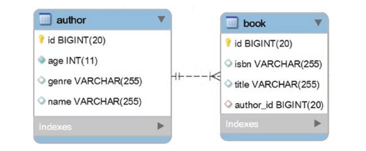
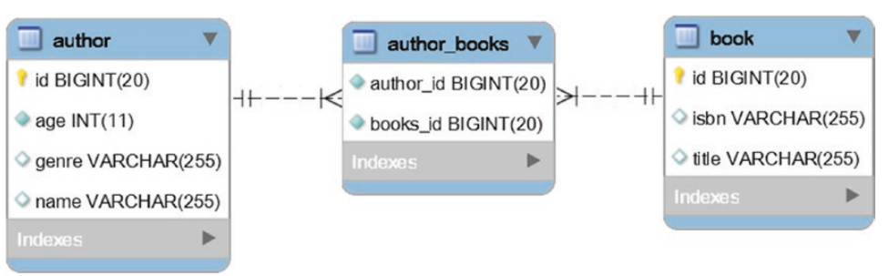
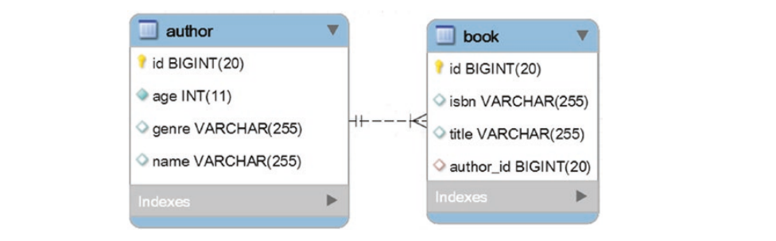
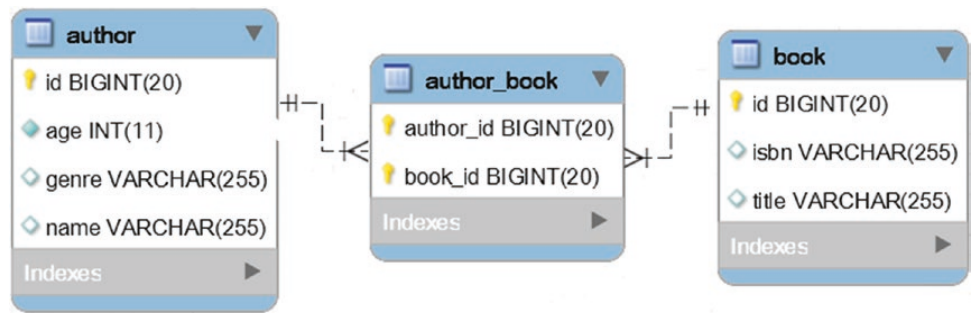

# <p style="color: #2563EB">Spring Data JPA Best Practices</p>

## Table of contents

1. [Associations](#Associations)
   1. [How to effectively shape the @OneToMany Associations](#how-to-effectively-shape-the-onetomany-associations)
   2. [Why should you avoid the unidirectional @OneToMany Association](#why-should-you-avoid-the-unidirectional-onetomany-association)

# Associations

## How to effectively shape the @OneToMany Associations

consider two entities Author and Book involved in a bidirectional lazy @OneToMany association



So the Author table has @OneToMany relationship with the book table. An author row can be referenced by multiple book rows.

The author_id column maps this relationship via foreign key that references the primary key of the author table.

A book column cannot exist without an author therefore the author is the parent-side (@OneToMany) while the book is the

child side (@ManyToOne)

The @ManyToOne association is responsible for synchronizing the foreign key column with the persistence context (the first level cache)

Rule of thumb

Always use bidirectional @OneToMany associations instead of unidirectional ones due to performance constraints as explained in the section below

### Best way to code a bidirectional @OneToMany association

1. Always cascade from parent side to child side

   Cascading from child side to parent-side is a code smell and a bad practice and it is a clear signal that its time to review your domain model

   Think of how illogical it is for a child to cascade the creation of a parent

   in this case we cascade from Authors side to the Book side so we add the cascade type in the Author entity

   `@OneToMany(cascade = CascadeType.All)`

   Never use CascadeType.* on @ManyToOne since entity state transitions should be propagated from parent-side entities to child-side entities
2. Don't forget to set mappedby on the parent side

   The mappedBy attribute characterizes a bidirectional association and must be set on the parent side

   in other words for a bidirectional @OneToMany association, set mappedBy to @OneToMany on the parent side and add @ManyToOne on the child-side

   referenced by mappedBy

   Via mappedBy, the bidirectional @OneToMany association signals that it mirrors the @ManyToOne child-side mapping

   in this case we add

   `@OneToMany(cascade = CascadeType.ALL, mappedBy = "author")`
3. set orphanRemoval on the parent side

   Setting orphanRemoval on the parent-side guarantees the removal of children without references.

   Example

   `@OneToMany(cascade = CascadeType.ALL, mappedBy = "author", orphanRemoval = true)`
4. Keep both sides of the Association in sync

   You can easily keep the both sides of the association in sync via helper methods added on the parent side

   commonly the addChild(), removeChild() and removeChildren()

   if you do not strive to keep both sides of the association in sync, the entity state transitions may lead to unexpected behaviours

   in this case we add the following helpers

   ```
   public void addBook(Book book) {
   this.books.add(book);
   book.setAuthor(this);
   }

   public void removeBook(Book book) {
   book.setAuthor(null);
   this.books.remove(book);
   }

   public void removeBooks() {
   Iteratorbook iterator = this.books.iterator();
   while (iterator.hasNext()) {
   Book book = iterator.next();
   book.setAuthor(null);
   iterator.remove();
   }
   }
   ```
5. override equals() and hashCode()

   By properly overriding equals() and hashcode() methods the application obtains the same results across all entity state transitions

   for @OneToMany associations these methods should be override on the child side

   incase we use the auto-generated database identifier to override these two methods.

   The most important aspect to keep in mind is that, for autogenerated database identifiers, the equals() method should perform a null

   check on the identifier before performing an equality check and the hashCode() method should return a constant value

   Since the Book entity is on the child side we highlight these two aspects as follows

   ```
   @Override
   public boolean equals(Object obj) {
   ...
   return id != null && id.equals(((Book) obj).id);
   }
   @Override
   public int hashCode() {
   return 2021;
   }
   ```
6. Use lazy fetching on both sides of the association

   by default fetching a parent will not fetch children entities

   This means @OneToMany is lazy

   On the other hand, fetching a child entity will eagerly fetch its parent by default

   Its advisable to explicitly set @ManyToOne to lazy and rey on eager fetching only on query basis

   in this case we Book entity explicitly maps @ManyToOne as lazy

   @ManyToOne(fetch =  FetchType.LAZY)
7. Pay attention to how toString() is overridden

   if toString() is to be overridden, then be sure to involve the basic attributes fetched when the entity is loaded from the database

   involving lazy attributes or associations will trigger separate SQL statements that fetch the corresponding data and throw LazyInitializationException.

   example when we implement the toString() method for Author entity then we dont mention the books collection, we mention only the basic attributes

   (id, name, age and genre)

   ```
   @Override
   public String toString() {
   return "Author{" + "id=" + id + ", name=" + name 
   + ", genre=" + genre + ", age=" + age + '}';
   }
   ```
8. Use @JoinColumn to specify the Join Column Name

   The join column defined by the owner entity (Book) stores the ID value and has a foreign key to the Author entity

   its advisable to specify the desired name for this column

   This way you avoid potential confusions/mistakes when referring to it (e.g in native queries)

   In this case we add @JoinColumn to the book entity as follows

   `@JoinColumn(name = "author_id)`

pay attention to remove entities operations especially child entities operations

While CascadeType.Remove and orphanRemoval=true will do their jobs but they may produce too may SQL statements

Relying on bulk operations is the best way to delete any significant amount of entities

## Why should you avoid the unidirectional @OneToMany Association

Consider the Author and Book entities are involved in a bidirectional lazy @OneToMany association

Trying to insert a child entity, a book will result in one SQL INSERT statement triggered against the book table

Trying to delete will result in one SQL delete statement triggered against the book table

Now lets assume that the same Author and Book entities are involved in a unidirectional @OneToMany association

```
@OneToMany(cascade = CascadeType.ALL, orphanRemoval = true)
private Listbook books = new ArrayList<>();
```

The missing @ManyToOne association leads to separate junction table(author_books) meant to manage the parent-child association

example



The junction table holds two foreign keys, so indexing consumes more memory than in the case of bidirectional relationship @OneToMany

Moreover having three tables affects the query operations as well

Reading the data may require three joins instead of two as in the case of bidirectional @ManyToOne association

lets see how INSERT AND DELETE act in unidirectional relationship

### Regular Unidirectional @OneToMany

checking how the INSERT and

#### Persisting Author and their books

The service method for persisting an author and the associated books is as follows

```
@Transactional
public void insertAuthorWithBooks() {
Author jn = new Author();
jn.setName("Joana Nimar");
jn.setAge(34);
jn.setGenre("History");
Book jn01 = new Book();
jn01.setIsbn("001-JN");
jn01.setTitle("A History of Ancient Prague");
Book jn02 = new Book();
jn02.setIsbn("002-JN");
jn02.setTitle("A People's History");
Book jn03 = new Book();
jn03.setIsbn("003-JN");
jn03.setTitle("World History");
jn.addBook(jn01);
jn.addBook(jn02);
jn.addBook(jn03);
authorRepository.save(jn);
}
```

inspecting the generated SQL statements reveals that in comparison to the bidirectional @OneToMany association there are 3 additional insert statements in the junction table (for n books there are n additional inserts)

```
INSERT INTO author (age, genre, name)
VALUES (?, ?, ?)
Binding:[34, History, Joana Nimar]
INSERT INTO book (isbn, title)
VALUES (?, ?)
Binding:[001-JN, A History of Ancient Prague]
INSERT INTO book (isbn, title)
VALUES (?, ?)
Binding:[002-JN, A People's History]
INSERT INTO book (isbn, title)
VALUES (?, ?)
Binding:[003-JN, World History]
```

-- additional inserts that are not needed for bidirectional @OneToMany

```
INSERT INTO author_books (author_id, books_id)
VALUES (?, ?)
Binding:[1, 1]
INSERT INTO author_books (author_id, books_id)
VALUES (?, ?)
Binding:[1, 2]
INSERT INTO author_books (author_id, books_id)
VALUES (?, ?)
Binding:[1, 3]
```

so in this context the unidirectional @OneToMany association is less efficient than bidirectional @OneToMany association

#### Persisting a new book of an existing author

Since Joana Nimar has just published a new book, we have to add it to the book table. This time, the service-method looks as follows:

@Transactional
public void insertNewBook() {
Author author = authorRepository.fetchByName("Joana Nimar");
Book book = new Book();
book.setIsbn("004-JN");
book.setTitle("History Details");
author.addBook(book); // use addBook() helper
authorRepository.save(author);
}

Calling this method and focusing on SQL INSERT statements results in the following output:

```
INSERT INTO book (isbn, title)
VALUES (?, ?)
Binding:[004-JN, History Details]
-- the following DML statements don't appear in bidirectional @OneToMany
DELETE FROM author_books
WHERE author_id = ?
Binding:[1]
INSERT INTO author_books (author_id, books_id)
VALUES (?, ?)
Binding:[1, 1]
INSERT INTO author_books (author_id, books_id)
VALUES (?, ?)
Binding:[1, 2]
INSERT INTO author_books (author_id, books_id)
VALUES (?, ?)Binding:[1, 3]
INSERT INTO author_books (author_id, books_id)
VALUES (?, ?)
Binding:[1, 4]
```

So, in order to insert a new book, the JPA persistence provider (Hibernate) deletes all the associated books from the junction table and it adds the new book in-memory and persists again

This is far from being efficient and potential performance penalty is quite obvious

#### Deleting the last book

Deleting the last book involves fetching the associated List of an author and deleting the last book from this list, as follows:

```
@Transactional
public void deleteLastBook() {
Author author = authorRepository.fetchByName("Joana Nimar");
Listbook books = author.getBooks();
// use removeBook() helper
author.removeBook(books.get(books.size() - 1));
}
```

Calling deleteLastBook() reveals the following relevant SQL statements:

```
DELETE FROM author_books
WHERE author_id = ?
Binding:[1]
INSERT INTO author_books (author_id, books_id)
VALUES (?, ?)
Binding:[1, 1]
INSERT INTO author_books (author_id, books_id)
VALUES (?, ?)
Binding:[1, 2]
```

-- for bidirectional @OneToMany this is the only needed DML

```
DELETE FROM book
WHERE id = ?
Binding:[3]
```

So, in order to delete the last book, the JPA persistence provider (Hibernate) deletes all associated books from the junction table, removes in-memory the last book, and persists the remaining books back again.

So, in comparison to the bidirectional @OneToMany association, there are several additional DML statements representing a performance penalty.

The more associated books there are, the larger the performance penalty.

#### Deleting the first book

Deleting the first book involves fetching the associated List of an author and deleting the first book from this list, as follows:

```
@Transactional
public void deleteFirstBook() {
Author author = authorRepository.fetchByName("Joana Nimar");
Listbook books = author.getBooks();
author.removeBook(books.get(0));
}
```

Calling deleteFirstBook() reveals the following relevant SQL statements:

```
DELETE FROM author_books
WHERE author_id = ?
Binding:[1]
INSERT INTO author_books (author_id, books_id)
VALUES (?, ?)
Binding:[1, 2]
INSERT INTO author_books (author_id, books_id)
VALUES (?, ?)
Binding:[1, 3]
```

-- for bidirectional @OneToMany this is the only needed DML

```
DELETE FROM book
WHERE id = ?
Binding:[1]
```

So, deleting the first book acts exactly as deleting the last book.

Besides the performance penalties caused by the dynamic number of additional SQL statements, we also face the performance penalties caused by the deletion and reinsertion of the index entries associated with the foreign key column of the junction table (most databases use indexes for foreign key columns).

When the database deletes all the table rows associated with the parent entity from the junction table, it also deletes the corresponding index entries. When the database inserts back in the junction table, it inserts the index entries as well.

### Using @OrderColumn

By adding the @OrderColumn annotation, the unidirectional @OneToMany association becomes ordered. In other words, @OrderColumn instructs Hibernate to materialize the element index (index of every collection element) into a separate database column of the junction table so that the collection is sorted using an ORDER BY clause. In this case, the index of every collection element is going to be stored in the books\_order column of the junction table.

#### Persist the Author and Books

Persisting the author and the associated books from the snapshot via the insertAuthorWithBooks() service-method triggers the following relevant SQL statements:

```
INSERT INTO author (age, genre, name)
VALUES (?, ?, ?)
Binding:[34, History, Joana Nimar]
INSERT INTO book (isbn, title)
VALUES (?, ?)
Binding:[001-JN, A History of Ancient Prague]
INSERT INTO book (isbn, title)
VALUES (?, ?)
Binding:[002-JN, A People's History]
INSERT INTO book (isbn, title)
VALUES (?, ?)
Binding:[003-JN, World History]
```

-- additional inserts not needed for bidirectional @OneToMany

```
INSERT INTO author_books (author_id, books_order, books_id)
VALUES (?, ?, ?)
Binding:[1, 0, 1]
INSERT INTO author_books (author_id, books_order, books_id)
VALUES (?, ?, ?)
Binding:[1, 1, 2]
INSERT INTO author
_books (author_id, books_order, books_id)
VALUES (?, ?, ?)
Binding:[1, 2, 3]
```

Looks like @OrderColumn doesn’t bring any benefit. The three additional INSERT statements are still triggered.

#### Persist a New Book of an Existing Author

Persisting a new book via the insertNewBook() service-method triggers the following relevant SQL statements:

```
INSERT INTO book (isbn, title)
VALUES (?, ?)
Binding:[004-JN, History Details]
-- this is not needed for bidirectional @OneToMany
INSERT INTO author_books (author_id, books_order, books_id)
VALUES (?, ?, ?)
Binding:[1, 3, 4]
```

There is good news and bad news!

The good news is that, this time, Hibernate doesn’t delete the associated books to add them back from memory.

The bad news is that, in comparison to bidirectional @OneToMany association, there is still an additional INSERT statement in the junction table. So, in this context, @OrderColumn brought some benefit.

#### Delete the Last Book

Deleting the last book via deleteLastBook() triggers the following relevant SQL statements:

```
DELETE FROM author_books
WHERE author_id = ?
AND books_order = ?
Binding:[1, 2]
```

-- for bidirectional @OneToMany this is the only needed DML

```
DELETE FROM book
WHERE id = ?
Binding:[3]
```

Looks like @OrderColumn brought some benefit in the case of removing the last book. The JPA persistence provider (Hibernate) did not delete all the associated books to add the remaining back from memory.

But, in comparison to the bidirectional @OneToMany association, there is still an additional DELETE triggered against the junction table.

#### Delete the First Book

Deleting the first book via deleteFirstBook() triggers the following relevant SQL statements:

```
DELETE FROM author_books
WHERE author_id = ?
AND books_order = ?
Binding:[1, 2]
UPDATE author_books
SET books_id = ?
WHERE author_id = ?
AND books_order = ?
Binding:[3, 1, 1]
UPDATE author_books
SET books_id = ?
WHERE author_id = ?
AND books_order = ?
Binding:[2, 1, 0]
```

-- for bidirectional @OneToMany this is the only needed DML

```
DELETE FROM book
WHERE id = ?
Binding:[1]
```

The more you move away from the end of the collection, the smaller the benefit of using @OrderColumn. Deleting the first book results in a DELETE from the junction table followed by a bunch of UPDATE statements meant to preserve the in-memory order of the collection in the database. Again, this is not efficient.

Adding @OrderColumn can bring some benefits for removal operations. Nevertheless, the closer an element to be removed is to the head of the fetched list, the more UPDATE statements are needed.

This causes performance penalties. Even in the best-case scenario (removing an element from the tail of the collection), this approach is not better than bidirectional @OneToMany association.

### @JoinColumn

Now, let’s see if adding @JoinColumn will bring any benefit:

```
@OneToMany(cascade = CascadeType.ALL, orphanRemoval = true)
@JoinColumn(name = "author_id")
private Listbook books = new ArrayList<>();
```

Adding @JoinColumn instructs Hibernate that the @OneToMany association is capable of
controlling the child-table foreign key. In other words, the junction table is eliminated
and the number of tables is reduced from three to two, as shown



#### Persist the author and the books

Persisting the author and the associated books via the insertAuthorWithBooks() service-method triggers the following relevant SQL statements:

```
INSERT INTO author (age, genre, name)
VALUES (?, ?, ?)
Binding:[34, History, Joana Nimar]                                                                                                                         INSERT INTO book (isbn, title)
VALUES (?, ?)
Binding:[001-JN, A History of Ancient Prague]
INSERT INTO book (isbn, title)
VALUES (?, ?)
Binding:[002-JN, A People's History]
INSERT INTO book (isbn, title)
VALUES (?, ?)
Binding:[003-JN, World History]
```

-- additional DML that are not needed in bidirectional @OneToMany

```
UPDATE book
SET author_id = ?
WHERE id = ?
Binding:[1, 1]
UPDATE book
SET author_id = ?
WHERE id = ?
Binding:[1, 2]
UPDATE book
SET author_id = ?
WHERE id = ?
Binding:[1, 3]
```

So, for each inserted book, Hibernate triggers an UPDATE to set the author\_id value. Obviously, this adds a performance penalty in comparison to the bidirectional @OneToMany association.

#### Persist a New Book of an Existing Author

Persisting a new book via the insertNewBook() service-method triggers the following relevant SQL statements:

```
INSERT INTO book (isbn, title)
VALUES (?, ?)
Binding:[004-JN, History Details]
```

-- additional DML that is not needed in bidirectional @OneToMany

```
UPDATE book
SET author_id = ?
WHERE id = ?
Binding:[1, 4]
```

This is not as bad as a regular unidirectional @OneToMany association, but it still requires an UPDATE statement that is not needed in bidirectional @OneToMany associations.

#### Delete the Last Book

Deleting the last book via deleteLastBook() triggers the following relevant SQL statements:

```
UPDATE book
SET author_id = NULL
WHERE author_id = ?
AND id = ?
Binding:[1, 3]
```

-- for bidirectional @OneToMany this is the only needed DML

```
DELETE FROM book
WHERE id = ?
Binding:[3]
```

The JPA persistence provider (Hibernate) dissociates the book from its author by setting author\_id to null.

Next, the disassociated book is deleted, thanks to orphanRemoval=true. Nevertheless, this additional UPDATE is not necessary with bidirectional @OneToMany association.

#### Delete the First Book

Deleting the first book via deleteFirstBook() triggers the following relevant SQL statements (these are the same SQL statements as in the previous subsection):

```
UPDATE book
SET author_id = NULL
WHERE author_id = ?
AND id = ?
Binding:[1, 1]
```

-- for bidirectional @OneToMany this is the only needed DML

```
DELETE FROM book
WHERE id = ?
Binding:[1]
```

The UPDATE is still there! Once again, the bidirectional @OneToMany association wins this game.

Adding @JoinColumn can provide benefits over the regular unidirectional @OneToMany, but is not better than a bidirectional @OneToMany association. The additional UPDATE statements still cause a performance degradation

Adding @JoinColumn and @OrderColumn at the same time is still not better than bidirectional @OneToMany.

Moreover, using Set instead of List or unidirectional @OneToMany with @JoinColumn (e.g., @ManyToOne @Join Column(name = "author\_id", updatable = false, insertable = false)) still performs worse than a bidirectional @OneToMany association.

As a rule of thumb, a unidirectional @OneToMany association is less efficient than a bidirectional @OneToMany or unidirectional @ManyToOne associations.

## How Efficient Is the Unidirectional @ManyToOne

Let’s assume that Author and Book are involved in a unidirectional lazy @ManyToOne association.

In code, the Author and Book entities are as follows:

```
@Entity
public class Author implements Serializable {
private static final long serialVersionUID = 1L;
@Id
@GeneratedValue(strategy = GenerationType.IDENTITY)
private Long id;
private String name;
private String genre;
private int age;
...
}@Entity
public class Book implements Serializable {
private static final long serialVersionUID = 1L;
@Id
@GeneratedValue(strategy = GenerationType.IDENTITY)
private Long id;
private String title;
private String isbn;
@ManyToOne(fetch = FetchType.LAZY)
@JoinColumn(name = "author_id")
private Author author;
...
}
```

### Adding a New Book to a Certain Author

The most efficient way to add a new book to a certain author is shown in the following

```
@Transactional
public void insertNewBook() {
Author author = authorRepository.getOne(4L);
Book book = new Book();
book.setIsbn("003-JN");
book.setTitle("History Of Present");
book.setAuthor(author);
bookRepository.save(book);
}
```

This method will trigger a single INSERT SQL statement. The author\_id column will be populated with the identifier of the associated Author entity:

```
INSERT INTO book (author_id, isbn, title)
VALUES (?, ?, ?)
Binding:[4, 003-JN, History Of Present]
```

Notice that we used the getOne() method, which returns an Author reference via EntityManager.getReference()

The reference state may be lazily fetched, but you don’t need it in this context. Therefore, you avoid an unneeded SELECT statement. Of course, relying on findById() is also possible and desirable if you need to actually load the Author instance in the Persistence Context. Obviously, this will happen via a SELECT statement.

The Hibernate Dirty Checking mechanism works as expected

In other words, updating the book will result in UPDATE statements triggered on your behalf.

```
@Transactional
public void insertNewBook() {
Author author = authorRepository.getOne(4L);
Book book = new Book();
book.setIsbn("003-JN");
book.setTitle("History Of Present");
book.setAuthor(author);
bookRepository.save(book);
book.setIsbn("not available");
}
```

This time, calling insertNewBook() will trigger an INSERT and an UPDATE:

```
INSERT INTO book (author_id, isbn, title)
VALUES (?, ?, ?)
UPDATE book
SET author_id = ?,
isbn = ?,
title = ?
WHERE id = ?
```

Since Hibernate populates the author\_id column with the identifier of the associated Author entity, adding a new book to a certain author is efficient.

### Fetching All Books of an Author

You can fetch all the books written by an author via a JPQL query as follows:

```
@Transactional(readOnly = true)
@Query("SELECT b FROM Book b WHERE b.author.id = :id")
Listbook fetchBooksOfAuthorById(Long id);
```

Calling fetchBooksOfAuthorById() from a service-method is quite simple:

```
public void fetchBooksOfAuthorById() {
Listbook books = bookRepository.fetchBooksOfAuthorById(4L);
}
```

The triggered SELECT is shown here:

```
SELECT
book0_.id AS id1_1_,
book0_.author_id AS author_i4_1_,
book0_.isbn AS isbn2_1_,
book0_.title AS title3_1_
FROM book book0_
WHERE book0_.author_id = ?
```

Modifying a book will take advantage of the Dirty Checking mechanism. In other words, updating a book from this collection will result in a UPDATE statement triggered on your behalf. Check out the following code:

```
@Transactional
public void fetchBooksOfAuthorById() {
Listbook books = bookRepository.fetchBooksOfAuthorById(4L);
books.get(0).setIsbn("not available");
}
```

This time, calling fetchBooksOfAuthorById() will trigger a SELECT and an UPDATE:

```
SELECT
book0_.id AS id1_1_,
book0_.author_id AS author_i4_1_,
book0_.isbn AS isbn2_1_,
book0_.title AS title3_1_
FROM book book0_
WHERE book0_.author_id = ?
```

```
UPDATE book
SET author_id = ?,
isbn = ?,
title = ?
WHERE id = ?
```

Fetching all books of an author requires a single SELECT; therefore, this operation is efficient

The fetched collection is not managed by Hibernate but adding/removing books is quite efficient and easy to accomplish.

### Paging the Books of an Author

Fetching all books work fine as long as the number of child records is rather small. Generally speaking, fetching large collections is definitely a bad practice that leads to important performance penalties.

Pagination comes to the rescue as follows

```
@Transactional(readOnly = true)
@Query("SELECT b FROM Book b WHERE b.author.id = :id")
Pagebook fetchPageBooksOfAuthorById(Long id, Pageable pageable);
```

You can call fetchPageBooksOfAuthorById()from a service-method

```
public void fetchPageBooksOfAuthorById() {
Pagebook books = bookRepository.fetchPageBooksOfAuthorById(4L,
PageRequest.of(0, 2, Sort.by(Sort.Direction.ASC, "title")));
books.get().forEach(System.out::println);
}
```

This method triggers two SELECT statements:

```
SELECT
book0_.id AS id1_1_,
book0_.author_id AS author_i4_1_,
book0_.isbn AS isbn2_1_,
book0_.title AS title3_1_
FROM book book0_
WHERE book0_.author_id = ?
ORDER BY book0_.title ASC LIMIT ?SELECT
COUNT(book0_.id) AS col_0_0_
FROM book book0_
WHERE book0_.author_id = ?
```

the fetched collection is not managed by Hibernate, but modifying a book will take advantage of the Dirty Checking mechanism.

### Fetching All Books of an Author and Adding a New Book

The section “Fetching All Books of an Author” already covered half of this topic while the section “Adding a New Book to a Certain Author” covered the other half. Joining these sections results in the following code:

```
@Transactional
public void fetchBooksOfAuthorByIdAndAddNewBook() {
Listbook books = bookRepository.fetchBooksOfAuthorById(4L);
Book book = new Book();
book.setIsbn("004-JN");
book.setTitle("History Facts");
book.setAuthor(books.get(0).getAuthor());
books.add(bookRepository.save(book));
}
```

The triggered SQL statements are:

```
SELECT
book0_.id AS id1_1_,
book0_.author_id AS author_i4_1_,
book0_.isbn AS isbn2_1_,
book0_.title AS title3_1_
FROM book book0_
WHERE book0_.author_id = ?
```

```
INSERT INTO book (author_id, isbn, title)
VALUES (?, ?, ?)
```

Since fetching all the books of an author requires a single SELECT and adding a new book into the fetched collection requires a single INSERT, this operation is efficient.

### Fetching all Books of an Author and Deleting a Book

The following code fetches all books of an author and deletes the first book:

```
@Transactional
public void fetchBooksOfAuthorByIdAndDeleteFirstBook() {
Listbook books = bookRepository.fetchBooksOfAuthorById(4L);
bookRepository.delete(books.remove(0));
}
```

Besides the well known SELECT needed to fetch all books of the author, deletion takes place in a single DELETE statement, as follows:

```
DELETE FROM book
WHERE id = ?
```

Since fetching all books of an author requires a single SELECT and removing a book from the fetched collection requires a single DELETE, this operation is efficient.

It looks like unidirectional @ManyToOne association is quite efficient and it can be used whenever a bidirectional @OneToMany association is not needed. Again, try to avoid the unidirectional @OneToMany association

## How to Effectively Shape the @ManyToMany Association

This time, the well-known Author and Book entities are involved in a bidirectional lazy @ManyToMany association (an author has written more books and a book was written by several authors).




The bidirectional @ManyToMany association can be navigated from both sides, therefore, both sides can be parents (parent-side).

Since both are parents, none of them will hold a foreign key. In this association, there are two foreign keys that are stored in a separate table, known as the junction or join table. The junction table is hidden and it plays the child-side role.

### The best way to code a bidirectional @ManyToMany association is described in the following sections.

#### Choose the Owner of the Relationship

Using the default @ManyToMany mapping requires the developer to choose an owner of the relationship and a mappedBy side (aka, the inverse side).

Only one side can be the owner and the changes are only propagated to the database from this particular side.

For example, Author can be the owner, while Book adds a mappedBy side.

```
@ManyToMany(mappedBy = "books")
private Setauthor authors = new HashSet<>();
```

#### Always Use Set not List

Especially if remove operations are involved, it is advisable to rely on Set and avoid List.

Set performs much better than List.

```
private Setbook books = new HashSet<>(); // in Author
private Setauthor authors = new HashSet<>(); // in Book
```

#### Keep Both Sides of the Association in Sync

You can easily keep both sides of the association in sync via helper methods added on the side that you are more likely to interact with. For example, if the business logic is more interested in manipulating Author than Book then the developer can add Author to least these three helpers:

addBook(), removeBook() and removeBooks().

#### Avoid CascadeType.ALL and CascadeType.REMOVE

In most of the cases, cascading removals are bad ideas. For example, removing an Author entity should not trigger a Book removal because the Book can be referenced by other authors as well

So, avoid CascadeType.ALL and CascadeType.REMOVE and rely on explicit CascadeType.PERSIST and CascadeType.MERGE:

```
@ManyToMany(cascade = {CascadeType.PERSIST, CascadeType.MERGE})
private Setbook books = new HashSet<>();
```

The orphan removal (orphanRemoval) option is defined on @OneToOne and @OneToMany relationship annotations, but on neither of the @ManyToOne or @ManyToMany annotations

#### Setting Up the Join Table

Explicitly setting up the join table name and the columns names allows the developer to reference them without confusion. This can be done via @JoinTable as in the following example:

@JoinTable(name = "author_book",
joinColumns = @JoinColumn(name = "author_id"),
inverseJoinColumns = @JoinColumn(name = "book_id")
)

#### Using Lazy Fetching on Both Sides of the Association

By default, the @ManyToMany association is lazy. Keep it this way! Don’t do this: @ManyToMany(fetch=FetchType.EAGER)

#### Override equals() and hashCode()

By properly overriding the equals() and hashCode() methods, the application obtains the same results across all entity state transitions.

For bidirectional @ManyToMany associations, these methods should be overridden on both sides.

#### Pay Attention to How toString() Is Overridden

If toString() needs to be overridden, involve only the basic attributes fetched when the entity is loaded from the database. Involving lazy attributes or associations will trigger separate SQL statements for fetching the corresponding data.


Alternatively, @ManyToMany can be replaced with two bidirectional @OneToMany associations. In other words, the junction table can be mapped to an entity.
