# <p style="color: #2563EB">Spring Data JPA Best Practices</p>

## Table of contents

1. [Associations](#Associations)
   1. [How to effectively shape the @OneToMany Associations](#how-to-effectively-shape-the-onetomany-associations)
   2. [Why should you avoid the unidirectional @OneToMany Association](#why-should-you-avoid-the-unidirectional-onetomany-association)

# Associations

## How to effectively shape the @OneToMany Associations

consider two entities Author and Book involved in a bidirectional lazy @OneToMany association


So the Author table has @OneToMany relationship with the book table. An author row can be referenced by multiple book rows.

The author_id column maps this relationship via foreign key that references the primary key of the author table.

A book column cannot exist without an author therefore the author is the parent-side (@OneToMany) while the book is the

child side (@ManyToOne)

The @ManyToOne association is responsible for synchronizing the foreign key column with the persistence context (the first level cache)

Rule of thumb

Always use bidirectional @OneToMany associations instead of unidirectional ones due to performance constraints as explained in the section below

### Best way to code a bidirectional @OneToMany association

1. Always cascade from parent side to child side

   Cascading from child side to parent-side is a code smell and a bad practice and it is a clear signal that its time to review your domain model

   Think of how illogical it is for a child to cascade the creation of a parent

   in this case we cascade from Authors side to the Book side so we add the cascade type in the Author entity

   `@OneToMany(cascade = CascadeType.All)`

   Never use CascadeType.* on @ManyToOne since entity state transitions should be propagated from parent-side entities to child-side entities
2. Don't forget to set mappedby on the parent side

   The mappedBy attribute characterizes a bidirectional association and must be set on the parent side

   in other words for a bidirectional @OneToMany association, set mappedBy to @OneToMany on the parent side and add @ManyToOne on the child-side

   referenced by mappedBy

   Via mappedBy, the bidirectional @OneToMany association signals that it mirrors the @ManyToOne child-side mapping

   in this case we add

   `@OneToMany(cascade = CascadeType.ALL, mappedBy = "author")`
3. set orphanRemoval on the parent side

   Setting orphanRemoval on the parent-side guarantees the removal of children without references.

   Example

   `@OneToMany(cascade = CascadeType.ALL, mappedBy = "author", orphanRemoval = true)`
4. Keep both sides of the Association in sync

   You can easily keep the both sides of the association in sync via helper methods added on the parent side

   commonly the addChild(), removeChild() and removeChildren()

   if you do not strive to keep both sides of the association in sync, the entity state transitions may lead to unexpected behaviours

   in this case we add the following helpers

   ```
   public void addBook(Book book) {
   this.books.add(book);
   book.setAuthor(this);
   }

   public void removeBook(Book book) {
   book.setAuthor(null);
   this.books.remove(book);
   }

   public void removeBooks() {
   Iteratorbook iterator = this.books.iterator();
   while (iterator.hasNext()) {
   Book book = iterator.next();
   book.setAuthor(null);
   iterator.remove();
   }
   }
   ```
5. override equals() and hashCode()

   By properly overriding equals() and hashcode() methods the application obtains the same results across all entity state transitions

   for @OneToMany associations these methods should be override on the child side

   incase we use the auto-generated database identifier to override these two methods.

   The most important aspect to keep in mind is that, for autogenerated database identifiers, the equals() method should perform a null

   check on the identifier before performing an equality check and the hashCode() method should return a constant value

   Since the Book entity is on the child side we highlight these two aspects as follows

   ```
   @Override
   public boolean equals(Object obj) {
   ...
   return id != null && id.equals(((Book) obj).id);
   }
   @Override
   public int hashCode() {
   return 2021;
   }
   ```
6. Use lazy fetching on both sides of the association

   by default fetching a parent will not fetch children entities

   This means @OneToMany is lazy

   On the other hand, fetching a child entity will eagerly fetch its parent by default

   Its advisable to explicitly set @ManyToOne to lazy and rey on eager fetching only on query basis

   in this case we Book entity explicitly maps @ManyToOne as lazy

   @ManyToOne(fetch =  FetchType.LAZY)
7. Pay attention to how toString() is overridden

   if toString() is to be overridden, then be sure to involve the basic attributes fetched when the entity is loaded from the database

   involving lazy attributes or associations will trigger separate SQL statements that fetch the corresponding data and throw LazyInitializationException.

   example when we implement the toString() method for Author entity then we dont mention the books collection, we mention only the basic attributes

   (id, name, age and genre)

   ```
   @Override
   public String toString() {
   return "Author{" + "id=" + id + ", name=" + name 
   + ", genre=" + genre + ", age=" + age + '}';
   }
   ```
8. Use @JoinColumn to specify the Join Column Name

   The join column defined by the owner entity (Book) stores the ID value and has a foreign key to the Author entity

   its advisable to specify the desired name for this column

   This way you avoid potential confusions/mistakes when referring to it (e.g in native queries)

   In this case we add @JoinColumn to the book entity as follows

   `@JoinColumn(name = "author_id)`

pay attention to remove entities operations especially child entities operations

While CascadeType.Remove and orphanRemoval=true will do their jobs but they may produce too may SQL statements

Relying on bulk operations is the best way to delete any significant amount of entities

## Why should you avoid the unidirectional @OneToMany Association

Consider the Author and Book entities are involved in a bidirectional lazy @OneToMany association

Trying to insert a child entity, a book will result in one SQL INSERT statement triggered against the book table

Trying to delete will result in one SQL delete statement triggered against the book table

Now lets assume that the same Author and Book entities are involved in a unidirectional @OneToMany association

```
@OneToMany(cascade = CascadeType.ALL, orphanRemoval = true)
private Listbook books = new ArrayList<>();
```

The missing @ManyToOne association leads to separate junction table(author_books) meant to manage the parent-child association

example


The junction table holds two foreign keys, so indexing consumes more memory than in the case of bidirectional relationship @OneToMany

Moreover having three tables affects the query operations as well

Reading the data may require three joins instead of two as in the case of bidirectional @ManyToOne association

lets see how INSERT AND DELETE act in unidirectional relationship

### Regular Unidirectional @OneToMany

checking how the INSERT and

#### Persisting Author and their books

The service method for persisting an author and the associated books is as follows

```
@Transactional
public void insertAuthorWithBooks() {
Author jn = new Author();
jn.setName("Joana Nimar");
jn.setAge(34);
jn.setGenre("History");
Book jn01 = new Book();
jn01.setIsbn("001-JN");
jn01.setTitle("A History of Ancient Prague");
Book jn02 = new Book();
jn02.setIsbn("002-JN");
jn02.setTitle("A People's History");
Book jn03 = new Book();
jn03.setIsbn("003-JN");
jn03.setTitle("World History");
jn.addBook(jn01);
jn.addBook(jn02);
jn.addBook(jn03);
authorRepository.save(jn);
}
```

inspecting the generated SQL statements reveals that in comparison to the bidirectional @OneToMany association there are 3 additional insert statements in the junction table (for n books there are n additional inserts)

```
INSERT INTO author (age, genre, name)
VALUES (?, ?, ?)
Binding:[34, History, Joana Nimar]
INSERT INTO book (isbn, title)
VALUES (?, ?)
Binding:[001-JN, A History of Ancient Prague]
INSERT INTO book (isbn, title)
VALUES (?, ?)
Binding:[002-JN, A People's History]
INSERT INTO book (isbn, title)
VALUES (?, ?)
Binding:[003-JN, World History]
```

-- additional inserts that are not needed for bidirectional @OneToMany

```
INSERT INTO author_books (author_id, books_id)
VALUES (?, ?)
Binding:[1, 1]
INSERT INTO author_books (author_id, books_id)
VALUES (?, ?)
Binding:[1, 2]
INSERT INTO author_books (author_id, books_id)
VALUES (?, ?)
Binding:[1, 3]
```

so in this context the unidirectional @OneToMany association is less efficient than bidirectional @OneToMany association

#### Persisting a new book of an existing author

Since Joana Nimar has just published a new book, we have to add it to the book table. This time, the service-method looks as follows:

@Transactional
public void insertNewBook() {
Author author = authorRepository.fetchByName("Joana Nimar");
Book book = new Book();
book.setIsbn("004-JN");
book.setTitle("History Details");
author.addBook(book); // use addBook() helper
authorRepository.save(author);
}

Calling this method and focusing on SQL INSERT statements results in the following output:

```
INSERT INTO book (isbn, title)
VALUES (?, ?)
Binding:[004-JN, History Details]
-- the following DML statements don't appear in bidirectional @OneToMany
DELETE FROM author_books
WHERE author_id = ?
Binding:[1]
INSERT INTO author_books (author_id, books_id)
VALUES (?, ?)
Binding:[1, 1]
INSERT INTO author_books (author_id, books_id)
VALUES (?, ?)
Binding:[1, 2]
INSERT INTO author_books (author_id, books_id)
VALUES (?, ?)Binding:[1, 3]
INSERT INTO author_books (author_id, books_id)
VALUES (?, ?)
Binding:[1, 4]
```

So, in order to insert a new book, the JPA persistence provider (Hibernate) deletes all the associated books from the junction table and it adds the new book in-memory and persists again

This is far from being efficient and potential performance penalty is quite obvious

#### Deleting the last book

Deleting the last book involves fetching the associated List of an author and deleting the last book from this list, as follows:

```
@Transactional
public void deleteLastBook() {
Author author = authorRepository.fetchByName("Joana Nimar");
Listbook books = author.getBooks();
// use removeBook() helper
author.removeBook(books.get(books.size() - 1));
}
```

Calling deleteLastBook() reveals the following relevant SQL statements:

```
DELETE FROM author_books
WHERE author_id = ?
Binding:[1]
INSERT INTO author_books (author_id, books_id)
VALUES (?, ?)
Binding:[1, 1]
INSERT INTO author_books (author_id, books_id)
VALUES (?, ?)
Binding:[1, 2]
```

-- for bidirectional @OneToMany this is the only needed DML

```
DELETE FROM book
WHERE id = ?
Binding:[3]
```

So, in order to delete the last book, the JPA persistence provider (Hibernate) deletes all associated books from the junction table, removes in-memory the last book, and persists the remaining books back again.

So, in comparison to the bidirectional @OneToMany association, there are several additional DML statements representing a performance penalty.

The more associated books there are, the larger the performance penalty.

#### Deleting the first book

Deleting the first book involves fetching the associated List of an author and deleting the first book from this list, as follows:

```
@Transactional
public void deleteFirstBook() {
Author author = authorRepository.fetchByName("Joana Nimar");
Listbook books = author.getBooks();
author.removeBook(books.get(0));
}
```

Calling deleteFirstBook() reveals the following relevant SQL statements:

```
DELETE FROM author_books
WHERE author_id = ?
Binding:[1]
INSERT INTO author_books (author_id, books_id)
VALUES (?, ?)
Binding:[1, 2]
INSERT INTO author_books (author_id, books_id)
VALUES (?, ?)
Binding:[1, 3]
```

-- for bidirectional @OneToMany this is the only needed DML

```
DELETE FROM book
WHERE id = ?
Binding:[1]
```

So, deleting the first book acts exactly as deleting the last book.

Besides the performance penalties caused by the dynamic number of additional SQL statements, we also face the performance penalties caused by the deletion and reinsertion of the index entries associated with the foreign key column of the junction table (most databases use indexes for foreign key columns).

When the database deletes all the table rows associated with the parent entity from the junction table, it also deletes the corresponding index entries. When the database inserts back in the junction table, it inserts the index entries as well.

### Using @OrderColumn

By adding the @OrderColumn annotation, the unidirectional @OneToMany association becomes ordered. In other words, @OrderColumn instructs Hibernate to materialize the element index (index of every collection element) into a separate database column of the junction table so that the collection is sorted using an ORDER BY clause. In this case, the index of every collection element is going to be stored in the books\_order column of the junction table.

#### Persist the Author and Books

Persisting the author and the associated books from the snapshot via the insertAuthorWithBooks() service-method triggers the following relevant SQL statements:

```
INSERT INTO author (age, genre, name)
VALUES (?, ?, ?)
Binding:[34, History, Joana Nimar]
INSERT INTO book (isbn, title)
VALUES (?, ?)
Binding:[001-JN, A History of Ancient Prague]
INSERT INTO book (isbn, title)
VALUES (?, ?)
Binding:[002-JN, A People's History]
INSERT INTO book (isbn, title)
VALUES (?, ?)
Binding:[003-JN, World History]
```

-- additional inserts not needed for bidirectional @OneToMany

```
INSERT INTO author_books (author_id, books_order, books_id)
VALUES (?, ?, ?)
Binding:[1, 0, 1]
INSERT INTO author_books (author_id, books_order, books_id)
VALUES (?, ?, ?)
Binding:[1, 1, 2]
INSERT INTO author
_books (author_id, books_order, books_id)
VALUES (?, ?, ?)
Binding:[1, 2, 3]
```

Looks like @OrderColumn doesn’t bring any benefit. The three additional INSERT statements are still triggered.

#### Persist a New Book of an Existing Author

Persisting a new book via the insertNewBook() service-method triggers the following relevant SQL statements:

```
INSERT INTO book (isbn, title)
VALUES (?, ?)
Binding:[004-JN, History Details]
-- this is not needed for bidirectional @OneToMany
INSERT INTO author_books (author_id, books_order, books_id)
VALUES (?, ?, ?)
Binding:[1, 3, 4]
```

There is good news and bad news!

The good news is that, this time, Hibernate doesn’t delete the associated books to add them back from memory.

The bad news is that, in comparison to bidirectional @OneToMany association, there is still an additional INSERT statement in the junction table. So, in this context, @OrderColumn brought some benefit.

#### Delete the Last Book

Deleting the last book via deleteLastBook() triggers the following relevant SQL statements:

```
DELETE FROM author_books
WHERE author_id = ?
AND books_order = ?
Binding:[1, 2]
```

-- for bidirectional @OneToMany this is the only needed DML

```
DELETE FROM book
WHERE id = ?
Binding:[3]
```

Looks like @OrderColumn brought some benefit in the case of removing the last book. The JPA persistence provider (Hibernate) did not delete all the associated books to add the remaining back from memory.

But, in comparison to the bidirectional @OneToMany association, there is still an additional DELETE triggered against the junction table.

#### Delete the First Book

Deleting the first book via deleteFirstBook() triggers the following relevant SQL statements:

```
DELETE FROM author_books
WHERE author_id = ?
AND books_order = ?
Binding:[1, 2]
UPDATE author_books
SET books_id = ?
WHERE author_id = ?
AND books_order = ?
Binding:[3, 1, 1]
UPDATE author_books
SET books_id = ?
WHERE author_id = ?
AND books_order = ?
Binding:[2, 1, 0]
```

-- for bidirectional @OneToMany this is the only needed DML

```
DELETE FROM book
WHERE id = ?
Binding:[1]
```

The more you move away from the end of the collection, the smaller the benefit of using @OrderColumn. Deleting the first book results in a DELETE from the junction table followed by a bunch of UPDATE statements meant to preserve the in-memory order of the collection in the database. Again, this is not efficient.

Adding @OrderColumn can bring some benefits for removal operations. Nevertheless, the closer an element to be removed is to the head of the fetched list, the more UPDATE statements are needed.

This causes performance penalties. Even in the best-case scenario (removing an element from the tail of the collection), this approach is not better than bidirectional @OneToMany association.

### @JoinColumn

Now, let’s see if adding @JoinColumn will bring any benefit:

```
@OneToMany(cascade = CascadeType.ALL, orphanRemoval = true)
@JoinColumn(name = "author_id")
private Listbook books = new ArrayList<>();
```

Adding @JoinColumn instructs Hibernate that the @OneToMany association is capable of
controlling the child-table foreign key. In other words, the junction table is eliminated
and the number of tables is reduced from three to two, as shown


#### Persist the author and the books

Persisting the author and the associated books via the insertAuthorWithBooks() service-method triggers the following relevant SQL statements:

```
INSERT INTO author (age, genre, name)
VALUES (?, ?, ?)
Binding:[34, History, Joana Nimar]                                                                                                                         INSERT INTO book (isbn, title)
VALUES (?, ?)
Binding:[001-JN, A History of Ancient Prague]
INSERT INTO book (isbn, title)
VALUES (?, ?)
Binding:[002-JN, A People's History]
INSERT INTO book (isbn, title)
VALUES (?, ?)
Binding:[003-JN, World History]
```

-- additional DML that are not needed in bidirectional @OneToMany

```
UPDATE book
SET author_id = ?
WHERE id = ?
Binding:[1, 1]
UPDATE book
SET author_id = ?
WHERE id = ?
Binding:[1, 2]
UPDATE book
SET author_id = ?
WHERE id = ?
Binding:[1, 3]
```

So, for each inserted book, Hibernate triggers an UPDATE to set the author\_id value. Obviously, this adds a performance penalty in comparison to the bidirectional @OneToMany association.

#### Persist a New Book of an Existing Author

Persisting a new book via the insertNewBook() service-method triggers the following relevant SQL statements:

```
INSERT INTO book (isbn, title)
VALUES (?, ?)
Binding:[004-JN, History Details]
```

-- additional DML that is not needed in bidirectional @OneToMany

```
UPDATE book
SET author_id = ?
WHERE id = ?
Binding:[1, 4]
```

This is not as bad as a regular unidirectional @OneToMany association, but it still requires an UPDATE statement that is not needed in bidirectional @OneToMany associations.

#### Delete the Last Book

Deleting the last book via deleteLastBook() triggers the following relevant SQL statements:

```
UPDATE book
SET author_id = NULL
WHERE author_id = ?
AND id = ?
Binding:[1, 3]
```

-- for bidirectional @OneToMany this is the only needed DML

```
DELETE FROM book
WHERE id = ?
Binding:[3]
```

The JPA persistence provider (Hibernate) dissociates the book from its author by setting author\_id to null.

Next, the disassociated book is deleted, thanks to orphanRemoval=true. Nevertheless, this additional UPDATE is not necessary with bidirectional @OneToMany association.

#### Delete the First Book

Deleting the first book via deleteFirstBook() triggers the following relevant SQL statements (these are the same SQL statements as in the previous subsection):

```
UPDATE book
SET author_id = NULL
WHERE author_id = ?
AND id = ?
Binding:[1, 1]
```

-- for bidirectional @OneToMany this is the only needed DML

```
DELETE FROM book
WHERE id = ?
Binding:[1]
```

The UPDATE is still there! Once again, the bidirectional @OneToMany association wins this game.

Adding @JoinColumn can provide benefits over the regular unidirectional @OneToMany, but is not better than a bidirectional @OneToMany association. The additional UPDATE statements still cause a performance degradation

Adding @JoinColumn and @OrderColumn at the same time is still not better than bidirectional @OneToMany.

Moreover, using Set instead of List or unidirectional @OneToMany with @JoinColumn (e.g., @ManyToOne @Join Column(name = "author\_id", updatable = false, insertable = false)) still performs worse than a bidirectional @OneToMany association.

As a rule of thumb, a unidirectional @OneToMany association is less efficient than a bidirectional @OneToMany or unidirectional @ManyToOne associations.

## How Efficient Is the Unidirectional @ManyToOne

Let’s assume that Author and Book are involved in a unidirectional lazy @ManyToOne association.

In code, the Author and Book entities are as follows:

```
@Entity
public class Author implements Serializable {
private static final long serialVersionUID = 1L;
@Id
@GeneratedValue(strategy = GenerationType.IDENTITY)
private Long id;
private String name;
private String genre;
private int age;
...
}@Entity
public class Book implements Serializable {
private static final long serialVersionUID = 1L;
@Id
@GeneratedValue(strategy = GenerationType.IDENTITY)
private Long id;
private String title;
private String isbn;
@ManyToOne(fetch = FetchType.LAZY)
@JoinColumn(name = "author_id")
private Author author;
...
}
```

### Adding a New Book to a Certain Author

The most efficient way to add a new book to a certain author is shown in the following

```
@Transactional
public void insertNewBook() {
Author author = authorRepository.getOne(4L);
Book book = new Book();
book.setIsbn("003-JN");
book.setTitle("History Of Present");
book.setAuthor(author);
bookRepository.save(book);
}
```

This method will trigger a single INSERT SQL statement. The author\_id column will be populated with the identifier of the associated Author entity:

```
INSERT INTO book (author_id, isbn, title)
VALUES (?, ?, ?)
Binding:[4, 003-JN, History Of Present]
```

Notice that we used the getOne() method, which returns an Author reference via EntityManager.getReference()

The reference state may be lazily fetched, but you don’t need it in this context. Therefore, you avoid an unneeded SELECT statement. Of course, relying on findById() is also possible and desirable if you need to actually load the Author instance in the Persistence Context. Obviously, this will happen via a SELECT statement.

The Hibernate Dirty Checking mechanism works as expected

In other words, updating the book will result in UPDATE statements triggered on your behalf.

```
@Transactional
public void insertNewBook() {
Author author = authorRepository.getOne(4L);
Book book = new Book();
book.setIsbn("003-JN");
book.setTitle("History Of Present");
book.setAuthor(author);
bookRepository.save(book);
book.setIsbn("not available");
}
```

This time, calling insertNewBook() will trigger an INSERT and an UPDATE:

```
INSERT INTO book (author_id, isbn, title)
VALUES (?, ?, ?)
UPDATE book
SET author_id = ?,
isbn = ?,
title = ?
WHERE id = ?
```

Since Hibernate populates the author\_id column with the identifier of the associated Author entity, adding a new book to a certain author is efficient.

### Fetching All Books of an Author

You can fetch all the books written by an author via a JPQL query as follows:

```
@Transactional(readOnly = true)
@Query("SELECT b FROM Book b WHERE b.author.id = :id")
Listbook fetchBooksOfAuthorById(Long id);
```

Calling fetchBooksOfAuthorById() from a service-method is quite simple:

```
public void fetchBooksOfAuthorById() {
Listbook books = bookRepository.fetchBooksOfAuthorById(4L);
}
```

The triggered SELECT is shown here:

```
SELECT
book0_.id AS id1_1_,
book0_.author_id AS author_i4_1_,
book0_.isbn AS isbn2_1_,
book0_.title AS title3_1_
FROM book book0_
WHERE book0_.author_id = ?
```

Modifying a book will take advantage of the Dirty Checking mechanism. In other words, updating a book from this collection will result in a UPDATE statement triggered on your behalf. Check out the following code:

```
@Transactional
public void fetchBooksOfAuthorById() {
Listbook books = bookRepository.fetchBooksOfAuthorById(4L);
books.get(0).setIsbn("not available");
}
```

This time, calling fetchBooksOfAuthorById() will trigger a SELECT and an UPDATE:

```
SELECT
book0_.id AS id1_1_,
book0_.author_id AS author_i4_1_,
book0_.isbn AS isbn2_1_,
book0_.title AS title3_1_
FROM book book0_
WHERE book0_.author_id = ?
```

```
UPDATE book
SET author_id = ?,
isbn = ?,
title = ?
WHERE id = ?
```

Fetching all books of an author requires a single SELECT; therefore, this operation is efficient

The fetched collection is not managed by Hibernate but adding/removing books is quite efficient and easy to accomplish.

### Paging the Books of an Author

Fetching all books work fine as long as the number of child records is rather small. Generally speaking, fetching large collections is definitely a bad practice that leads to important performance penalties.

Pagination comes to the rescue as follows

```
@Transactional(readOnly = true)
@Query("SELECT b FROM Book b WHERE b.author.id = :id")
Pagebook fetchPageBooksOfAuthorById(Long id, Pageable pageable);
```

You can call fetchPageBooksOfAuthorById()from a service-method

```
public void fetchPageBooksOfAuthorById() {
Pagebook books = bookRepository.fetchPageBooksOfAuthorById(4L,
PageRequest.of(0, 2, Sort.by(Sort.Direction.ASC, "title")));
books.get().forEach(System.out::println);
}
```

This method triggers two SELECT statements:

```
SELECT
book0_.id AS id1_1_,
book0_.author_id AS author_i4_1_,
book0_.isbn AS isbn2_1_,
book0_.title AS title3_1_
FROM book book0_
WHERE book0_.author_id = ?
ORDER BY book0_.title ASC LIMIT ?SELECT
COUNT(book0_.id) AS col_0_0_
FROM book book0_
WHERE book0_.author_id = ?
```

the fetched collection is not managed by Hibernate, but modifying a book will take advantage of the Dirty Checking mechanism.

### Fetching All Books of an Author and Adding a New Book

The section “Fetching All Books of an Author” already covered half of this topic while the section “Adding a New Book to a Certain Author” covered the other half. Joining these sections results in the following code:

```
@Transactional
public void fetchBooksOfAuthorByIdAndAddNewBook() {
Listbook books = bookRepository.fetchBooksOfAuthorById(4L);
Book book = new Book();
book.setIsbn("004-JN");
book.setTitle("History Facts");
book.setAuthor(books.get(0).getAuthor());
books.add(bookRepository.save(book));
}
```

The triggered SQL statements are:

```
SELECT
book0_.id AS id1_1_,
book0_.author_id AS author_i4_1_,
book0_.isbn AS isbn2_1_,
book0_.title AS title3_1_
FROM book book0_
WHERE book0_.author_id = ?
```

```
INSERT INTO book (author_id, isbn, title)
VALUES (?, ?, ?)
```

Since fetching all the books of an author requires a single SELECT and adding a new book into the fetched collection requires a single INSERT, this operation is efficient.

### Fetching all Books of an Author and Deleting a Book

The following code fetches all books of an author and deletes the first book:

```
@Transactional
public void fetchBooksOfAuthorByIdAndDeleteFirstBook() {
Listbook books = bookRepository.fetchBooksOfAuthorById(4L);
bookRepository.delete(books.remove(0));
}
```

Besides the well known SELECT needed to fetch all books of the author, deletion takes place in a single DELETE statement, as follows:

```
DELETE FROM book
WHERE id = ?
```

Since fetching all books of an author requires a single SELECT and removing a book from the fetched collection requires a single DELETE, this operation is efficient.

It looks like unidirectional @ManyToOne association is quite efficient and it can be used whenever a bidirectional @OneToMany association is not needed. Again, try to avoid the unidirectional @OneToMany association

## How to Effectively Shape the @ManyToMany Association

This time, the well-known Author and Book entities are involved in a bidirectional lazy @ManyToMany association (an author has written more books and a book was written by several authors).


The bidirectional @ManyToMany association can be navigated from both sides, therefore, both sides can be parents (parent-side).

Since both are parents, none of them will hold a foreign key. In this association, there are two foreign keys that are stored in a separate table, known as the junction or join table. The junction table is hidden and it plays the child-side role.

### The best way to code a bidirectional @ManyToMany association is described in the following sections.

#### Choose the Owner of the Relationship

Using the default @ManyToMany mapping requires the developer to choose an owner of the relationship and a mappedBy side (aka, the inverse side).

Only one side can be the owner and the changes are only propagated to the database from this particular side.

For example, Author can be the owner, while Book adds a mappedBy side.

```
@ManyToMany(mappedBy = "books")
private Setauthor authors = new HashSet<>();
```

#### Always Use Set not List

Especially if remove operations are involved, it is advisable to rely on Set and avoid List.

Set performs much better than List.

```
private Setbook books = new HashSet<>(); // in Author
private Setauthor authors = new HashSet<>(); // in Book
```

#### Keep Both Sides of the Association in Sync

You can easily keep both sides of the association in sync via helper methods added on the side that you are more likely to interact with. For example, if the business logic is more interested in manipulating Author than Book then the developer can add Author to least these three helpers:

addBook(), removeBook() and removeBooks().

#### Avoid CascadeType.ALL and CascadeType.REMOVE

In most of the cases, cascading removals are bad ideas. For example, removing an Author entity should not trigger a Book removal because the Book can be referenced by other authors as well

So, avoid CascadeType.ALL and CascadeType.REMOVE and rely on explicit CascadeType.PERSIST and CascadeType.MERGE:

```
@ManyToMany(cascade = {CascadeType.PERSIST, CascadeType.MERGE})
private Setbook books = new HashSet<>();
```

The orphan removal (orphanRemoval) option is defined on @OneToOne and @OneToMany relationship annotations, but on neither of the @ManyToOne or @ManyToMany annotations

#### Setting Up the Join Table

Explicitly setting up the join table name and the columns names allows the developer to reference them without confusion. This can be done via @JoinTable as in the following example:

```
@JoinTable(name = "author_book",
joinColumns = @JoinColumn(name = "author_id"),
inverseJoinColumns = @JoinColumn(name = "book_id")
)
```

#### Using Lazy Fetching on Both Sides of the Association

By default, the @ManyToMany association is lazy. Keep it this way! Don’t do this: @ManyToMany(fetch=FetchType.EAGER)

#### Override equals() and hashCode()

By properly overriding the equals() and hashCode() methods, the application obtains the same results across all entity state transitions.

For bidirectional @ManyToMany associations, these methods should be overridden on both sides.

#### Pay Attention to How toString() Is Overridden

If toString() needs to be overridden, involve only the basic attributes fetched when the entity is loaded from the database. Involving lazy attributes or associations will trigger separate SQL statements for fetching the corresponding data.

Alternatively, @ManyToMany can be replaced with two bidirectional @OneToMany associations. In other words, the junction table can be mapped to an entity.

## Why Set Is Better than List in @ManyToMany

First of all, keep in mind that Hibernate deals with @ManyToMany relationships as two unidirectional @OneToMany associations.

The owner-side and the child-side (the junction table) represents one unidirectional @OneToMany association.

On the other hand, the non-owner-side and the child-side (the junction table) represent another unidirectional @OneToMany association.

Each association relies on a foreign key stored in the junction table

In the context of this statement, the entity removal (or reordering) results in deleting all junction entries from the junction table and reinserts them to reflect the memory content (the current Persistence Context content).

### Using List

Let’s assume that Author and Book involved in a bidirectional lazy @ManyToMany association are mapped via java.util.List, as shown here (only the relevant code is listed):

```
@Entity
public class AuthorList implements Serializable {
...
@ManyToMany(cascade = {CascadeType.PERSIST, CascadeType.MERGE})
@JoinTable(name = "author_book_list",
joinColumns = @JoinColumn(name = "author_id"),
inverseJoinColumns = @JoinColumn(name = "book_id")
)
private Listbooklist books = new ArrayList<>();
...
}
```

```
@Entity
public class BookList implements Serializable {
...
@ManyToMany(mappedBy = "books")
private Listauthorlist authors = new ArrayList<>();
...
}
```


The goal is to remove the book called One Day (the book with ID of 2) written by the author, Alicia Tom (the author with ID 1). Considering that the entity representing this author is stored via a variable named alicia, and the book is stored via a variable named oneDay, the deletion can be done via removeBook() as follows:

alicia.removeBook(oneDay);

The SQL statements triggered by this deletion are:

```
DELETE FROM author_book_list
WHERE author_id = ?
Binding: [1]
INSERT INTO author_book_list (author_id, book_id)
VALUES (?, ?)
Binding: [1, 1]
INSERT INTO author_book_list (author_id, book_id)
VALUES (?, ?)
Binding: [1, 3]
```

So, the removal didn’t materialized in a single SQL statement. Actually, it started by deleting all junction entries of alicia from the junction table. Further, the junction entries that were not the subject of removal were reinserted to reflect the in-memory content (Persistence Context). The more junction entries reinserted, the longer the database transaction.

### Using set

Consider switching from List to Set as follows:

```
@Entity
public class AuthorSet implements Serializable {
...
@ManyToMany(cascade = {CascadeType.PERSIST, CascadeType.MERGE})
@JoinTable(name = "author_book_set",
joinColumns = @JoinColumn(name = "author_id"),
inverseJoinColumns = @JoinColumn(name = "book_id")
)
private Setbookset books = new HashSet<>();
...
}
```

```
@Entity
public class BookSet implements Serializable {
...
@ManyToMany(mappedBy = "books")
private Setauthorset authors = new HashSet<>();
...
}
```

This time, calling alicia.removeBook(oneDay) will trigger the following SQL DELETE statement:

```
DELETE FROM author_book_set
WHERE author_id = ?
AND book_id = ?
Binding: [1, 2]
```

This is much better since a single DELETE statement is needed to accomplish the job.

When using the @ManyToMany annotation, always use a java.util.Set. Do not use the java.util.List. In the case of other associations, use the one that best fits your case. If you go with List, do not forget to be aware of the HHH-58557  issue that was fixed starting with Hibernate 5.0.8

### Preserving the Order of the Result Set

It’s a well-known fact that java.util.ArrayList preserves the order of inserted elements while java.util.HashSet doesn’t.

In other words, java.util.ArrayList has a predefined entry order of elements, while java.util.HashSet is, by default, unordered

There are at least two ways to order the result set by the given columns defined by JPA specification

1. Use @OrderBy to ask the database to order the fetched data by the given columns (appends the ORDER BY clause in the generated SQL query to retrieve the entities in a specific order) and Hibernate to preserve this order
2. Use @OrderColumn to permanently order this via an extra column (in this case, stored in the junction table).

This annotation (@OrderBy) can be used with @OneToMany/@ManyToMany associations and @ElementCollection. Adding @OrderBy without an explicit column will result in ordering the entities ascending by their primary key (ORDER BY author1\_.id ASC).

Ordering by multiple columns is possible as well (e.g., order descending by age and ascending by name, @OrderBy("age DESC, name ASC"). Obviously, @OrderBy can be used with java.util.List as well.

#### Using @OrderBy

Consider the data snapshot in Figure

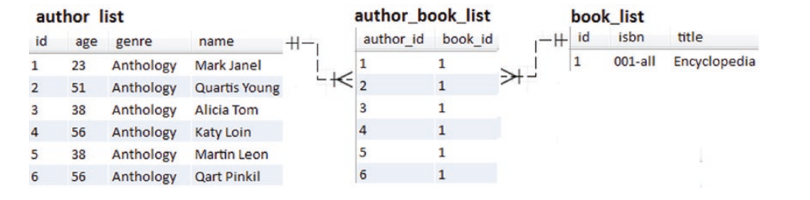

There is a book written by six authors. The goal is to fetch the authors in descending order by name via Book#getAuthors(). This can be done by adding @OrderBy in Book, as shown here:

```
@ManyToMany(mappedBy = "books")
@OrderBy("name DESC")
private Setauthor authors = new HashSet<>();
```

When getAuthors() is called, the @OrderBy will:

1. Attach the corresponding ORDER BY clause to the triggered SQL. This will instruct the database to order the fetched data.
2. Signal to Hibernate to preserve the order. Behind the scenes, Hibernate will preserve the order via a LinkedHashSet

So, calling getAuthors() will result in a Set of authors conforming to the @OrderBy information. The triggered SQL is the following SELECT containing the ORDER BY clause:

```
SELECT
authors0_.book_id AS book_id2_1_0_,
authors0_.author_id AS author_i1_1_0_,
author1_.id AS id1_0_1_,
author1_.age AS age2_0_1_,
author1_.genre AS genre3_0_1_,
author1_.name AS name4_0_1_
FROM author_book authors0_
INNER JOIN author author1_
ON authors0_.author_id = author1_.id
WHERE authors0_.book_id = ?
ORDER BY author1_.name DESC
```

Displaying Set will output the following (via Author#toString()):

```
Author{id=2, name=Quartis Young, genre=Anthology, age=51},
Author{id=6, name=Qart Pinkil, genre=Anthology, age=56},
Author{id=5, name=Martin Leon, genre=Anthology, age=38},
Author{id=1, name=Mark Janel, genre=Anthology, age=23},
Author{id=4, name=Katy Loin, genre=Anthology, age=56},
Author{id=3, name=Alicia Tom, genre=Anthology, age=38}
```

Using @OrderBy with HashSet will preserve the order of the loaded/fetched Set, but this is not consistent across the transient state. If this is an issue, to get consistency across the transient state as well, consider explicitly using LinkedHashSet instead of HashSet. So, for full consistency, use:

```
@ManyToMany(mappedBy = "books")
@OrderBy("name DESC")
private Setauthor authors = new LinkedHashSet<>();
```

## Why and When to Avoid Removing Child Entities with CascadeType.Remove and orphanRemoval=true

First of all, let’s quickly highlight the differences between CascadeType.REMOVE and orphanRemoval=true

Let’s use the Author and Book entities involved in a bidirectional lazy @OneToMany association, written as follows:

```
// in Author.java
@OneToMany(cascade = CascadeType.ALL,
mappedBy = "author", orphanRemoval = true)                                                                                                               private List books = new ArrayList<>();// in Book.java
@ManyToOne(fetch = FetchType.LAZY)
@JoinColumn(name = "author_id")
private Author author;
```

Removing an Author entity is automatically cascaded to the associated Book entities. This is happening as long as CascadeType.REMOVE or orphanRemoval=true is present. In other words, from this perspective, the presence of both is redundant.

Then how are they different? Well, consider the following helper-method used to disconnect (or disassociate) a Book from its Author:

```
public void removeBook(Book book) {
book.setAuthor(null);
this.books.remove(book);
}
```

Or, to disconnect all Books from their Authors:

```
public void removeBooks() {
Iteratorbook iterator = this.books.iterator();
while (iterator.hasNext()) {
Book book = iterator.next();
book.setAuthor(null);
iterator.remove();
}
}
```

Calling the removeBook() method in the presence of orphanRemoval=true will result in automatically removing the book via a DELETE statement.

Calling it in the presence of orphanRemoval=false will trigger an UPDATE statement.

Since disconnecting a Book is not a remove operation, the presence of CascadeType.REMOVE doesn’t matter.

So, orphanRemoval=true is useful for cleaning up entities (remove dangling references) that should not exist without a reference from an owner entity (Author).

But how efficient are these settings? The short answer is: not very efficient if they must affect a significant number of entities.

The long answer starts by deleting an author in the following service-method (this author has three associated books):

```
@Transactional
public void deleteViaCascadeRemove() {
Author author = authorRepository.findByName("Joana Nimar");
authorRepository.delete(author);
}
```

Deleting an author will cascade the deletion to the associated books. This is the effect of CascadeType.ALL, which includes CascadeType.REMOVE. But, before deleting the associated books, they are loaded in the Persistence Context via a SELECT. If they are already in the Persistence Context then they are not loaded. If the books are not present in the Persistence Context then CascadeType.REMOVE will not take effect. Further, there are four DELETE statements, one for deleting the author and three for deleting the associated books:

```
DELETE
FROM book
WHERE id=?
Binding:[1]
DELETE
FROM book
WHERE id=?
Binding:[2]
DELETE
FROM book
WHERE id=?
Binding:[4]
DELETE
FROM author
WHERE id=?
Binding:[4]
```

For each book there is a separate DELETE statement. The more books there are to delete, the more DELETE statements you have and the larger the performance penalty.

Now let’s write a service-method that deletes based on the orphanRemoval=true. For the sake of variation, this time, we load the author and the associated books in the same SELECT.

```
@Transactional
public void deleteViaOrphanRemoval() {
Author author = authorRepository.findByNameWithBooks("Joana Nimar");
author.removeBooks();
authorRepository.delete(author);
}
```

Unfortunately, this approach will trigger the exact same DELETE statements as in the case of cascading the deletes, so it’s prone to the same performance penalties.

If your application triggers sporadic deletes, you can rely on CascadeType.REMOVE and/or orphanRemoval=true. This is useful especially if you delete managed entities, so you need Hibernate to manage the entities state transitions. Moreover, via this approach, you benefit from the automatic Optimistic Locking mechanism (e.g., @Version) for parents and children. But, if you are just looking for approaches that delete more efficiently (in fewer DML statements), we will consider a few of them. Of course, each approach has its own trade-offs

The following four approaches delete the authors and the associated books via bulk operations. This way, you can optimize and control the number of triggered DELETE statements. These operations are very fast, but they have three main shortcomings:

1. They ignore the automatic Optimistic Locking mechanism (for example, you cannot rely on @Version anymore)
2. The Persistence Context is not synchronized to reflect the modifications performed by the bulk operations, which may lead to an outdated context
3. They don’t take advantage of cascading removals (CascadeType. REMOVE) or orphanRemoval

If these shortcomings matter to you, you have two options: avoid bulk operations or explicitly deal with the problem. The most difficult part is to emulate the job of the automatic Optimistic Locking mechanism for children that are not loaded in the Persistence Context.

The following examples assume that there is no automatic Optimistic Locking mechanism enabled. However, they manage the Persistence Context synchronization issues via flushAutomatically = true and clearAutomatically = true. Do not conclude that these two settings are always needed. Their usage depends on what you want to achieve.

### Deleting Authors that Are Already Loaded in the Persistence Context

Let’s tackle the case when, in the Persistence Context, there is only one Author loaded and the case when there are more Authors loaded, but not all of them. The associated books (which are or aren’t already loaded in the Persistence Context) have to be deleted as well.

### One Author Has Already Been Loaded in the Persistence Context

Let’s assume that the Author that should be deleted was loaded earlier in the Persistence Context without their associated Book. To delete this Author and the associated books, you can use the author identifier (author.getId()). First, delete all the author’s associated books:

```
// add this method in BookRepository@Transactional
@Modifying(flushAutomatically = true, clearAutomatically = true)
@Query("DELETE FROM Book b WHERE b.author.id = ?1")
public int deleteByAuthorIdentifier(Long id);
```

Then, let’s delete the author by his identifier:

```
// add this method in AuthorRepository
@Transactional
@Modifying(flushAutomatically = true, clearAutomatically = true)
@Query("DELETE FROM Author a WHERE a.id = ?1")
public int deleteByIdentifier(Long id);
```

The presence of flushAutomatically = true, clearAutomatically = true is explained a little bit later. For now, the service-method responsible for triggering the deletion is:

```
@Transactional
public void deleteViaIdentifiers() {
Author author = authorRepository.findByName("Joana Nimar");
bookRepository.deleteByAuthorIdentifier(author.getId());
authorRepository.deleteByIdentifier(author.getId());
}
```

Calling deleteViaIdentifiers() triggers the following queries:

```
DELETE FROM book
WHERE author_id = ?
```

Notice that the associated books are not loaded in the Persistence Context and there are only two DELETE statements triggered. The number of books doesn’t affect the number of DELETE statements. The author can be deleted via the built-in deleteInBatch(Iterable entities) as well:

authorRepository.deleteInBatch(List.of(author));

### More Authors Have Been Loaded in the Persistence Context

Let’s assume that the Persistence Context contains more Authors that should be deleted. For example, let’s delete all Authors of age 34 fetched as a List (let’s assume that there are two authors of age 34).

Trying to delete by author identifier (as in the previous case) will result in a separate DELETE for each author. Moreover, there will be a separate DELETE for the associated books of each author. So this is not efficient.

This time, let’s rely on two bulk operations. One defined by you via the IN operator (which allows you to specify multiple values in a WHERE clause) and the built-in deleteInBatch(Iterable entities):

```
// add this method in BookRepository
@Transactional
@Modifying(flushAutomatically = true, clearAutomatically = true)
@Query("DELETE FROM Book b WHERE b.author IN ?1")
public int deleteBulkByAuthors(Listauthor authors);
```

The service-methods to delete a List and the associated Book are as follows:

```
@Transactional
public void deleteViaBulkIn() {
Listauthor authors = authorRepository.findByAge(34);
bookRepository.deleteBulkByAuthors(authors);
authorRepository.deleteInBatch(authors);
}
```

Calling deleteViaBulkIn() triggers the following queries:

```
DELETE FROM book
WHERE author_id IN (?, ?)
DELETE FROM author
WHERE id = ?
OR id = ?
```

Notice that the associated books are not loaded in the Persistence Context and there are only two DELETE statements triggered. The number of authors and books doesn’t affect the number of DELETE statements.

### One Author and His Associated Books Have Been Loaded in the Persistence Context

Assume that the Author (the one that should be deleted) and his associated Books are already loaded in the Persistence Context. This time there is no need to define bulk operations since the built-in deleteInBatch(Iterable entities) can do the job for you:

```
@Transactional
public void deleteViaDeleteInBatch() {
Author author = authorRepository.findByNameWithBooks("Joana Nimar");
bookRepository.deleteInBatch(author.getBooks());
authorRepository.deleteInBatch(List.of(author));
}
```

The main shortcoming here is the default behavior of the built-in deleteInBatch(Iterable entities), which, by default, don’t flush or clear the Persistence Context. This may leave the Persistence Context in an outdated state.

Of course, in the previous methods, there is nothing to flush before deletions and no need to clear the Persistence Context because, after the delete operations, the transaction commits.

Therefore the Persistence Context is closed. But, flush and clear (not necessarily both of them) are needed in certain cases. Commonly, the clear operation is needed much more often than the flush operation.

For example, the following method doesn’t need a flush prior to any deletions, but it needs a clear after any deletions. Otherwise it will cause an exception:

```
@Transactional
public void deleteViaDeleteInBatch() {
Author author = authorRepository.findByNameWithBooks("Joana Nimar");
bookRepository.deleteInBatch(author.getBooks());
authorRepository.deleteInBatch(List.of(author));
...
// later on, we forgot that this author was deleted
author.setGenre("Anthology");
}
```

The highlighted code will cause an exception of type:

```
org.springframework.orm.ObjectOptimisticLockingFailureException: Object of class [com.bookstore.entity.Author] with identifier [4]: Optimistic Locking failed; nested exception is org.hibernate.StaleObjectStateException: Row was updated or deleted by another transaction (or unsaved-value mapping was incorrect) : [com.bookstore.entity.Author#4]
```

Practically, the modification (the call of setGenre()) changes the Author entity contained in the Persistence Context, but this context is outdated since the author was deleted from the database.

In other words, after deleting the author and the associated books from the database, they will continue to exist in the current Persistence Context.

The Persistence Context is not aware of the deletions performed via deleteInBatch(Iterable entities). To make sure that the Persistence Context is cleared after the deletions, you can override the deleteInBatch(Iterable entities) to add @Modifying(clearAutomatically = true).

This way, the Persistence Context is automatically cleared after the deletions. If you are in a use case that requires a prior flush as well, then use @Modifying(flushAutomatically = true, clearAutomatically = true) or call the flush() method.

Or, even better, you can reuse the deleteViaIdentifiers() method, as shown here (we’ve already annotated this method with @Modifying(flushAutomatically = true, clearAutomatically = true)):

```
@Transactional
public void deleteViaIdentifiers() {
Author author = authorRepository.findByNameWithBooks("Joana Nimar");
bookRepository.deleteByAuthorIdentifier(author.getId());
authorRepository.deleteByIdentifier(author.getId());
}
```

Calling deleteViaIdentifiers() triggers the following queries:

```
DELETE FROM book
WHERE author_id = ?
DELETE FROM author
WHERE id = ?
```

The number of books doesn’t affect the number of DELETE statements.

If the Persistence Context manages several Authors and the associated Books that should be deleted then rely on the deleteViaBulkIn().

### Deleting When the Author and Books that Should Be Deleted Are Not Loaded in the Persistence Context

If the author that should be deleted and his associated books are not loaded in the Persistence Context then you can hardcode the author identifier (if you know it), as in the following service-method:

```
@Transactional
public void deleteViaHardCodedIdentifiers() {
bookRepository.deleteByAuthorIdentifier(4L);
authorRepository.deleteByIdentifier(4L);
}
```

The deleteByAuthorIdentifier() and deleteByIdentifier() methods are the same from “One Author Have Been Already Loaded in the Persistence Context” section. The triggered queries are quite obvious:

```
DELETE FROM book
WHERE author_id = ?
DELETE FROM author
WHERE id = ?
```

If there are more authors, you can use bulk operations to delete them:

```
// add this method in BookRepository
@Transactional
@Modifying(flushAutomatically = true, clearAutomatically = true)
@Query("DELETE FROM Book b WHERE b.author.id IN ?1")
public int deleteBulkByAuthorIdentifier(List<Long> id);// add this method in AuthorRepository

@Transactional
@Modifying(flushAutomatically = true, clearAutomatically = true)
@Query("DELETE FROM Author a WHERE a.id IN ?1")
public int deleteBulkByIdentifier(List<long> id);
```

Now, let’s delete two authors and their associated books:

```
@Transactional
public void deleteViaBulkHardCodedIdentifiers() {
Listlong authorsIds = Arrays.asList(1L, 4L);
bookRepository.deleteBulkByAuthorIdentifier(authorsIds);
authorRepository.deleteBulkByIdentifier(authorsIds);
}
```

The triggered SQL statements are as follows:

```
DELETE FROM book
WHERE author_id IN (?, ?)
DELETE FROM author
WHERE id IN (?, ?)
```

The number of authors and books doesn’t affect the number of DELETE statements. Since we don’t load anything in the Persistence Context, flushAutomatically = true, clearAutomatically = true has no effect.

In order to avoid outdated entities in the Persistence Context, do not forget to flush the EntityManager before the query is executed (flushAutomatically = true) and clear it after the query is executed (clearAutomatically = true).

If you don’t want/need to flush and/or clear then pay attention to how you manage to avoid outdated entities in Persistence Context.

As long as you know what you are doing, it’s not problematic to not flush and/or clear the Persistence Context. Ideally isolate bulk operations in dedicated transactional service-methods. This way, there is no need to explicitly flush and clear the Persistence Context. Issues may arise when you interleave bulk operations with managed entity operations.

The most efficient way to delete all entities is via the built-in deleteAllInBatch(), which trigger a bulk operation.

## How to Fetch Associations via JPA Entity Graphs

Now, in a nutshell, entity graphs (aka, fetch plans) were introduced in JPA 2.1 and they help you improve the performance of loading entities by solving lazy loading exceptions and N+1 issues.

The developer specifies the entity’s related associations and basic fields that should be loaded in a single SELECT statement. The developer can define multiple entity graphs for the same entity and can chain any number of entities, and even use sub-graphs to create complex fetch plans. Entity graphs are global and reusable across the entities (Domain Model).

To override the current FetchType semantics, there are two properties that you can set:

1. Fetch graph: This is the default fetching type represented by the javax.persistence.fetchgraph property. The attributes present in attributeNodes are treated as FetchType.EAGER. The remaining attributes are treated as FetchType.LAZY, regardless of the default/ explicit FetchType.
2. Load graph: This fetching type can be employed via the javax. persistence.loadgraph property. The attributes present in attributeNodes are treated as FetchType.EAGER. The remaining attributes are treated according to their specified or default FetchType.

An entity graph can be defined via annotations (e.g., @NamedEntityGraph)), via attributePaths (ad hoc entity graphs), and via the EntityManager API by calling the getEntityGraph() or createEntityGraph() methods.

Assume the Author and Book entities involved in a bidirectional lazy @OneToMany association. The entity graph (a fetch graph) should load all Authors and the associated Books in the same SELECT. The same thing can be obtained via JOIN FETCH, but this time let’s do it via entity graphs.

### Defining an Entity Graph via @NamedEntityGraph

The @NamedEntityGraph annotation occurs at entity-level. Via its elements, the developer can specify a unique name for this entity graph (via the name element) and the attributes to include when fetching the entity graph (via the attributeNodes element, which contains a list of @NamedAttributeNode annotations separated by commas; each @NamedAttributeNode from this list corresponds to a field/association that should be fetched).

Let’s put the entity graph in code in the Author entity:

```
@Entity
@NamedEntityGraph(
name = "author-books-graph",
attributeNodes = {
@NamedAttributeNode("books")
}
)
public class Author implements Serializable {
private static final long serialVersionUID = 1L;
@Id
@GeneratedValue(strategy = GenerationType.IDENTITY)
private Long id;
private String name;
private String genre;
private int age;
@OneToMany(cascade = CascadeType.ALL,
mappedBy = "author", orphanRemoval = true)
private Listbook books = new ArrayList<>();
// getters and setters omitted for brevity
}
```

Next, focus on the repository of the Author entity, AuthorRepository.

The AuthorRepository is the place where the entity graph should be specified. Spring Data provides support for entity graphs via the @EntityGraph annotation (the class of this annotation is org.springframework.data.jpa.repository.EntityGraph).

### Overriding a Query Method

For example, the code to use the entity graph (author-books-graph) to find all Authors, including the associated Book, is as follows

EntityGraph.EntityGraphType.FETCH is the default and indicates a fetch graph;

EntityGraph.EntityGraphType.LOAD can be specified for a load graph;

```
@Repository
@Transactional(readOnly = true)
public interface AuthorRepository extends JpaRepositoryauthor, {
@Override
@EntityGraph(value = "author-books-graph",
type = EntityGraph.EntityGraphType.FETCH)
public Listauthor findAll();
}
```

Calling the findAll() method will result in the following SQL SELECT statement:

```
SELECT
author0_.id AS id1_0_0_,
books1_.id AS id1_1_1_,
author0_.age AS age2_0_0_,
author0_.genre AS genre3_0_0_,
author0_.name AS name4_0_0_,
books1_.author_id AS author_i4_1_1_,
books1_.isbn AS isbn2_1_1_,
books1_.title AS title3_1_1_,
books1_.author_id AS author_i4_1_0__,
books1_.id AS id1_1_0__
FROM author author0_
LEFT OUTER JOIN book books1_
ON author0_.id = books1_.author_id
```

Notice that the generated query took into account the entity graph specified via @EntityGraph.

### Using the Query Builder Mechanism

Overriding findAll() is a convenient way to fetch all entities. But, use the Spring Data Query Builder mechanism to filter the fetched data via the WHERE clause. For example, you can fetch the entity graph for authors younger than the given age and in descending order by name as follows:

```
@Repository
@Transactional(readOnly = true)
public interface AuthorRepository extends JpaRepositoryauthor, {
@EntityGraph(value = "author-books-graph",
type = EntityGraph.EntityGraphType.FETCH)
public Listauthor findByAgeLessThanOrderByNameDesc(int age);
}
```

The generated SQL SELECT statement is shown here:

```
SELECT
...
FROM author author0_
LEFT OUTER JOIN book books1_
ON author0_.id = books1_.author_id
WHERE author0_.age < ?
ORDER BY author0_.name DESC
```

### Using Specification

Using Specification is also supported. For example, let’s assume the following classical Specification for generating WHERE age > 45:

```
public class AuthorSpecs {
private static final int AGE = 45;
public static Specificationauthor isAgeGt45() {
return (Rootauthor root,
CriteriaQuery? query, CriteriaBuilder builder)
-> builder.greaterThan(root.get("age"), AGE);
}
}
```

Let’s use this Specification:

```
@Repository
@Transactional(readOnly = true)
public interface AuthorRepository extends JpaRepositoryauthor,,
JpaSpecificationExecutorauthor {
@Override
@EntityGraph(value = "author-books-graph",
type = EntityGraph.EntityGraphType.FETCH)
public Listauthor findAll(Specification spec);
}
```

```
List authors = authorRepository.findAll(isAgeGt45());
```

The generated SQL SELECT statement is as follows:

```
SELECT
...
FROM author author0_
LEFT OUTER JOIN book books1_
ON author0_.id = books1_.author_id
WHERE author0_.age > 45
```

### Using @Query and JPQL

Pay attention to queries that are used with entity graphs that specify join fetching. In such cases, it’s mandatory to have the owner of the fetched association present in the SELECT list.

@EntityGraph(value = "author-books-graph",
type = EntityGraph.EntityGraphType.FETCH)
@Query(value="SELECT a FROM Author a WHERE a.age > 20 AND a.age < 40")
public Listauthor fetchAllAgeBetween20And40();
The SQL SELECT statement is as follows:

```
SELECT
...
FROM author author0_
LEFT OUTER JOIN book books1_
ON author0_.id = books1_.author_id
WHERE author0_.age > 20 AND author0_.age < 40
```

### consider

**MultipleBagFetchException:**

* This exception occurs when you attempt multiple eager fetches in Hibernate, and it can happen both with entity graphs and when manually constructing queries.
* The multiple eager fetches might result in loading a large number of records due to the Cartesian product, which can be a performance bottleneck.

@EntityGraph(graphType = EntityGraphType.FETCH, attributePaths = { "authors", "chapters.sections.pages" })
@Query("SELECT b FROM Book b")
List<Book> findAllWithEagerLoading();

also

```
@Entity
public class Order {
@Id
@GeneratedValue(strategy = GenerationType.IDENTITY)
private Long id;@OneToMany(mappedBy = "order", fetch = FetchType.EAGER)
private Setproduct products;

// Other Order fields and methods
}@Entity
public class Product {
@Id
@GeneratedValue(strategy = GenerationType.IDENTITY)
private Long id;@ManyToOne
@JoinColumn(name = "order_id")
private Order order;

// Other Product fields and methods
}
```

Here, if you retrieve orders with their products using eager fetching (by default, Hibernate uses Sets for one-to-many associations), you might encounter a MultipleBagFetchException.

**Solutions**

**Fetch Associations One at a Time:**

To avoid the MultipleBagFetchException and improve performance, you can fetch associations one at a time. Here's an example of how you can achieve this using separate queries:

```
@Repository
public class BookRepository {@PersistenceContext
private EntityManager entityManager;

public Listbook findAllBooks() {
    TypedQuerybook query = entityManager.createQuery("SELECT b FROM Book b", Book.class);
    return query.getResultList();
}

public Listauthor findAuthorsForBook(Book book) {
    // Fetch authors for a specific book
    return book.getAuthors();
}

public Listchapter findChaptersForBook(Book book) {
    // Fetch chapters for a specific book
    return book.getChapters();
}

// Define similar methods for fetching sections and pages.
}
```

In this solution, you fetch the list of books separately and then fetch authors, chapters, sections, and pages for each book as needed. This avoids eager loading of all associations at once and minimizes the Cartesian product.

Switching from Set to List:

To address the MultipleBagFetchException, you can switch from using `Set` to `List` for your associations. Modify the `Order` entity like this:

```
@Entity
public class Order {
@Id
@GeneratedValue(strategy = GenerationType.IDENTITY)
private Long id;@OneToMany(mappedBy = "order", fetch = FetchType.EAGER)
private Listproduct products;

// Other Order fields and methods
}
```

While this change avoids the MultipleBagFetchException, it can still be inefficient in terms of performance because it may lead to a large number of rows in the result set (cartesian product).

**Fetching One Association at a Time:**

Rather than eagerly fetching both Books and Chapters simultaneously, you can fetch one association at a time to avoid the Cartesian product issue.

```
//fetch books
EntityGraphauthor graph = entityManager.createEntityGraph(Author.class);
graph.addSubgraph("books");
Author author = entityManager.find(Author.class, authorId, Collections.singletonMap("javax.persistence.fetchgraph", graph));
// Fetch Chapters separately
EntityGraphauthor chapterGraph = entityManager.createEntityGraph(Author.class);
chapterGraph.addSubgraph("chapters");
author = entityManager.find(Author.class, authorId, Collections.singletonMap("javax.persistence.fetchgraph", chapterGraph));
```

**Native Queries with Entity Graphs:**

you cannot use entity graphs with native SQL queries in Hibernate. Entity graphs are a feature of JPA (Java Persistence API) and are not applicable to native SQL queries.

**Pagination and In-Memory Processing:**

When using entity graphs that translate into SQL JOINs for fetching associated collections, pagination may not work as expected.

In such cases, pagination could occur in-memory, leading to potential performance issues.

### Ad Hoc Entity Graphs

An ad hoc entity graph can be defined via the attributePaths element of the @EntityGraph annotation. The entity’s related associations and basic fields that should be loaded in a single SELECT are specified as a list separated by comma of type,

```
@EntityGraph(attributePaths = {"attr1", "attr2", ...}.
```

Obviously, this time, there is no need to use @NamedEntityGraph.

For example, the entity graph from the previous section can be written as follows:

```
@Repository
@Transactional(readOnly = true)
public interface AuthorRepository extends JpaRepositoryauthor, {
@Override
@EntityGraph(attributePaths = {"books"},
type = EntityGraph.EntityGraphType.FETCH)
public Listauthor findAll();
}
```

Calling findAll() triggers the same SQL SELECT statement as @NamedEntityGraph:

```
SELECT
author0_.id AS id1_0_0_,
books1_.id AS id1_1_1_,
author0_.age AS age2_0_0_,
author0_.genre AS genre3_0_0_,
author0_.name AS name4_0_0_,
books1_.author_id AS author_i4_1_1_,
books1_.isbn AS isbn2_1_1_,
books1_.title AS title3_1_1_,
books1_.author_id AS author_i4_1_0__,
books1_.id AS id1_1_0__
FROM author author0_
LEFT OUTER JOIN book books1_
ON author0_.id = books1_.author_id
```

Ad hoc entity graphs are a convenient way to keep the entity graph definition at the repository-level and not alter the entities with @NamedEntityGraph.

### Defining an Entity Graph via EntityManager

To get an entity graph directly via EntityManager, you call the getEntityGraph(String entityGraphName) method. Next, pass the return of this method to the overloaded find() method, as in the following snippet of code:

```
EntityGraph entityGraph = entityManager
.getEntityGraph("author-books-graph");
Mapstring, properties = new HashMap<>();
properties.put("javax.persistence.fetchgraph", entityGraph);
Author author = entityManager.find(Author.class, id, properties);
```

JPQL and EntityManager can be used as well:

```
EntityGraph entityGraph = entityManager
.getEntityGraph("author-books-graph");
Author author = entityManager.createQuery(
"SELECT a FROM Author a WHERE a.id = :id", Author.class)
.setParameter("id", id)
.setHint("javax.persistence.fetchgraph", entityGraph)
.getSingleResult();
Or via CriteriaBuilder and EntityManager:
EntityGraph entityGraph = entityManager
.getEntityGraph("author-books-graph");
CriteriaBuilder criteriaBuilder = entityManager.getCriteriaBuilder();
CriteriaQueryauthor criteriaQuery
= criteriaBuilder.createQuery(Author.class);
Rootauthor author = criteriaQuery.from(Author.class);
criteriaQuery.where(criteriaBuilder.equal(root.longget("id"), id));
TypedQueryauthor typedQuery = entityManager.createQuery(criteriaQuery);
typedQuery.setHint("javax.persistence.loadgraph", entityGraph);
Author author = typedQuery.getSingleResult();
```

You can create an entity graph via the EntityManager#createEntityGraph() method.

## How to Fetch Associations via Entity Sub-Graphs

Entity graphs are prone to performance penalties as well. Creating big trees of entities (e.g., sub-graphs that have sub-graphs) or loading associations (and/or fields) that are not needed will cause performance penalties. Think about how easy it is to create Cartesian products of type m x n x p x..., which grow to huge values very fast.

Sub-graphs allow you to build complex entity graphs. Mainly, a sub-graph is an entity graph that is embedded into another entity graph or entity sub-graph.

Let’s look at three entities—Author, Book, and Publisher. The Author and Book entities are involved in a bidirectional lazy @OneToMany association. The Publisher and Book entities are also involved in a bidirectional lazy @OneToMany association.

Between Author and Publisher there is no association.

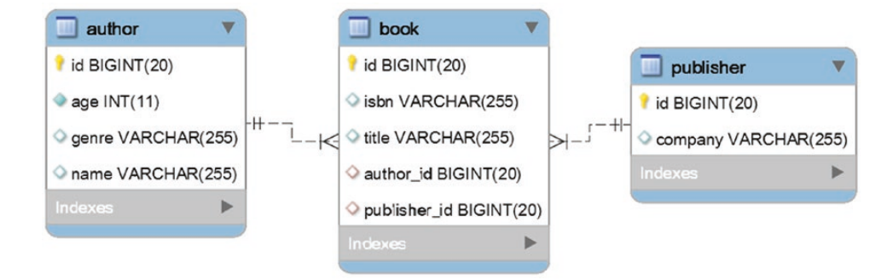

The goal of this entity graph is to fetch all authors with associated books, and further, the publishers associated with these books. For this, let’s use the entity sub-graphs.

### Using @NamedEntityGraph and @NamedSubgraph

In the Author entity use the @NamedEntityGraph to define the entity graph to eagerly load the authors and the associated books and @NamedSubgraph to define the entity sub-graph for loading the publishers associated with the loaded books:

```
@Entity
@NamedEntityGraph(
name = "author-books-publisher-graph",
attributeNodes = {
@NamedAttributeNode(value = "books", subgraph = "publisher-subgraph")
},
subgraphs = {
@NamedSubgraph(
name = "publisher-subgraph",
attributeNodes = {
@NamedAttributeNode("publisher")
}
)
}
)
public class Author implements Serializable {
private static final long serialVersionUID = 1L;
@Id
@GeneratedValue(strategy = GenerationType.IDENTITY)
private Long id;
private String name;
private String genre;
private int age;
@OneToMany(cascade = CascadeType.ALL,
mappedBy = "author", orphanRemoval = true)
private Listbook books = new ArrayList<>();
// getters and setters omitted for brevity
}
```

And the relevant part from Book is listed here:

```
@Entity
public class Book implements Serializable {
...
@ManyToOne(fetch = FetchType.LAZY)
@JoinColumn(name = "publisher_id")
private Publisher publisher;
...
}
```

Further, let’s use the entity graph in AuthorRepository:

```
@Repository
@Transactional(readOnly = true)
public interface AuthorRepository extends JpaRepositoryauthor, {
@Override
@EntityGraph(value = "author-books-publisher-graph",
type = EntityGraph.EntityGraphType.FETCH)
public Listauthor findAll();
}
```

Calling findAll() triggers the following SQL SELECT statement:

```
SELECT
author0_.id AS id1_0_0_,
books1_.id AS id1_1_1_,
publisher2_.id AS id1_2_2_,
author0_.age AS age2_0_0_,
author0_.genre AS genre3_0_0_,
author0_.name AS name4_0_0_,
books1_.author_id AS author_i4_1_1_,
books1_.isbn AS isbn2_1_1_,
books1_.publisher_id AS publishe5_1_1_,
books1_.title AS title3_1_1_,
books1_.author_id AS author_i4_1_0__,
books1_.id AS id1_1_0__,
publisher2_.company AS company2_2_2_
FROM author author0_
LEFT OUTER JOIN book books1_
ON author0_.id = books1_.author_id
LEFT OUTER JOIN publisher publisher2_
ON books1_.publisher_id = publisher2_.id
```

Although it’s quite obvious, let’s mention that sub-graphs can be used with the Query Builder mechanism, Specification, and JPQL. For example, here’s the sub-graph used with JPQL:

### Using the Dot Notation (.) in Ad Hoc Entity Graphs

Sub-graphs can be used in ad hoc entity graphs as well. Remember that ad hoc entity graphs allows you to keep the entity graph definition at repository-level and not alter the entities with @NamedEntityGraph.

To use sub-graphs, you just chain the needed associations using the dot notation (.), as shown in the following example:

```
@Repository
@Transactional(readOnly = true)
public interface AuthorRepository extends JpaRepositoryauthor, {
@Override
@EntityGraph(attributePaths = {"books.publisher"},
type = EntityGraph.EntityGraphType.FETCH)
public Listauthor findAll();
}
```

So, you can fetch the publishers associated with the books via the books.publisher path. The triggered SELECT is the same as when using @NamedEntityGraph and @ NamedSubgraph.

Let’s look at another example, just to get familiar with this idea. Let’s define an ad hoc entity graph to fetch all publishers and associated books, and further, the authors associated with these books. This time, the entity graph is defined in PublisherRepository as follows:

```
@Repository
@Transactional(readOnly = true)
public interface PublisherRepository
extends JpaRepositorypublisher, {
@Override
@EntityGraph(attributePaths = "books.author"},
type = EntityGraph.EntityGraphType.FETCH)
public Listpublisher findAll();
}
```

### Defining an Entity Sub-Graph via EntityManager

You can build an entity sub-graph directly via EntityManager and the EntityGraph. addSubgraph(String attributeName) method, as shown in the following snippet of code:

```
EntityGraphauthor entityGraph = entityManager
.createEntityGraph(Author.class);
Subgraphbook bookGraph = entityGraph.addSubgraph("books");
bookGraph.addAttributeNodes("publisher");
Mapstring, properties = new HashMap<>();
properties.put("javax.persistence.fetchgraph", entityGraph);
Author author = entityManager.find(Author.class, id, properties);
```

## How to Handle Entity Graphs and Basic Attributes

When Hibernate JPA is around, using entity graphs to fetch only some basic attributes of an entity (not all) requires a compromise solution based on:

* Enabling Hibernate Bytecode Enhancement
* Annotating the basic attributes that should not be part of the
  entity graph with @Basic(fetch = FetchType.LAZY)

Conforming to JPA specifications, entity graphs can override the current FetchType semantics via two properties—javax.persistence.fetchgraph and javax. persistence.loadgraph. Depending on the used property, the entity graph can be a fetch graph or a load graph. In the case of a fetch graph, the attributes present in attributeNodes are treated as FetchType.EAGER. The remaining attributes are treated as FetchType.LAZY regardless of the default/explicit FetchType. In the case of load graph, the attributes present in attributeNodes are treated as FetchType.EAGER. The remaining attributes are treated according to their specified or default FetchType.

That being said, let’s assume that the Author and Book entities are involved in a bidirectional lazy @OneToMany association. Moreover, in the Author entity, let’s define an entity graph to load the names of the authors and the associated books. There is no need to load the ages and genres of authors, so the age and genre basic fields are not specified in the entity graph:

```
@Entity
@NamedEntityGraph(
name = "author-books-graph",
attributeNodes = {
@NamedAttributeNode("name"),
@NamedAttributeNode("books")
}
)
public class Author implements Serializable {
private static final long serialVersionUID = 1L;
@Id
@GeneratedValue(strategy = GenerationType.IDENTITY)
private Long id;
private String name;
private String genre;
private int age;
@OneToMany(cascade = CascadeType.ALL,
mappedBy = "author", orphanRemoval = true)
private Listbook books = new ArrayList<>();
// getters and setters omitted for brevity
}
```

Let’s use this entity graph in AuthorRepository. To have both in the same repository, you can use two methods via the Query Builder mechanism. It produces almost identical SQL statements named findByAgeGreaterThanAndGenre() and findByGenreAndAgeGreaterThan():

```
@Repository
@Transactional(readOnly = true)
public interface AuthorRepository extends JpaRepositoryauthor, {
@EntityGraph(value = "author-books-graph",
type = EntityGraph.EntityGraphType.FETCH)
public Listauthor findByAgeGreaterThanAndGenre(int age, String genre);
@EntityGraph(value = "author-books-graph",
type = EntityGraph.EntityGraphType.LOAD)
public Listauthor findByGenreAndAgeGreaterThan(String genre, int age);
}
```

Calling the findByAgeGreaterThanAndGenre() triggers the following SQL SELECT statement (this is the fetch graph):

```
SELECT
author0_.id AS id1_0_0_,
books1_.id AS id1_1_1_,
author0_.age AS age2_0_0_,
author0_.genre AS genre3_0_0_,
author0_.name AS name4_0_0_,
books1_.author_id AS author_i4_1_1_,
books1_.isbn AS isbn2_1_1_,
books1_.title AS title3_1_1_,
books1_.author_id AS author_i4_1_0__,
books1_.id AS id1_1_0__
FROM author author0_
LEFT OUTER JOIN book books1_
ON author0_.id = books1_.author_id
WHERE author0_.age > ?
AND author0_.genre = ?
```

Notice that, even if age and genre are not part of the fetch graph, they have been fetched in the query. Let’s try the load graph via findByGenreAndAgeGreaterThan():

```
SELECT
author0_.id AS id1_0_0_,
books1_.id AS id1_1_1_,
author0_.age AS age2_0_0_,
author0_.genre AS genre3_0_0_,
author0_.name AS name4_0_0_,
books1_.author_id AS author_i4_1_1_,
books1_.isbn AS isbn2_1_1_,
books1_.title AS title3_1_1_,
books1_.author_id AS author_i4_1_0__,
books1_.id AS id1_1_0__
FROM author author0_
LEFT OUTER JOIN book books1_
ON author0_.id = books1_.author_id
WHERE author0_.genre = ?
AND author0_.age > ?
```

This time the presence of age and genre is normal. But these attributes (age and genre) are also loaded in the case of the fetch graph even if they are not explicitly specified via @ NamedAttributeNode.

By default, attributes are annotated with @Basic, which relies on the default fetch policy. The default fetch policy is FetchType.EAGER. Based on this statement, a compromise solution consists of annotating the basic attributes that should not be fetched in the fetch graph with @Basic(fetch = FetchType.LAZY) as here:

```
@Basic(fetch = FetchType.LAZY)
private String genre;
@Basic(fetch = FetchType.LAZY)
private int age;
```

But executing the fetch and load graph again reveals the exactly same queries. This means that the JPA specifications don’t apply to Hibernate with the basic (@Basic) attributes. Both the fetch graph and the load graph will ignore these settings as long as Bytecode Enhancement is not enabled. In Maven, add the following plug-in:

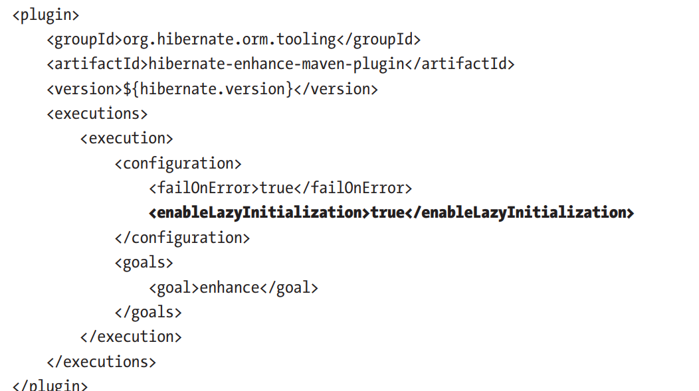

Finally, executing the fetch graph will reveal the expected SELECT:

```
SELECT
author0_.id AS id1_0_0_,
books1_.id AS id1_1_1_,
author0_.name AS name4_0_0_,
books1_.author_id AS author_i4_1_1_,
books1_.isbn AS isbn2_1_1_,
books1_.title AS title3_1_1_,
books1_.author_id AS author_i4_1_0__,
books1_.id AS id1_1_0__
FROM author author0_
LEFT OUTER JOIN book books1_
ON author0_.id = books1_.author_id
WHERE author0_.age > ?
AND author0_.genre = ?
```

Executing the load graph will reveal the expected SELECT as well:

```
SELECT
author0_.id AS id1_0_0_,
books1_.id AS id1_1_1_,
author0_.name AS name4_0_0_,
books1_.author_id AS author_i4_1_1_,
books1_.isbn AS isbn2_1_1_,
books1_.title AS title3_1_1_,
books1_.author_id AS author_i4_1_0__,
books1_.id AS id1_1_0__
FROM author author0_
LEFT OUTER JOIN book books1_
ON author0_.id = books1_.author_id
WHERE author0_.genre = ?
AND author0_.age > ?
```

## How to Filter Associations via a Hibernate-Specific @Where Annotation

The @Where annotation is simple to use and can be useful for filtering the fetched association by appending a WHERE clause to the query.

Let’s use the Author and Book entities involved in a bidirectional lazy @OneToMany association. The goal is to lazy fetch the following:

. All books
• All books cheaper than $20
• All books more expensive than $20

To filter the cheaper/more expensive books, the Author entity relies on @Where as follows:

```
@Entity
public class Author implements Serializable {
private static final long serialVersionUID = 1L;
@Id
@GeneratedValue(strategy = GenerationType.IDENTITY)
private Long id;
private String name;
private String genre;
private int age;
@OneToMany(cascade = CascadeType.ALL,
mappedBy = "author", orphanRemoval = true)
private Listbook books = new ArrayList<>();
@OneToMany(cascade = CascadeType.ALL,
mappedBy = "author", orphanRemoval = true)
@Where(clause = "price <= 20")
private Listbook cheapBooks = new ArrayList<>();
@OneToMany(cascade = CascadeType.ALL,
mappedBy = "author", orphanRemoval = true)
@Where(clause = "price > 20")
private Listbook restOfBooks = new ArrayList<>();
...
}
```

Further, let’s write three service-methods that will trigger the three queries:

```
@Transactional(readOnly = true)
public void fetchAuthorWithAllBooks() {
Author author = authorRepository.findById(1L).orElseThrow();
Listbook books = author.getBooks();
System.out.println(books);
}@Transactional(readOnly = true)
public void fetchAuthorWithCheapBooks() {
Author author = authorRepository.findById(1L).orElseThrow();
Listbook books = author.getCheapBooks();
System.out.println(books);
}
@Transactional(readOnly = true)
public void fetchAuthorWithRestOfBooks() {
Author author = authorRepository.findById(1L).orElseThrow();
Listbook books = author.getRestOfBooks();
System.out.println(books);
}
```

Calling fetchAuthorWithCheapBooks() triggers the following SQL statement, which fetches the books cheaper than \$20:

```
SELECT
cheapbooks0_.author_id AS author_i5_1_0_,
cheapbooks0_.id AS id1_1_0_,
cheapbooks0_.id AS id1_1_1_,
cheapbooks0_.author_id AS author_i5_1_1_,
cheapbooks0_.isbn AS isbn2_1_1_,
cheapbooks0_.price AS price3_1_1_,
cheapbooks0_.title AS title4_1_1_
FROM book cheapbooks0_
WHERE (cheapbooks0_.price <= 20)
AND cheapbooks0_.author_id = ?
```

Hibernate has appended the WHERE clause to instruct the database to filter the books by price <= 20.

Calling fetchAuthorWithRestOfBooks() will append the WHERE clause to filter the books by price > 20:

```
SELECT
restofbook0_.author_id AS author_i5_1_0_,
restofbook0_.id AS id1_1_0_,
restofbook0_.id AS id1_1_1_,
restofbook0_.author_id AS author_i5_1_1_,
restofbook0_.isbn AS isbn2_1_1_,
restofbook0_.price AS price3_1_1_,
restofbook0_.title AS title4_1_1_
FROM book restofbook0_
WHERE (restofbook0_.price > 20)
AND restofbook0_.author_id = ?
```

Notice that these queries fetch the books in a lazy fashion. In other words, these are additional SELECT queries triggered after fetching the author in a separate SELECT. This is okay as long as you don’t want to fetch the author and the associated books in the same SELECT. In such cases, switching from LAZY to EAGER should be avoided. Therefore, relying on JOIN FETCH WHERE is much better at least from two aspects:

* It fetches the associated books in the same SELECT with author
* It allows us to pass the given price as a query binding parameter

Nevertheless, @Where can be useful in several situations. For example, it can be used in a soft deletes implementation

## How to Optimize Unidirectional/ Bidirectional @OneToOne via @MapsId

Let’s use the Author and Book entities involved in a @OneToOne association.

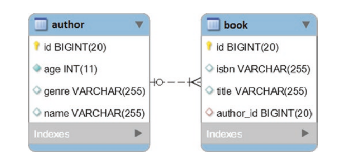

In relational databases (RDBMS), the one-to-one association involves a parent-side and a child-side that are “linked” via a unique foreign key. In JPA, this association is mapped via the @OneToOne annotation, and the association can be either unidirectional or bidirectional.

In this context, why is @MapsId so important in unidirectional and bidirectional @OneToOne associations? Well, let’s use a regular mapping and highlight the drawbacks from a performance perspective. Therefore, we focus on the unidirectional @OneToOne association.

### Regular Unidirectional @OneToOne

The Author is the parent-side and the Book is the child-side of the one-to-one association. The Author entity is listed here:

```
@Entity
public class Author implements Serializable {
private static final long serialVersionUID = 1L;
@Id
@GeneratedValue(strategy = GenerationType.IDENTITY)
private Long id;
private String name;
private String genre;
private int age;
// getters and setters omitted for brevity
}
```

The @OneToOne annotation is added on the child-side as follows:

```
@Entity
public class Book implements Serializable {
private static final long serialVersionUID = 1L;
@Id
@GeneratedValue(strategy = GenerationType.IDENTITY)
private Long id;
private String title;
private String isbn;
@OneToOne(fetch = FetchType.LAZY)
@JoinColumn(name = "author_id")
private Author author;
// getters and setters omitted for brevity
}
```

The @JoinColumn annotation is used to customize the name of the foreign key column.

The unidirectional @OneToOne controls the associated foreign key. In other words, the owning side of the relationship controls the foreign key. You call setAuthor() from a service-method as follows

```
@Transactional
public void newBookOfAuthor() {
Author author = authorRepository.findById(1L).orElseThrow();
Book book = new Book();
book.setTitle("A History of Ancient Prague");
book.setIsbn("001-JN");
book.setAuthor(author);
bookRepository.save(book);
}
```

Calling newBookOfAuthor() will produce the following INSERT statement in the book table:

```
INSERT INTO book (author_id, isbn, title)
VALUES (?, ?, ?)
Binding:[1, 001-JN, A History of Ancient Prague]
```

So, the JPA persistence provider (Hibernate) has populated the foreign key column (author\_id) value with the author identifier.

Everything looks fine so far! However, when the parent-side of such an association needs to fetch the associated child, it needs to trigger a JPQL query because the child entity identifier is unknown. Check out the following JPQL query

```
@Repository
public interface BookRepository extends JpaRepositorybook, {
@Query("SELECT b FROM Book b WHERE b.author = ?1")
public Book fetchBookByAuthor(Author author);
}
```

And, the service-method is as follows:

```
@Transactional(readOnly = true)
public Book fetchBookByAuthor() {
Author author = authorRepository.findById(1L).orElseThrow();
return bookRepository.fetchBookByAuthor(author);
}
```

Calling fetchBookByAuthor() will produce the following SQL statement:

```
SELECT
book0_.id AS id1_1_,
book0_.author_id AS author_i4_1_,
book0_.isbn AS isbn2_1_,
book0_.title AS title3_1_
FROM book book0_
WHERE book0_.author_id = ?
Binding:[1] Extracted:[1, 1, 001-JN, A History of Ancient Prague]
```

If the parent-side constantly/always needs the child-side as well, then triggering a new query can be a performance penalty'

The performance penalty highlighted gets worse if the application uses the Second Level Cache for storing Authors and Books. While the Authors and Books are stored in the Second Level Cache, fetching the associated child will still require a database round trip via the JPQL query listed here. Assuming that the parent knows the identifier of the child, it can take advantage of the Second Level Cache as follows

Author author = authorRepository.findById(1L).orElseThrow();
Book book = bookRepository.findById(author.getId()).orElseThrow();

But, since the child identifier is unknown, this code cannot be used. Other (not better) workarounds are to rely on query cache or @NaturalId.

### Regular Bidirectional @OneToOne

Let’s use the Author and Book entities involved in a bidirectional @OneToOne association. In other words, the parent-side relies on mappedBy as follows (the childside remains the same):

```
@Entity
public class Author implements Serializable {
private static final long serialVersionUID = 1L;
@Id
@GeneratedValue(strategy = GenerationType.IDENTITY)
private Long id;
private String name;
private String genre;
private int age;
@OneToOne(mappedBy = "author", cascade = CascadeType.ALL,
fetch = FetchType.LAZY)
private Book book;
// getters and setters omitted for brevity
}
```

The main drawback of the bidirectional @OneToOne can be observed by fetching the parent (Author) as follows:

```
Author author = authorRepository.findById(1L).orElseThrow();
```

Even if this is a LAZY association, fetching the Author will trigger the following SELECT statements:

```
SELECT
author0_.id AS id1_0_0_,
author0_.age AS age2_0_0_,
author0_.genre AS genre3_0_0_,
author0_.name AS name4_0_0_
FROM author author0_
WHERE author0_.id = ?SELECT
book0_.id AS id1_1_0_,
book0_.author_id AS author_i4_1_0_,
book0_.isbn AS isbn2_1_0_,
book0_.title AS title3_1_0_
FROM book book0_
WHERE book0_.author_id = ?
```

Next to the parent entity, Hibernate fetched the child entity as well. Obviously, if the application needs only the parent then fetching the child is just a waste of resources, which is a performance penalty.

The secondary query is caused by a parent-side dilemma. Without fetching the child entity, the JPA persistent provider (Hibernate) cannot know if it should assign the child reference to null or to an Object (concrete object or proxy object). Adding non-nullability awareness via the optional=false element to @OneToOne doesn’t help in this case.

A workaround consists of relying on Bytecode Enhancement and @LazyToOne(LazyToOneOption.NO\_PROXY) on the parent-side. Or, even better, rely on unidirectional @OneToOne and @MapsId.

### @MapsId to the Rescue of @OneToOne

The @MapsId is a JPA 2.0 annotation that can be applied to @ManyToOne and unidirectional (or bidirectional) @OneToOne associations. Via this annotation, the book table’s primary key can also be a foreign key referencing the author’s table primary key.

The author and book tables share primary keys

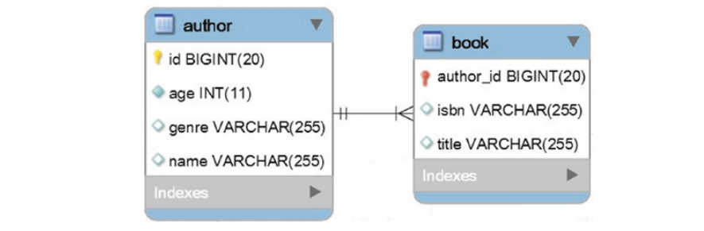

You add @MapsId to the child entity, as shown here:

```
@Entity
public class Book implements Serializable {
private static final long serialVersionUID = 1L;
@Id
private Long id;
private String title;
private String isbn;
@MapsId
@OneToOne(fetch = FetchType.LAZY)
@JoinColumn(name = "author_id")
private Author author;
// getters and setters omitted for brevity
}
```

Check out the identifier of the Book entity. There is no need for it to be generated (@GeneratedValue is not present) since this identifier is exactly the identifier of the author association. The Book identifier is set by Hibernate on your behalf.

The @JoinColumn annotation is used to customize the name of the primary key column

The parent entity is quite simple because there is no need to have a bidirectional @OneToOne (if this is what you initially had). The Author is as follows:

```
@Entity
public class Author implements Serializable {
private static final long serialVersionUID = 1L;
@Id
@GeneratedValue(strategy = GenerationType.IDENTITY)
private Long id;
private String name;
private String genre;
private int age;
// getters and setters omitted for brevity
}
```

Now, you can persist a Book via a service-method as follows

```
@Transactional
public void newBookOfAuthor() {
Author author = authorRepository.findById(1L).orElseThrow();
Book book = new Book();
book.setTitle("A History of Ancient Prague");
book.setIsbn("001-JN");
// this will set the id of the book as the id of the author
book.setAuthor(author);
bookRepository.save(book);
}
```

Calling newBookOfAuthor() reveals the following INSERT statement (this is the effect of calling the save() method):

```
INSERT INTO book (isbn, title, author_id)
VALUES (?, ?, ?)
Binding:[001-JN, A History of Ancient Prague, 1]
```

Notice that author\_id was set to the author identifier. This means that the parent and the child tables share the same primary key.

Further, the developer can fetch the Book via the Author identifier, as follows

```
@Transactional(readOnly = true)
public Book fetchBookByAuthorId() {
Author author = authorRepository.findById(1L).orElseThrow();
return bookRepository.findById(author.getId()).orElseThrow();
}
```

There are a bunch of advantages of using @MapsId, as follows:

* If Book is present in the Second Level Cache it will be fetched accordingly (no extra database round trip is needed). This is the main drawback of a regular unidirectional @OneToOne.
* Fetching the Author doesn’t automatically trigger an unnecessary additional query for fetching the Book as well. This is the main drawback of a regular bidirectional @OneToOne.
* Sharing the primary key reduces memory footprint (no need to index both the primary key and the foreign key)

## How to Validate that Only One Association Is Non-Null

Consider the Review entity. It defines three @ManyToOne relationships to Book, Article, and Magazine:

```
@Entity
public class Review implements Serializable {
private static final long serialVersionUID = 1L;
@Id
@GeneratedValue(strategy = GenerationType.IDENTITY)
private Long id;
private String content;
@ManyToOne(fetch = FetchType.LAZY)
private Book book;
@ManyToOne(fetch = FetchType.LAZY)
private Article article;
@ManyToOne(fetch = FetchType.LAZY)
private Magazine magazine;
// getters and setters omitted for brevity
}
```

In this context, a review can be associated with a book, a magazine, or an article. Implementing this constraint at application-level can be achieved via Bean Validation

Start by defining an annotation that will be added at class-level to the Review entity

```
@Target({ElementType.TYPE})
@Retention(RetentionPolicy.RUNTIME)
@Constraint(validatedBy = {JustOneOfManyValidator.class})
public @interface JustOneOfMany {
String message() default "A review can be associated with either
a book, a magazine or an article";
Class?[] groups() default {};
Class? extends Payload[] payload() default {};
}
```

Following the Bean Validation documentation, the @JustOneOfMany annotation is empowered by the following validation:

```
public class JustOneOfManyValidator
implements ConstraintValidatorjustoneofmany, {
@Override
public boolean isValid(Review review, ConstraintValidatorContext ctx) {
return Stream.of(
review.getBook(), review.getArticle(), review.getMagazine())
.filter(Objects::nonNull)
.count() == 1;
}
}
```

Finally, just add the @JustOneOfMany annotation at the class-level to the Review entity:

```
@Entity
@JustOneOfMany
public class Review implements Serializable {
...
}
```

### Testing Time

The database already contains a Book, an Article, and a Magazine. The following service-method will successfully save a Review of a Book:

```
@Transactional
public void persistReviewOk() {
Review review = new Review();
review.setContent("This is a book review ...");
review.setBook(bookRepository.findById(1L).get());
reviewRepository.save(review);

```

}

On the other hand, the following service-method will not succeed to persist a Review. It will fail the validation specified via @JustOneOfMany since the code tries to set this review to an Article and to a Magazine:

```
@Transactional
public void persistReviewWrong() {
Review review = new Review();
review.setContent("This is an article and magazine review ...");
review.setArticle(articleRepository.findById(1L).get());
// this will fail validation
review.setMagazine(magazineRepository.findById(1L).get());
reviewRepository.save(review);
}
```

Nevertheless, note that native queries can bypass this application-level validation. If you know that such a scenario is possible, you have to add this validation at the databaselevel as well. In MySQL, this can be done via a TRIGGER, as follows:

```
CREATE TRIGGER Just_One_Of_Many
BEFORE INSERT ON review
FOR EACH ROW
BEGIN
IF (NEW.article_id IS NOT NULL AND NEW.magazine_id IS NOT NULL)
OR (NEW.article_id IS NOT NULL AND NEW.book_id IS NOT NULL)
OR (NEW.book_id IS NOT NULL AND NEW.magazine_id IS NOT NULL) THEN
SIGNAL SQLSTATE '45000'
SET MESSAGE_TEXT='A review can be associated with either
a book, a magazine or an article';
END IF;
END;
```

## Entities

### How to Adopt a Fluent API Style in Entities

Consider the Author and Book entities, which are involved in a bidirectional lazy @OneToMany association,

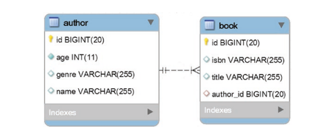

Usually, you can create an Author with Books as follows (e.g., one author with two books):

```
Author author = new Author();
author.setName("Joana Nimar");
author.setAge(34);
author.setGenre("History");Book book1 = new Book();
book1.setTitle("A History of Ancient Prague");
book1.setIsbn("001-JN");Book book2 = new Book();
book2.setTitle("A People's History");
book2.setIsbn("002-JN");// addBook() is a helper method defined in Author class
author.addBook(book1);
author.addBook(book2);
```

You can also write this snippet in fluent-style in at least two ways.

Fluent-style is primarily designed to be readable and to create a code-flowing sensation.

#### Fluent-Style via Entity Setters

Let’s employee fluent-style via the entity setters. Typically, an entity setter method returns void. You can alter the entity setters to return this instead of void as follows (this should be done for the helper methods as well):

```
@Entity
public class Author implements Serializable {
private static final long serialVersionUID = 1L;
@Id
@GeneratedValue(strategy = GenerationType.IDENTITY)
private Long id;
private String name;
private String genre;
private int age;
@OneToMany(cascade = CascadeType.ALL,
mappedBy = "author", orphanRemoval = true)
private Listbook books = new ArrayList<>();
public Author addBook(Book book) {
this.books.add(book);
book.setAuthor(this);
return this;
}
public Author removeBook(Book book) {
book.setAuthor(null);
this.books.remove(book);
return this;
}
public Author setId(Long id) {
this.id = id;
return this;
}
public Author setName(String name) {
this.name = name;
return this;
}
public Author setGenre(String genre) {
this.genre = genre;
return this;
}
public Author setAge(int age) {
this.age = age;
return this;
}
public Author setBooks(Listbook books) {
this.books = books;
return this;
}
// getters omitted for brevity
}
```

```
@Entity
public class Book implements Serializable {
private static final long serialVersionUID = 1L;
@Id
@GeneratedValue(strategy = GenerationType.IDENTITY)
private Long id;
private String title;
private String isbn;
@ManyToOne(fetch = FetchType.LAZY)
@JoinColumn(name = "author_id")
private Author author;
public Book setId(Long id) {
this.id = id;
return this;
}
public Book setTitle(String title) {
this.title = title;
return this;
}public Book setIsbn(String isbn) {
this.isbn = isbn;
return this;
}
public Book setAuthor(Author author) {
this.author = author;
return this;
}
// getters omitted for brevity
}
```

The setters return this instead of void, so they can be chained in a fluent-style as follows

```
Author author = new Author()
.setName("Joana Nimar")
.setAge(34)
.setGenre("History")
.addBook(new Book()
.setTitle("A History of Ancient Prague")
.setIsbn("001-JN"))
.addBook(new Book()
.setTitle("A People's History")
.setIsbn("002-JN"));
```

#### Fluent-Style via Additional Methods

You can also implement a fluent-style approach via other methods, instead of altering the entity setters, as follows:

```
@Entity
public class Author implements Serializable {
private static final long serialVersionUID = 1L;
@Id
@GeneratedValue(strategy = GenerationType.IDENTITY)
private Long id;
private String name;
private String genre;
private int age;
@OneToMany(cascade = CascadeType.ALL,
mappedBy = "author", orphanRemoval = true)
private Listbook books = new ArrayList<>();
public Author addBook(Book book) {
this.books.add(book);
book.setAuthor(this);
return this;
}
public Author removeBook(Book book) {
book.setAuthor(null);
this.books.remove(book);
return this;
}
public Author id(Long id) {
this.id = id;
return this;
}
public Author name(String name) {
this.name = name;
return this;
}
public Author genre(String genre) {
this.genre = genre;
return this;
}
public Author age(int age) {
this.age = age;
return this;
}
public Author books(Listbook books) {
this.books = books;
return this;
}
// getters and setters omitted for brevity
}
```

```
@Entity
public class Book implements Serializable {
private static final long serialVersionUID = 1L;
@Id
@GeneratedValue(strategy = GenerationType.IDENTITY)
private Long id;
private String title;
private String isbn;
@ManyToOne(fetch = FetchType.LAZY)
@JoinColumn(name = "author_id")
private Author author;
public Book id(Long id) {
this.id = id;
return this;
}
public Book title(String title) {
this.title = title;
return this;
}
public Book isbn(String isbn) {
this.isbn = isbn;
return this;
}
public Book author(Author author) {
this.author = author;
return this;
}
// getters and setters omitted for brevity
}
```

This time, these additional methods can be used in a fluent-style approach, as shown in the following snippet of code:

```
Author author = new Author()
.name("Joana Nimar")
.age(34)
.genre("History")
.addBook(new Book()
.title("A History of Ancient Prague")
.isbn("001-JN"))
.addBook(new Book()
.title("A People's History")
.isbn("002-JN"));
```

### How to Populate a Child-Side Parent Association via a Hibernate-Specific Proxy

You can fetch an entity by identifier via the Spring built-in query methods, findById() or getOne(). Behind the findById() method, Spring uses EntityManager#find(), and behind the getOne() method, Spring uses EntityManager#getReference().

Calling findById() returns the entity from the Persistence Context, the Second Level Cache, or the database (this is the strict order of attempting to find the indicated entity). Therefore, the returned entity is the same type as the declared entity mapping

On the other hand, calling getOne() will return a Hibernate-specific proxy object. This is not the actual entity type. A Hibernate-specific proxy can be useful when a child entity can be persisted with a reference to its parent (@ManyToOne or @OneToOne lazy association).

In such cases, fetching the parent entity from the database (executing the corresponding SELECT statement) is a performance penalty and merely a pointless action, because Hibernate can set the underlying foreign key value for an uninitialized proxy.

Let’s put this statement in practice via the @ManyToOne association. This association is a common JPA association, and it maps exactly to the one-to-many table relationship.

Therefore, consider that the Author and Book entities are involved in an unidirectional lazy @ManyToOne association. In the following example, the Author entity represents the parent-side, while the Book is the child-side. The author and book tables involved in this relationship are shown

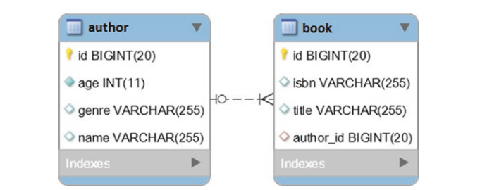

Consider that, in the author table, there is one author with an ID of 1. Now, let’s create a Book for this entry.

#### Using findById()

Relying on findById() may result in the following code (of course, don’t use orElseThrow() in production; here, orElseThrow() is just a quick shortcut to extract the value from the returned Optional):

```
@Transactional
public void addBookToAuthor() {
Author author = authorRepository.findById(1L).orElseThrow();
Book book = new Book();
book.setIsbn("001-MJ");
book.setTitle("The Canterbury Anthology");
book.setAuthor(author);
bookRepository.save(book);
}
```

Calling addBookToAuthor() triggers the following SQL statements:

```
SELECT
author0_.id AS id1_0_0_,
author0_.age AS age2_0_0_,
author0_.genre AS genre3_0_0_,
author0_.name AS name4_0_0_
FROM author author0_
WHERE author0_.id = ?INSERT INTO book (author_id, isbn, title)
VALUES (?, ?, ?)
```

First, a SELECT query is triggered via findById(). This SELECT fetches the author from the database. Next, the INSERT statement saves the new book by setting the foreign key, author\_id.

#### Using getOne()

Relying on getOne() may result in the following code:

```
@Transactional
public void addBookToAuthor() {
Author proxy = authorRepository.getOne(1L);
Book book = new Book();
book.setIsbn("001-MJ");
book.setTitle("The Canterbury Anthology");
book.setAuthor(proxy);
bookRepository.save(book);
}
```

Since Hibernate can set the underlying foreign key value of an uninitialized proxy, this code triggers a single INSERT statement:

```
INSERT INTO book (author_id, isbn, title)
VALUES (?, ?, ?)
```

### How to Use Java 8 Optional in Persistence Layer

The goal of this item is to identify the best practices for using Java 8 Optional API in the persistence layer. To show these practices in examples, we use the well-known Author and Book entities that are involved in a bidirectional lazy @OneToMany association.

#### Optional in Entities

Optional can be used in entities. More precisely, Optional should be used in certain getters of an entity (e.g., getters that are prone to return null). In the case of the Author entity, Optional can be used for the getters corresponding to name and genre, while for the Book entity, Optional can be used for title, isbn, and author, as follows:

```
@Entity
public class Author implements Serializable {
...
public Optionalstring getName() {
return Optional.ofNullable(name);
}
public Optionalstring getGenre() {
return Optional.ofNullable(genre);
}
...
}
@Entity
public class Book implements Serializable {
...
public Optionalstring getTitle() {
return Optional.ofNullable(title);
}
public Optionalstring getIsbn() {
return Optional.ofNullable(isbn);
}
public Optionalauthor getAuthor() {
return Optional.ofNullable(author);
}
...
}
```

Do not use Optional for:

1. Entity fields (Optional is not Serializable)
2. Constructor and setter arguments
3. Getters that return primitive types and collections
4. Getters specific to the primary key

#### Optional in Repositories

Optional can be used in repositories. More precisely, Optional can be used to wrap the result set of a query. Spring already comes with built-in methods that return Optional, such as findById() and findOne(). The following snippet of code uses the findById() method:

Optional author = authorRepository.findById(1L);

In addition, you can write queries that return Optional, as in the following two examples:

```
@Repository
@Transactional(readOnly = true)
public interface AuthorRepository extends JpaRepositoryauthor, {
Optionalauthor findByName(String name);
}@Repository
@Transactional(readOnly = true)
public interface BookRepository extends JpaRepositorybook, {
Optionalbook findByTitle(String title);
}
```

Do not assume that Optional works only in conjunction with the Query Builder mechanism. It works with JPQL and native queries as well. The following queries are perfectly okay:

```
@Query("SELECT a FROM Author a WHERE a.name=?1")
Optionalauthor fetchByName(String name);
@Query("SELECT a.genre FROM Author a WHERE a.name=?1")
Optionalstring fetchGenreByName(String name);
@Query(value="SELECT a.genre FROM author a WHERE a.name=?1",
nativeQuery=true)
Optionalstring fetchGenreByNameNative(String name);
```

### How to Write Immutable Entities

An immutable entity must respect the following contract:

1. It must be annotated with @Immutable(org.hibernate. annotations.Immutable)
2. It must not contain any kind of association (@ElementCollection, @OneToOne, @OneToMany, @ManyToOne, or @ManyToMany)
3. The hibernate.cache.use\_reference\_entries configuration property must be set to true

An immutable entity is stored in the Second Level Cache as an entity reference instead as a disassembled state. This will prevent the performance penalty of reconstructing an entity from its disassembled state

Here an immutable entity will be stored in the Second Level Cache:

```
@Entity
@Immutable
@Cache(usage = CacheConcurrencyStrategy.READ_ONLY, region = "Author")
public class Author implements Serializable {
private static final long serialVersionUID = 1L;
@Id
private Long id;
private String name;
private String genre;
private int age;
// getters and setters omitted for brevity
}
```

solution relies on the EhCache implementation of the Second Level Cache.

Now, let’s apply the CRUD operations to this entity:

Creating a new Author: The following method creates a new Author and persists it in the database. Moreover, this Author will be stored in the Second Level Cache via the write-through strategy

```
public void newAuthor() {
Author author = new Author();
author.setId(1L);
author.setName("Joana Nimar");
author.setGenre("History");
author.setAge(34);
authorRepository.save(author);
}
```

Fetching the created Author: The next method fetches the created Author from the Second Level Cache, without hitting the database:

```
public void fetchAuthor() {
Author author = authorRepository.findById(1L).orElseThrow();
System.out.println(author);
}
```

Updating Author: This operation will not work since the Author is immutable (it cannot be modified). This will not cause any errors, it will just be silently ignored:

```
@Transactional
public void updateAuthor() {
Author author = authorRepository.findById(1L).orElseThrow();
author.setAge(45);
}
```

Deleting Author: This operation will fetch the entity from the Second Level Cache and will delete it from both places (the Second Level Cache and the database):

```
public void deleteAuthor() {
authorRepository.deleteById(1L);
}
```

Entities of immutable classes are automatically loaded as read-only entities.

The concept of immutable entities can be applied in various real-world situations where you want to ensure that the state of an object remains constant after its creation. Here are a few real-world use cases with code examples:

##### **Financial Transactions**:

Immutable objects are well-suited for representing financial transactions, as they should not change once created. For example, in a banking application, you might have an `ImmutableTransaction` class:

```
public final class ImmutableTransaction {
private final String transactionId;
private final BigDecimal amount;
private final LocalDateTime timestamp;public ImmutableTransaction(String transactionId, BigDecimal amount, LocalDateTime timestamp) {
this.transactionId = transactionId;
this.amount = amount;
this.timestamp = timestamp;
}// Getters for fields}
```

##### **Configuration Parameters**:

Immutable objects can be used to represent configuration parameters that should remain constant during the application's runtime:

```
public final class AppConfig {
private final String apiKey;
private final int maxConnections;
private final boolean useSSL;public AppConfig(String apiKey, int maxConnections, boolean useSSL) {
this.apiKey = apiKey;
this.maxConnections = maxConnections;
this.useSSL = useSSL;
}// Getters for fields}
```

##### **Immutable Collections**:

Immutable collections, such as lists and maps, can be used when you want to ensure that a collection of data does not change:

```
Liststring names = List.of("Alice", "Bob", "Charlie");
Mapstring, scores = Map.of("Alice", 95, "Bob", 88, "Charlie", 92);
```

##### **Thread Safety**:

Immutability is a key concept for ensuring thread safety. Immutable objects can be safely shared between multiple threads without the need for explicit synchronization. In concurrent programming, you can use immutable objects to represent shared data structures.

```
public final class ImmutableCounter {
private final AtomicInteger value;public ImmutableCounter(int initialValue) {
this.value = new AtomicInteger(initialValue);
}public ImmutableCounter increment() {
return new ImmutableCounter(value.incrementAndGet());
}public int getValue() {
return value.get();
}}
```

##### **Event Sourcing**:

In event sourcing, you often use immutable events to represent changes in the state of an entity. Events are recorded and cannot be altered once created.

```
public final class OrderCreatedEvent {
private final String orderId;
private final LocalDateTime timestamp;public OrderCreatedEvent(String orderId, LocalDateTime timestamp) {
this.orderId = orderId;
this.timestamp = timestamp;
}// Getters for fields}
```

### How to Clone Entities

Cloning entities is not a daily task but sometimes it can be the easiest way to avoid having to create entities from scratch. There are many well-known cloning techniques, such as manual cloning, cloning via clone(), cloning via a copy-constructor, using the Cloning library, cloning via serialization, and cloning via JSON.

In the case of entities, you’ll rarely need to use deep cloning, but if this is what you need, then the Cloning6  library can be really useful. Most of the time, you’ll need to copy only a subset of the properties. In such cases, a copy-constructor provides full control over what is cloned.

Let’s use the Author and Book entities involved in a bidirectional lazy @ManyToMany association for the example

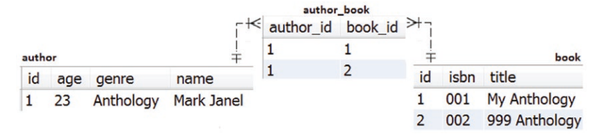

#### Cloning the Parent and Associating the Books

Let’s assume that Mark Janel is not the only author of these two books (My Anthology and 999 Anthology). Therefore, you need to add the co-author. The co-author has the same genre and books as Mark Janel, but has a different age and name

One solution is to clone the Mark Janel entity and use the clone (new entity) to create the co-author.

Assuming that the co-author’s name is Farell Tliop and he is 54, you can expect to obtain the data snapshot from Figure

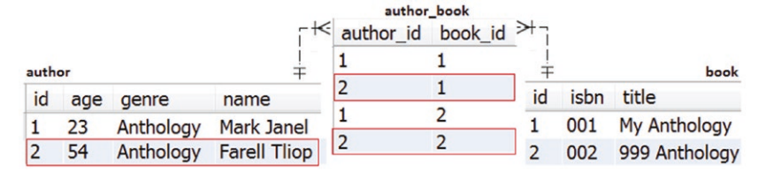

To accomplish this task, you need to focus on the Author entity. Here, you add the following two constructors:

```
@Entity
public class Author implements Serializable {
private static final long serialVersionUID = 1L;
@Id
@GeneratedValue(strategy = GenerationType.IDENTITY)
private Long id;
private String name;
private String genre;
private int age;
@ManyToMany(...)
private Setbook books = new HashSet<>();
private Author() {
}
public Author(Author author) {
this.genre = author.getGenre();
// associate books
books.addAll(author.getBooks());
}
...
}
```

The private constructor is needed internally by Hibernate. The public copy-constructor is what you need to clone an Author. More precisely, you clone the genre property only.

Further, all the Book entities that were referenced by the initial Author entity (Mark Janel) are going to be associated with the new co-author entity (Farell Tliop).

A service-method can create the co-author entity (Farell Tliop) via the initial Author entity (Mark Janel) as follows:

```
@Transactional
public void cloneAuthor() {
Author author = authorRepository.fetchByName("Mark Janel");
Author authorClone = new Author(author);
authorClone.setAge(54);
authorClone.setName("Farell Tliop");
authorRepository.save(authorClone);
}
```

The triggered SQL statements—except for the SELECT JOIN FETCH triggered via fetchByName()—for fetching Mark Janel and the associated books are the expected INSERT statements:

```
INSERT INTO author (age, genre, name)
VALUES (?, ?, ?)
Binding: [54, Anthology, Farell Tliop]
INSERT INTO author_book (author_id, book_id)
VALUES (?, ?)
Binding: [2, 1]
INSERT INTO author_book (author_id, book_id)
VALUES (?, ?)
Binding: [2, 2]
```

Notice that this example uses the Set#addAll() method and not the classical addBook() helper

This is done to avoid the additional SELECT statements triggered by book.getAuthors().add(this):

```
public void addBook(Book book) {
this.books.add(book);
book.getAuthors().add(this);
}For example, if you replace books.addAll(author.getBooks()) with:
for (Book book : author.getBooks()) {
addBook((book));
}
```

Then, for each book, there is an additional SELECT. In other words, both sides of the association between the co-author and books are synchronized. For example, if you run the following snippet of code in the service-method before saving the co-author:

authorClone.getBooks().forEach(  b -> System.out.println(b.getAuthors()));

```
[
Author{id=1, name=Mark Janel, genre=Anthology, age=23},
Author{id=null, name=Farell Tliop, genre=Anthology, age=54}
]
[
Author{id=1, name=Mark Janel, genre=Anthology, age=23},
Author{id=null, name=Farell Tliop, genre=Anthology, age=54}
]
```

You can see that the author and the co-author IDs are null since they were not saved in the database and you are using the IDENTITY generator. On the other hand, if you run the same snippet of code, relying on Set#addAll(), you would obtain this:

```
[
Author{id=1, name=Mark Janel, genre=Anthology, age=23}
]
[
Author{id=1, name=Mark Janel, genre=Anthology, age=23}
]
```

This time, the co-author is not visible since you didn’t set it on the books (you didn’t synchronized this side of the association). Since Set#addAll() helps you avoid additional SELECT statements, and after cloning an entity, you will likely immediately save it in the database, this should not be an issue.

#### Cloning the Parent and the Books

This time, assume that you want to clone the Author (Mark Janel) and the associated books. Therefore, you should expect something like Figure

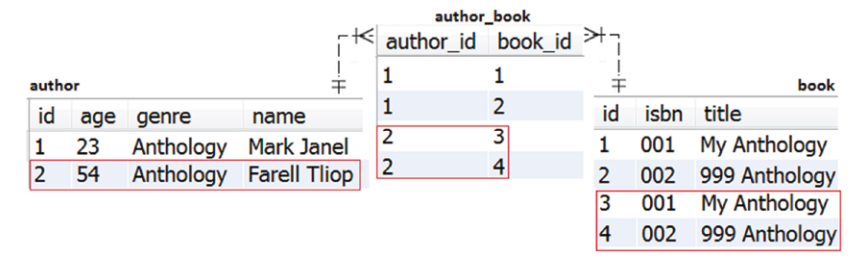

To clone the Book, you need to add the proper constructors in the Book entity, as follows:

```
@Entity
public class Book implements Serializable {
private static final long serialVersionUID = 1L;
@Id
@GeneratedValue(strategy = GenerationType.IDENTITY)
private Long id;
private String title;
private String isbn;
private Book() {
}
public Book(Book book) {
this.title = book.getTitle();
this.isbn = book.getIsbn();
}
...
}
```

The private constructor is needed internally by Hibernate. The public copyconstructor clones the Book. This example clones all properties of the Book.

Further, you would provide the Author constructors:

```
@Entity
public class Author implements Serializable {
private static final long serialVersionUID = 1L;
@Id
@GeneratedValue(strategy = GenerationType.IDENTITY)
private Long id;
private String name;
private String genre;
private int age;
@ManyToMany(...)
private Setbook books = new HashSet<>();
private Author() {
}
public Author(Author author) {
this.genre = author.getGenre();
// clone books
for (Book book : author.getBooks()) {
addBook(new Book(book));
}
}
public void addBook(Book book) {
this.books.add(book);
book.getAuthors().add(this);
}
...
}
```

The service-method remains the same:

```
@Transactional
public void cloneAuthor() {
Author author = authorRepository.fetchByName("Mark Janel");
Author authorClone = new Author(author);
authorClone.setAge(54);
authorClone.setName("Farell Tliop");
authorRepository.save(authorClone);
}
```

The triggered SQL statements—except the SELECT JOIN FETCH triggered via fetchByName()—for fetching Mark Janel and the associated books are the expected INSERT statements:

```
INSERT INTO author (age, genre, name)
VALUES (?, ?, ?)
Binding: [54, Anthology, Farell Tliop]
INSERT INTO book (isbn, title)
VALUES (?, ?)
Binding: [001, My Anthology]
INSERT INTO book (isbn, title)
VALUES (?, ?)
Binding: [002, 999 Anthology]
INSERT INTO author_book (author_id, book_id)
VALUES (?, ?)
Binding: [2, 1]
INSERT INTO author_book (author_id, book_id)
VALUES (?, ?)
Binding: [2, 2]
```

#### Joining These Cases

You can easily decide between these two cases (cloning the parent and associating the books or cloning the parent and the books) from the service-method by using a boolean argument to reshape the copy-constructor of Author, as shown here:

```
public Author(Author author, boolean cloneChildren) {
this.genre = author.getGenre();
if (!cloneChildren) {
// associate books
books.addAll(author.getBooks());
} else {
// clone each book
for (Book book : author.getBooks()) {
addBook(new Book(book));
}
}
}
```

### Why and How to Activate Dirty Tracking

Dirty Checking is a Hibernate mechanism dedicated to detecting, at flush time, the managed entities that have been modified since they were loaded in the current Persistence Context. It then fires the corresponding SQL UPDATE statements on behalf of the application (the data access layer). Note that Hibernate scans all managed entities even if only one property of a managed entity has changed.

Prior to Hibernate 5, the Dirty Checking mechanism relies on the Java Reflection API to check every property of every managed entity. From a performance perspective, this approach is “harmless” as long as the number of entities is relatively small. For a large number of managed entities, this approach may cause performance penalties.

Starting with Hibernate 5, the Dirty Checking mechanism relies on the Dirty Tracking mechanism, which is the capability of an entity to track its own attributes’ changes. The Dirty Tracking mechanism results in better performance and its benefits are noticeable,

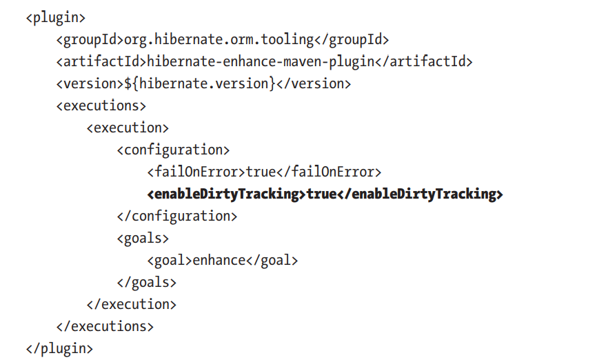

Generally speaking, Bytecode Enhancement is the process of instrumenting the bytecode of a Java class for certain purposes. Hibernate Bytecode Enhancement is a process that commonly takes place at build-time; therefore, it doesn’t affect the runtime of the application (there is no runtime performance penalty, but of course there will be an overhead during the build-time). However, it can be set to take place at runtime or deploy-time.

You can add Bytecode Enhancement to your application by adding the corresponding Maven or Gradle plug-in (Ant is also supported). Once the Bytecode Enhancement plugin is added, the bytecode of all the entity classes is instrumented. This process is known as instrumention, and it consists of adding to the code a set of instructions needed to serve the chosen configurations (e.g., you need the entity’s code to be instrumented for Dirty Tracking; via this instrumentation, an entity is capable of tracking which of its attributes has changed). At flush time, Hibernate will require each entity to report any changes, rather than relying on state-diff computations. You enable Dirty Tracking via the enableDirtyTracking configuration. Nevertheless, having a thin Persistence Context is still recommended. The hydrated state (entity snapshot) is still saved in the Persistence Context.

To check if Dirty Tracking was activated, simply decompile the source code of an entity class and search for the following code:

@Transient
private transient DirtyTracker $$_hibernate_tracker;

\$\$\_hibernate\_tracker is used to register the entity modifications. During flushing, Hibernate calls a method named \$\$\_hibernate\_hasDirtyAttributes(). This method returns the dirty properties as a String[].

Or, just check the logs for messages, as shown here:

INFO: Enhancing [com.bookstore.entity.Author] as Entity
Successfully enhanced class [D:\...\com\bookstore\entity\Author.class

Hibernate Bytecode Enhancement serves three main mechanisms (for each mechanism, Hibernate will push in the bytecode the proper instrumentation instructions):

1. Dirty Tracking (covered in this item): enableDirtyTracking
2. Attribute lazy initialization : enableLazyInitialization
3. Association management (automatic sides synchronization in the case of bidirectional associations): enableAssociationManagement

### How to Map a Boolean to a Yes/No

Consider a legacy database that has a table author with the following Data Definition Language (DDL):

```
CREATE TABLE author (
id bigint(20) NOT NULL AUTO_INCREMENT,
age int(11) NOT NULL,
best_selling varchar(3) NOT NULL,
genre varchar(255) DEFAULT NULL,
name varchar(255) DEFAULT NULL,
PRIMARY KEY (id)
);
```

Notice the best\_selling column. This column stores two possible values, Yes or No, indicating if the author is a best-selling author or not. Further, let’s assume that this schema cannot be modified (e.g., it’s a legacy and you can’t modify it) and the best\_selling column should be mapped to a Boolean value.

Obviously, declaring the corresponding entity property as Boolean is necessary but not sufficient:

```
@Entity
public class Author implements Serializable {
...
@NotNull
private Boolean bestSelling;
...
public Boolean isBestSelling() {
return bestSelling;
}
public void setBestSelling(Boolean bestSelling) {
this.bestSelling = bestSelling;
}
}
```

At this point, Hibernate will attempt to map this Boolean as shown in the following table:

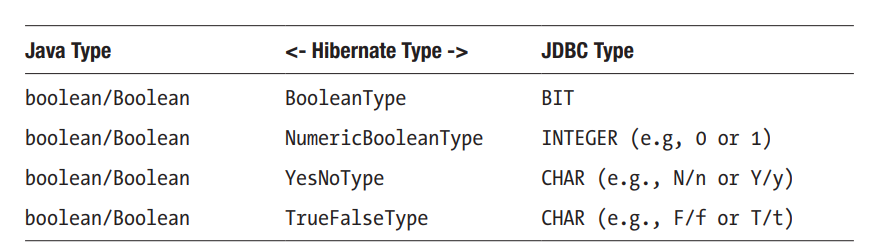

So, none of these mappings matches VARCHAR(3). An elegant solution consists of writing a custom converter that Hibernate will apply to all CRUD operations. This can be done by implementing the AttributeConverter interface and overriding its two methods:

```
@Converter(autoApply = true)
public class BooleanConverter
implements AttributeConverterboolean, {
@Override
public String convertToDatabaseColumn(Boolean attr) {
return attr == null ? "No" : "Yes";
}
@Override
public Boolean convertToEntityAttribute(String dbData) {
return !"No".equals(dbData);
}
}
```

The convertToDatabaseColumn() converts from Boolean to String while convertToEntityAttribute() converts from String to Boolean.

This converter is annotated with @Converter(autoApply = true), which means that this converter will be used for all attributes of the converted type (Boolean). To nominate the attributes, simply remove autoApply or set it to false and add @Converter at the attribute-level, as shown here:

@Convert(converter = BooleanConverter.class)
private Boolean bestSelling;

Notice that AttributeConverter cannot be applied to attributes annotated with @Enumerated.

### The Best Way to Publish Domain Events from Aggregate Roots

Entities managed by Spring repositories are known as aggregate roots. In a Domain Driven Design (DDD), the aggregate roots can publish events or domain events. Starting with the Spring Data Ingalls release, publishing such events by aggregate roots (entities) became much easier.

Spring Data comes with a @DomainEvents annotation that can be used on a method of the aggregate root to make that publication as easy as possible. A method annotated with @DomainEvents is recognized by Spring Data and is automatically invoked whenever an entity is saved using the proper repository.

Moreover, besides the @DomainEvents annotation, Spring Data provides the @AfterDomainEventsPublication annotation to indicate the method that should be automatically called to clear events after publication. In code, this commonly looks as follows:

```
class MyAggregateRoot {
@DomainEvents
Collection
<object> domainEvents() {
// return events you want to get published here
}
@AfterDomainEventsPublication
void callbackMethod() {
// potentially clean up domain events list
}
}
```

</object>

But Spring Data Commons comes with a convenient template base class (AbstractAggregateRoot) that helps register domain events and uses the publication mechanism implied by @DomainEvents and @AfterDomainEventsPublication. The events are registered by calling the AbstractAggregateRoot#registerEvent() method.

Let’s look at a sample application that relies on AbstractAggregateRoot and its registerEvent() method. There are two entities—Book and BookReview—involved in a bidirectional lazy @OneToMany association. A new book review is saved to the database in CHECK status and a CheckReviewEvent is published. This event is responsible for checking the review grammar, content, etc., and for switching the review status from CHECK to ACCEPT or REJECT.

It then propagates the new status in the database. So, this event is registered before saving the book review in CHECK status and is published automatically after you call the BookReviewRepository.save() method. After publication, the event is cleared.

Let’s start with the aggregator root, BookReview:

```
@Entity
public class BookReview extends AbstractAggregateRootbookreview
implements Serializable {
@Id
@GeneratedValue(strategy = GenerationType.IDENTITY)
private Long id;
private String content;
private String email;
@Enumerated(EnumType.STRING)
private ReviewStatus status;
@ManyToOne(fetch = FetchType.LAZY)
@JoinColumn(name = "book_id")
private Book book;
public void registerReviewEvent() {
registerEvent(new CheckReviewEvent(this));
}
// getters, setters, etc omitted for brevity
}
```

BookReview extends AbstractAggregateRoot and exposes the registerReviewEvent() method to register domain events via AbstractAggregateRoot#registerEvent(). The registerReviewEvent() method is called to register the event (CheckReviewEvent) before saving a book review:

```
@Service
public class BookstoreService {
private final static String RESPONSE
= "We will check your review and get back to you with an email
ASAP :)";
private final BookRepository bookRepository;
private final BookReviewRepository bookReviewRepository;
...
@Transactional
public String postReview(BookReview bookReview) {
Book book = bookRepository.getOne(1L);
bookReview.setBook(book);
bookReview.registerReviewEvent();
bookReviewRepository.save(bookReview);
return RESPONSE;
}
}
```

After the save() method is called and the transaction commits, the event is published. The CheckReviewEvent is listed here (it passes the bookReview instance, but you can pass only the needed properties as well by writing the proper constructor):

```
public class CheckReviewEvent {
private final BookReview bookReview;
public CheckReviewEvent(BookReview bookReview) {
this.bookReview = bookReview;
}
public BookReview getBookReview() {
return bookReview;
}
}
```

Finally, you need the event handler, which is implemented as follows:

## Fetching

### How to use Direct fetching

Direct fetching or fetching by ID is the preferable way to fetch an entity when its identifier is known and its lazy associations will not be navigated in the current Persistence Context.

By default, direct fetching will load the entity according to the default or specified FetchType. It’s important to keep in mind that, by default, the JPA @OneToMany and @ManyToMany associations are considered LAZY, while the @OneToOne and @ManyToOne associations are considered EAGER.

So, fetching an entity by ID that has an EAGER association will load that association in the Persistence Context even if is not needed, and this causes performance penalties. On the other hand, fetching an entity that has a LAZY association and accessing this association in the current Persistence Context will cause extra queries for loading it as well—also leading to performance penalties.

The best approach is to keep all the associations LAZY and rely on manual fetching strategy  to load these associations. Rely on direct fetching only if you don’t plan to access the LAZY associations in the current Persistence Context.

Now, let’s look at several approaches for fetching an entity by ID. Consider the following Author entity:

```
@Entity
public class Author implements Serializable {
private static final long serialVersionUID = 1L;
@Id
@GeneratedValue(strategy = GenerationType.IDENTITY)
private Long id;
private int age;
private String name;
private String genre;
// getters and setters omitted for brevity
}
```

The purpose of the following three examples is to use direct fetching to load the entity with an ID of 1.

#### Direct Fetching via Spring Data

You can do direct fetching in Spring Data via the built-in findById() method. This method gets as argument the ID and returns an Optional that wraps the corresponding entity. In code, findById() is used as follows:

```
@Repository
public interface AuthorRepository extends JpaRepositoryauthor, {}
Optionalauthor author = authorRepository.findById(1L);
```

The SQL SELECT statement that loads this Author is:

```
SELECT
author0_.id AS id1_0_0_,
author0_.age AS age2_0_0_,
author0_.genre AS genre3_0_0_,
author0_.name AS name4_0_0_
FROM author author0_
WHERE author0_.id = ?
```

Behind the scenes, findById() uses the EntityManager.find()
method.

#### Fetching via EntityManager

You can inject the EntityManager via @PersistenceContext. Having the EntityManager in your hands, the rest is just about calling the find() method. This method follows Spring Data style and returns an Optional:

```
@PersistenceContextprivate EntityManager entityManager;
```

```
@Override
public Optionalt find(Classt clazz, ID id) {
if (id == null) {
throw new IllegalArgumentException("ID cannot be null");
}
return Optional.ofNullable(entityManager.find(clazz, id));
}
```

The SQL SELECT statement that loads this Author is the same as with findById():

```
SELECT
author0_.id AS id1_0_0_,
author0_.age AS age2_0_0_,
author0_.genre AS genre3_0_0_,
author0_.name AS name4_0_0_
FROM author author0_
WHERE author0_.id = ?
```

#### Fetching via Hibernate-Specific Session

To fetch by ID using the Hibernate-specific Session.get() method, you need to unwrap the Session from EntityManager. The following method performs this unwrap and returns an Optional:

```
@PersistenceContext
private EntityManager entityManager;
@Override
public Optionalt findViaSession(Classt clazz, ID id) {
if (id == null) {
throw new IllegalArgumentException("ID cannot be null");
}
Session session = entityManager.unwrap(Session.class);
return Optional.ofNullable(session.get(clazz, id));
}
```

The SQL SELECT statement that loads this Author is the same as in the case of findById() and EntityManager:

```
SELECT
author0_.id AS id1_0_0_,
author0_.age AS age2_0_0_,
author0_.genre AS genre3_0_0_,
author0_.name AS name4_0_0_
FROM author author0_
WHERE author0_.id = ?
```

The JPA persistence provider (Hibernate) fetches the entity with the given ID via findById(), find(), and get(), by searching it in this order:

1. The current Persistence Context (if it’s not found, go to the next step)
2. The Second Level Cache (if it’s not found, go to the next step)
3. The database

### Direct Fetching and Session-Level Repeatable-Reads

This section expands on the first bullet (searching in the current Persistence Context). Why does Hibernate check the Persistence Context first to find the entity with the given ID? The answer is that Hibernate guarantees session-level repeatable reads. This means that the entity fetched the first time is cached in the Persistence Context (the First Level Cache). Subsequent fetches of the same entity (via direct fetching or explicit entity query (JPQL/HQL)) are done from the Persistence Context.

In other words, session-level repeatable reads prevent lost updates in concurrent writes cases.

Check out the following example, which groups these three direct fetching techniques under a transactional service-method:

```
@Transactional(readOnly=true)
public void directFetching() {
// direct fetching via Spring Data
Optionalauthor resultSD = authorRepository.findById(1L);
System.out.println("Direct fetching via Spring Data: "resultSD.get());
// direct fetching via EntityManager
Optionalauthor resultEM = dao.find(Author.class, 1L);
System.out.println("Direct fetching via EntityManager: "resultEM.get());
// direct fetching via Session
Optionalauthor resultHS = dao.findViaSession(Author.class, 1L);
System.out.println("Direct fetching via Session: "resultHS.get());
}
```

How many SELECT statements will be executed? If you answered one, you are right! There is a single SELECT caused by the authorRepository.findById(1L) call. The returned author is cached in the Persistence Context. The subsequent calls—dao.find(Author. class, 1L) and dao.findViaSession(Author.class, 1L)—fetch the same author instance from the Persistence Context without hitting the underlying database.

Now, let’s assume that we use explicit JPQL queries, as in the following example. First, we write the explicit JPQL that fetches an author by ID (we use Optional just to maintain the trend, but it’s not relevant for this topic):

@Repository
@Transactional(readOnly = true)
public interface AuthorRepository extends JpaRepository<Author, Long> {
@Query("SELECT a FROM Author a WHERE a.id = ?1")
public Optional<Author> fetchById(long id);
}

Next, let’s look at the following service-method

```
@Transactional(readOnly=true)
public void directFetching() {
// direct fetching via Spring Data
Optionalauthor resultSD = authorRepository.findById(1L);
System.out.println("Direct fetching via Spring Data: "resultSD.get());
// direct fetching via EntityManager
Optionalauthor resultJPQL = authorRepository.fetchById(1L);
System.out.println("Explicit JPQL: "resultJPQL.get());
}
```

The first SELECT is caused by the authorRepository.findById(1L) call, when the Persistence Context is empty. The second SELECT hits the database because, unless we use the Second Level Cache, any explicit query will be executed against the database.

Therefore, our explicit SELECT is not an exception to this rule. The author returned as the result of calling authorRepository.fetchById(1L) is the one from the current loaded database snapshot or is the author from the Persistence Context that was loaded when we called authorRepository.findById(1L)? Since the Persistence Context guarantees session-level repeatable-reads, Hibernate ignores the database snapshot loaded via our JPQL and returns the author that already exists in the Persistence Context.

From a performance perspective, it is advisable to use findById(), find(), or get() instead of an explicit JPQL/SQL to fetch an entity by ID. That way, if the entity is present in the current Persistence Context, there is no SELECT triggered against the database and no data snapshot to be ignored.

While, at first glance, this behavior may not be that obvious, we can reveal it via a simple test using two concurrent transactions shaped via the Spring TransactionTemplate API. Consider the following author:

INSERT INTO author (age, name, genre, id)  VALUES (23, "Mark Janel", "Anthology", 1);

```
private final AuthorRepository authorRepository;
private final TransactionTemplate template;public void process() {
template.setPropagationBehavior(
TransactionDefinition.PROPAGATION_REQUIRES_NEW);
template.setIsolationLevel(Isolation.READ_COMMITTED.value());
// Transaction A
template.execute(new TransactionCallbackWithoutResult() {
@Override
protected void doInTransactionWithoutResult(
TransactionStatus status) {
Author authorA1 = authorRepository.findById(1L).orElseThrow();
System.out.println("Author A1: " + authorA1.getName() + "\n");
// Transaction B
template.execute(new TransactionCallbackWithoutResult() {
@Override
protected void doInTransactionWithoutResult(
TransactionStatus status) {
Author authorB = authorRepository
.findById(1L).orElseThrow();
authorB.setName("Alicia Tom");
System.out.println("Author B: "authorB.getName() + "\n");
}
});
// Direct fetching via findById(), find() and get()
// doesn't trigger a SELECT
// It loads the author directly from Persistence Context
Author authorA2 = authorRepository.findById(1L).orElseThrow();
Chapter 3 Fetching
143
System.out.println("\nAuthor A2: " + authorA2.getName() + "\n");
// JPQL entity queries take advantage of
// session-level repeatable reads
// The data snapshot returned by the triggered SELECT is ignored
Author authorViaJpql = authorRepository.fetchByIdJpql(1L);
System.out.println("Author via JPQL: "authorViaJpql.getName() + "\n");
// SQL entity queries take advantage of
// session-level repeatable reads
// The data snapshot returned by the triggered SELECT is ignored
Author authorViaSql = authorRepository.fetchByIdSql(1L);
System.out.println("Author via SQL: "authorViaSql.getName() + "\n");
// JPQL query projections always load the latest database state
String nameViaJpql = authorRepository.fetchNameByIdJpql(1L);
System.out.println("Author name via JPQL: " + nameViaJpql + "\n");
// SQL query projections always load the latest database state
String nameViaSql = authorRepository.fetchNameByIdSql(1L);
System.out.println("Author name via SQL: " + nameViaSql + "\n");
}
});
}
```

There is a lot of code but it’s pretty simple. First of all, we run this code against MySQL, which relies on REPEATABLE\_READ as the default isolation level

We need to switch to the READ\_COMMITTED isolation level in order to highlight how the Hibernate session-level repeatable reads work without interleaving the REPEATABLE\_READ isolation level. We also ensure that the second transaction (Transaction B) doesn’t participate in the context of Transaction A by setting PROPAGATION\_REQUIRES\_NEW

Further, we start Transaction A (and Persistence Context A). In this transaction context, we call findById() to fetch the author with an ID of 1. So, this author is loaded in the Persistence Context A via the proper SELECT query.

Next, we leave Transaction A as it is and start Transaction B (and Persistence Context B). In Transaction B context, we load the author with an ID of 1 via the proper SELECT and perform an update of the name (Mark Janel becomes Alicia Tom). The corresponding UPDATE is executed against the database at flush time, right before Transaction B commits. So now, in the underlying database, the author with an ID of 1 has the name Alicia Tom

Now, we come back to Transaction A (and Persistence Context A) and trigger a succession of queries, as follows:

First, we call findById() to fetch the author with an ID of 1. The author is returned directly from Persistence Context A (without any SELECT) and the name is Mark Janel. Therefore, the session-level repeatable reads work as expected

Second, we execute the following explicit JPQL query (fetchByIdJpql()):

```
@Query("SELECT a FROM Author a WHERE a.id = ?1")
public Author fetchByIdJpql(long id);
```

The data snapshot returned by the triggered SELECT is ignored and the returned author is the one from Persistence Context A (Mark Janel). Again, the session-level repeatable reads work as expected.

Next, we execute the following explicit native SQL query (fetchByIdSql()):

```
@Query(value = "SELECT * FROM author WHERE id = ?1",
nativeQuery = true)
public Author fetchByIdSql(long id);
```

Again, the data snapshot returned by the triggered SELECT is ignored and the returned author is the one from Persistence Context A (Mark Janel). The session-level repeatable reads work as expected.

So far, we can conclude that the Hibernate session-level repeatable reads work as expected for entity queries expressed via JPQL or native SQL. Next, let’s see how this works with SQL query projections (SQL query projections involve selecting specific columns from a table to retrieve only the necessary information).

We execute the following JPQL query projection (fetchNameByIdJpql()):

```
@Query("SELECT a.name FROM Author a WHERE a.id = ?1")
public String fetchNameByIdJpql(long id);
```

This time, the data snapshot returned by the triggered SELECT is not ignored. The returned author has the name Alicia Tom. Therefore, the session-level repeatable reads didn’t work in this case.

Finally, we execute the following native SQL query projection (fetchNameByIdSql()):

```
@Query(value = "SELECT name FROM author WHERE id = ?1",
nativeQuery = true)
public String fetchNameByIdSql(long id);
```

Again, the data snapshot returned by the triggered SELECT is not ignored. The returned author has the name Alicia Tom. Therefore, the session-level repeatable reads didn’t work.

So far, we can conclude that Hibernate session-level repeatable reads don’t work for SQL query projections expressed via JPQL or as native SQL. These kinds of queries always load the latest database state.

Nevertheless, if we switch the transaction isolation level back to REPEATABLE\_READ then SQL query projection will return the author Mark Janel. This is happening because, as the name suggests, the REPEATABLE\_READ isolation level states that a transaction reads the same result across multiple reads. In other words, the REPEATABLE\_READ isolation level prevents the SQL non-repeatable reads anomaly. For example, a transaction that reads one record from the database multiple times obtains the same result at each read.

Do not confuse Hibernate session-level repeatable reads with the REPEATABLE\_READ transaction isolation level.

Hibernate provides session-level repeatable reads out-of-the-box. But sometimes you’ll want to load the latest state from the database. In such cases, you can call the EntityManager#refresh() method (since Spring Data doesn’t expose this method, you can extend the JpaRepository to add it).

Do not confuse Hibernate session-level repeatable reads with applicationlevel repeatable reads, which are commonly employed when the conversation spans over multiple requests

Hibernate guarantees session-level repeatable reads and offers support for application-level repeatable reads. More precisely, the Persistence Context guarantees session-level repeatable reads and you can shape application-level repeatable reads via detached entities or the Extended Persistence Context. Application-level repeatable reads should receive the help of an application-level concurrency control strategy such as Optimistic Locking in order to avoid lost updates.

#### Direct Fetching Multiple Entities by ID

Sometimes you’ll need to load more than one entity by ID. In such cases, the quickest approach to loading the entities by ID will rely on a query that uses the IN operator.

Spring Data provides out-of-the-box the findAllById() method. It takes as argument an Iterable of the IDs and returns a List of entities

```
List books = bookRepository.findAllById(List.of(1L, 2L, 5L));
```

The same result (the same triggered SQL) can be obtained via JPQL as follows:

```
@Query("SELECT b FROM Book b WHERE b.id IN ?1")
Listbook fetchByMultipleIds(Listlong ids);
```

Using the IN clause in combination with a database that supports Execution Plan Cache can be further optimized

Using Specification is also an option. Check out the following example:

List books = bookRepository.findAll(  new InIdsSpecification(List.of(1L, 2L, 5L)));

Where InIdsSpecification is:

```
public class InIdsSpecification implements Specificationbook {
private final Listlong ids;
public InIdsSpecification(Listlong ids) {
this.ids = ids;
}
@Override
public Predicate toPredicate(Rootbook root,
CriteriaQuery? cquery, CriteriaBuilder cbuilder) {
return root.in(ids);
// or
// Expressionstring expression = root.get("id");
// return expression.in(ids);
}
}
```

All three of these approaches trigger the same SQL SELECT and benefit from session-level repeatable reads.

Another approach is to rely on the Hibernate-specific MultiIdentifierLoadAccess interface. Among its advantages, this interface allows you to load multiple entities by ID in batches (withBatchSize()) and to specify if the Persistence Context should be inspected or not before executing the database query (by default it’s not inspected but this can be enabled via enableSessionCheck()). Since MultiIdentifierLoadAccess is a Hibernate-specific API, we need to shape it in Spring Boot style

### Why Use Read-Only Entities Whenever You Plan to Propagate Changes to the Database in a Future Persistence Context

Consider the Author entity that shapes an author profile via several properties as id, name, age, and genre. The scenario requires you to load an Author profile, edit the profile (e.g., modify the age), and save it back in the database. You don’t do this in a single transaction (Persistence Context). You do it in two different transactions, as follows.

#### Load Author in Read-Write Mode

Since the Author entity should be modified, you may think that it should be loaded in read-write mode as follows:

```
@Transactional
public Author fetchAuthorReadWriteMode() {
Author author = authorRepository.findByName("Joana Nimar");
return author;
}
```

Note that the fetched author is not modified in the method (transaction). It is fetched and returned, so the current Persistence Context is closed before any modifications and the returned author is detached. Let’s see what do we have in the Persistence Context.

Persistence Context after fetching the read-write entity:

Total number of managed entities: 1
Total number of collection entries: 0

EntityKey[com.bookstore.entity.Author#4]:

Author{id=4, age=34, name=Joana Nimar, genre=History}
Entity name: com.bookstore.entity.Author
Status: MANAGED
State: [34, History, Joana Nimar]

Notice the highlighted content. The status of the entity is MANAGED and the hydrated state is present as well. In other words, this approach has at least two drawbacks:

1. Hibernate is ready to propagate entity changes to the database (even if we have no modifications in the current Persistence Context), so it keeps the hydrated state in memory.
2. At flush time, Hibernate will scan this entity for modifications and this scan will include this entity as well.

The performance penalties are reflected in memory and CPU. Storing the unneeded hydrated state consumes memory, while scanning the entity at flush time and collecting it by the Garbage Collector consumes CPU resources. It will be better to avoid these drawbacks by fetching the entity in read-only mode

#### Load Author in Read-Only Mode

Since the Author entity is not modified in the current Persistence Context, it can be loaded in read-only mode as follows:

```
@Transactional(readOnly = true)
public Author fetchAuthorReadOnlyMode() {
Author author = authorRepository.findByName("Joana Nimar");
return author;
}
```

The entity loaded by this method (transaction) is a read-only entity. Do not confuse read-only entities with DTO (projections). A read-only entity is meant to be modified only so the modifications will be propagated to the database in a future Persistence Context. A DTO (projection) is never loaded in the Persistence Context and is suitable for data that will never be modified

Let’s see the Persistence Context content in this case. Persistence Context after fetching a read-only entity:

Total number of managed entities: 1
Total number of collection entries: 0
EntityKey[com.bookstore.entity.Author#4]:
Author{id=4, age=34, name=Joana Nimar, genre=History}
Entity name: com.bookstore.entity.Author
Status: READ_ONLY
State: null

This time the status is READ\_ONLY and the hydrated state was discarded. Moreover, there is no automatic flush time and no Dirty Checking is applied. This is much better than fetching the entity in read-write mode. We don’t consume memory for storing the hydrated state and we don’t burn CPU with unneeded actions.

#### Update the Author

After fetching and returning the entity (in read-write or read-only mode) it becomes detached. Further, we can modify it and merge it:

```
// modify the read-only entity in detached state
Author authorRO = bookstoreService.fetchAuthorReadOnlyMode();
authorRO.setAge(authorRO.getAge() + 1);
bookstoreService.updateAuthor(authorRO);// merge the entity
@Transactional
public void updateAuthor(Author author) {
// behind the scene it calls EntityManager#merge()
authorRepository.save(author);
}
```

The author is not the current Persistence Context and this is a merge operation. Therefore, this action is materialized in a SELECT and an UPDATE. Further, the merged entity is managed by Hibernate

The scenario presented in this item is commonly encountered in web applications and is known as a HTTP long conversation. Commonly, in a web application, this kind of scenario requires two or more HTTP requests. Particularly in this case, the first request will load the author profile, while the second request pushes the profile changes.

### How to Lazy Load the Entity Attributes via Hibernate Bytecode Enhancement

Assume that the application contains the following Author entity. This entity maps an author profile:

```
@Entity
public class Author implements Serializable {
private static final long serialVersionUID = 1L;
@Id
private Long id;
@Lob
private byte[] avatar;
private int age;
private String name;
private String genre;
...
// getters and setters omitted for brevity
}
```

#### enabling Lazy Loading of Attributes

Attributes such as the entity identifier (id), name, age, or genre are to be fetched eagerly on every entity load. But the avatar should be fetched lazily, only when it’s being accessed by the application code. So, the avatar column shouldn’t be present in the SQL triggered to fetch an Author.

By default, the attributes of an entity are loaded eagerly (all at once, in the same query), so avatar will be loaded even if it is not needed/required by the application. The avatar represents a picture; therefore, it’s a potential large amount of byte data

Loading the avatar on every entity load without using it is a performance penalty that should be eliminated.

A solution to this problem relies on attributes lazy loading.

Attributes lazy loading is useful for column types that store large amounts of data—CLOB, BLOB, VARBINARY, etc.—or for details that should be loaded on demand.

To employ attributes lazy loading, you need to follow some steps. The first step is to add Hibernate Bytecode Enhancement plug-in for Maven. Next, you instruct Hibernate to instrument the entity classes’ bytecode with the proper instructions by enabling lazy initialization via the enableLazyInitialization configuration

For Maven, add pom.xml to the Bytecode Enhancement plug-in in the  section, as shown here:

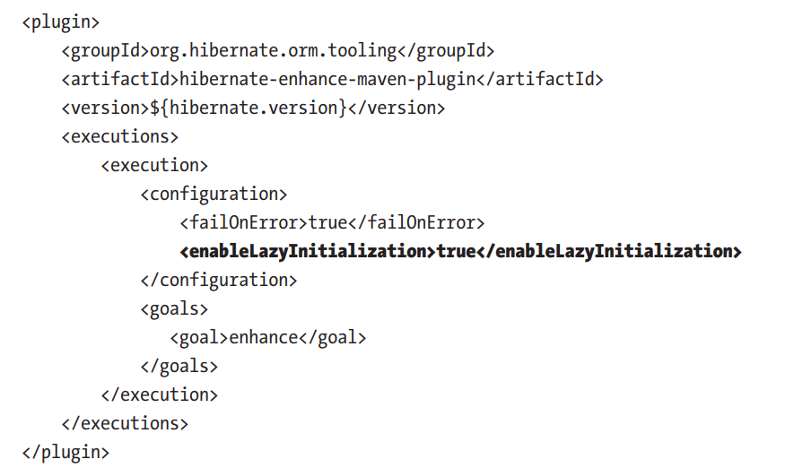

Hibernate Bytecode Enhancement takes place at build-time; therefore, it doesn’t add overhead to runtime. Without adding Bytecode Enhancement as shown here, the attribute lazy loading will not work.

The second step consists of annotating the entity attributes that should be loaded lazy with @Basic(fetch = FetchType.LAZY). For the Author entity, annotate the avatar attribute as follows:

```
@Lob
@Basic(fetch = FetchType.LAZY)
private byte[] avatar;
```

By default, the attributes are annotated with @Basic, which relies on the default fetch policy. The default fetch policy is FetchType.EAGER.

Further, a classical Spring repository for the Author entity can be written. Eventually, just for fun, add a query to fetch all authors older than or equal to the given age:

```
@Repository
public interface AuthorRepository extends JpaRepositoryauthor, {
@Transactional(readOnly=true)
Listauthor findByAgeGreaterThanEqual(int age);
}
```

The following service-method will load all authors older than the given age. The avatar attribute will not be loaded:

```
public Listauthor fetchAuthorsByAgeGreaterThanEqual(int age) {
Listauthor authors = authorRepository.findByAgeGreaterThanEqual(age);
return authors;
}
```

Calling this method will reveal an SQL that fetches only id, name, age, and genre:

```
SELECT
author0_.id AS id1_0_,
author0_.age AS age2_0_,
author0_.genre AS genre4_0_,
author0_.name AS name5_0_
FROM author author0_
WHERE author0_.age >= ?
```

Picking up an author id from the returned list of authors and passing it to the following method will fetch the avatar attribute as well. The explicit call of the getAvatar() method will trigger a secondary SQL meant to load the avatar’s bytes:

```
@Transactional(readOnly = true)
public byte[] fetchAuthorAvatarViaId(long id) {
Author author = authorRepository.findById(id).orElseThrow();
return author.getAvatar(); // lazy loading of 'avatar'
}
```

Fetching the author with the given id is accomplished in two SELECT statements. The first SELECT fetches the id, age, name, and genre, while the second SELECT fetches the avatar:

```
SELECT
author0_.id AS id1_0_0_,
author0_.age AS age2_0_0_,
author0_.genre AS genre4_0_0_,
author0_.name AS name5_0_0_
FROM author author0_
WHERE author0_.id = ?SELECT
author_.avatar AS avatar3_0_
FROM author author_
WHERE author_.id = ?
```

Trying to fetch the lazy attributes (e.g., avatar) outside the context of a session (outside a Persistence Context) will cause a LazyInitializationException.

### Attribute Lazy Loading and N+1

The N+1 represents a performance penalty caused by triggering more SQL statements (queries) than needed/expected. In other words, performing more database round trips than necessary consumes resources such as CPU, RAM memory, database connections, Chapter 3 Fetching 156 etc. Most of the time, N+1 remains undetected until you are inspecting (counting/ asserting) the number of triggered SQL statements.

The more additional and unnecessary SQL statements you have, the slower the application will get.

Consider the following method:

```
@Transactional(readOnly = true)
public Listauthor fetchAuthorsDetailsByAgeGreaterThanEqual(int age) {
Listauthor authors = authorRepository.findByAgeGreaterThanEqual(age);
// don't do this since this is a N+1 case
authors.forEach(a -> {
a.getAvatar();
});
return authors;
}
```

The query triggered by calling findByAgeGreaterThanEqual() fetches a list of authors older than the given age (this is the 1 from N+1). Looping the list of authors and calling getAvatar() for each author leads to a number of additional queries equal to the number of authors. In other words, since the avatar is fetched lazily, calling getAvatar() will trigger an SQL SELECT for each author (this is the N from N+1). For two authors, we have the following three SQL statements

```
SELECT
author0_.id AS id1_0_,
author0_.age AS age2_0_,
author0_.genre AS genre4_0_,
author0_.name AS name5_0_
FROM author author0_
WHERE author0_.age >= ?SELECT
author_.avatar AS avatar3_0_
FROM author author_
WHERE author_.id = ?SELECT
author_.avatar AS avatar3_0_
FROM author author_
WHERE author_.id = ?
```

You can avoid N+1 performance penalties by employing the subentities technique (see Item 24) or by triggering an SQL SELECT that explicitly loads the lazy fetched attributes in a DTO. For example, the following query will trigger a single SELECT to fetch the names and avatars of authors older than the given age as a DTO (Spring projection):

```
public interface AuthorDto {
public String getName();
public byte[] getAvatar();
}
@Transactional(readOnly = true)
@Query("SELECT a.name AS name, a.avatar AS avatar
FROM Author a WHERE a.age >= ?1")
Listauthordto findDtoByAgeGreaterThanEqual(int age);
```

### Attribute Lazy Loading and Lazy Initialization Exceptions

Enabling attributes lazy loading in a Spring Boot application will eventually lead to lazy initialization exceptions that are specific to this context. Commonly, this happens when the developer disables Open Session in View (which is enabled by default in Spring Boot).

By default, Open Session in View forces the current Persistence Context to remain open, while Jackson forces initialization of lazy loaded attributes (generally speaking, the View layer triggers the proxy initialization). For example, if Open Session in View is enabled, and the application returns a List from a REST controller endpoint, the View (Jackson serializes the JSON response) will force the initialization of the avatar attribute as well. OSIV will supply the current active Session, so no lazy initialization issues will occur

Obviously, this is against the application’s goal. The solution consists of disabling OSIV by setting the following in application.properties:

```
spring.jpa.open-in-view=false
```

But this leads to an exception. This time, when Jackson tries to serialize the List to JSON (this is the data received by the client of the application via a controller endpoint), there will be no active Session available.

Most probably, the exception is as follows:

Could not write JSON: Unable to perform requested lazy initialization [com. bookstore.entity.Author.avatar] - no session and settings disallow loading outside the Session;

So, Jackson forces the initialization of lazy loaded attributes without being in a Hibernate session, and this causes a lazy initialization exception. On the other hand, there is nothing wrong with not having an active Hibernate session at this point.

There are at least two ways to fix this issue and still take advantage of attributes lazy loading

**Setting Explicit Default Values for Lazy Loaded Attributes**

A quick approach consists of explicitly setting default values for lazy loaded attributes. If Jackson sees that the lazy loaded attributes have been initialized with values, then it will not attempt to initialize them. Consider the following method:

```
@Transactional(readOnly = true)
public Author fetchAuthor(long id) {
Author author = authorRepository.findById(id).orElseThrow();
if (author.getAge() < 40) {
author.getAvatar();
} else {
author.setAvatar(null);
}
return author;
}
```

The method fetches an author by id, and, if the fetched author is younger than 40, it loads the avatar via a secondary query. Otherwise, the avatar attribute is initialized with null. This time, Jackson serialization doesn’t cause any problems, but the JSON received by the client may be as follows:

```
{
"id": 1,
"avatar": null,
"age": 43,
"name": "Martin Ticher",
"genre": "Horror"
}
```

Now, depending on the implemented feature, you may want to serialize the avatar as null or instruct Jackson not to serialize the attributes that have default values (e.g., null in the case of objects, 0 in the case of primitive integers, etc.).

Most commonly, the application should avoid the serialization of avatar; therefore, setting @JsonInclude(Include.NON\_DEFAULT) is the setting needed at entity-level. In the presence of this setting, Jackson will skip the serialization of any attribute having a Chapter 3 Fetching 160 default value (depending on your case, other values of Include can be used as well, such as Include.NON\_EMPTY):

```
import com.fasterxml.jackson.annotation.JsonInclude;
import com.fasterxml.jackson.annotation.JsonInclude.Include;
...
@Entity
@JsonInclude(Include.NON_DEFAULT)
public class Author implements Serializable {
...
}
```

This time, the resulting JSON doesn’t contain the avatar:

```
{
"id": 1,
"age": 43,
"name": "Martin Ticher",
"genre": "Horror"
}
```

Setting explicit default values for lazy loaded attributes keeps the View from triggering the lazy loading of them. From this angle, it doesn’t matter if OSIV is enabled or disabled since the Session will not be used. However, the Session is still open and consumes resources, so it is advisable to disable OSIV.

#### Providing a Custom Jackson Filter

Alternatively, Jackson can be informed via a custom filter about what should be serialized and what not. In this case, Jackson should serialize id, age, name, and genre, and not serialize avatar.

Assume the following service-method, which simply fetches the authors older than the given age without their avatars:

```
public Listauthor fetchAuthorsByAgeGreaterThanEqual(int age) {
Listauthor authors = authorRepository.findByAgeGreaterThanEqual(age);
return authors;
}
```

There are several approaches for writing and configuring Jackson’s filters. One approach starts by annotating the entity with @JsonFilter as follows (the text between quotes acts as an identifier of this filter used for referencing it later):

```
@Entity
@JsonFilter("AuthorId")
public class Author implements Serializable {
...
}
```

The filter identified via AuthorId is implemented in the BookstoreController, as follows (the important part was highlighted; notice the list of attributes that should be serialized passed to the filterOutAllExcept() method):

```
@Controller
public class BookstoreController {
private final SimpleFilterProvider filterProvider;
private final BookstoreService bookstoreService;
public BookstoreController(BookstoreService bookstoreService) {
this.bookstoreService = bookstoreService;
filterProvider = new SimpleFilterProvider().addFilter("AuthorId",
SimpleBeanPropertyFilter.filterOutAllExcept(
"id", "name", "age", "genre"));
filterProvider.setFailOnUnknownId(false);
}
...
}
```

The filter is used in the REST endpoint as follows:

```
@GetMapping("/authors/{age}")
public MappingJacksonValue fetchAuthorsByAgeGreaterThanEqual(
@PathVariable int age) throws JsonProcessingException {
Listauthor authors = bookstoreService.
fetchAuthorsByAgeGreaterThanEqual(age);
MappingJacksonValue wrapper = new MappingJacksonValue(authors);
wrapper.setFilters(filterProvider);
return wrapper;
}
```

The returned MappingJacksonValue can be serialized as shown in the following JSON:

```
{
"id": 1,
"age": 43,
"name": "Martin Ticher",
"genre": "Horror"
}
```

This looks good, but the application must also cover the case when the avatar attribute was fetched. Otherwise, Jackson will throw an exception of type, Cannot resolve PropertyFilter with id 'AuthorId'. When the avatar is fetched, it should be serialized as well. Therefore, the filter should serialize all the attributes. Being the default behavior, the filter can be configured globally (at the application-level) to be used for serializing all attributes of the Author entity:

```
@Configuration
public class WebConfig extends WebMvcConfigurationSupport {
@Override
protected void extendMessageConverters(
Listhttpmessageconverter<?> converters) {
for(HttpMessageConverter? converter: converters) {
if(converter instanceof MappingJackson2HttpMessageConverter) {
ObjectMapper mapper = ((MappingJackson2HttpMessageConverter)
converter).getObjectMapper();
mapper.setFilterProvider(
new SimpleFilterProvider().addFilter("AuthorId",
SimpleBeanPropertyFilter.serializeAll()));
}
}
}
```

}

A REST endpoint that will return a List will rely on this filter that serializes all attributes of Author, including avatar

Jackson has an add-on module for the JSON processor, which handles Hibernate data types and specifically aspects of lazy-loading. This module is identified by the artifact id, jackson-datatype-hibernate5. Unfortunately, so far, this module doesn’t have an effect on lazy loaded attributes. It takes care of lazy loaded associations.

### How to Lazy Load the  Entity Attributes via Subentities

Assume that the application contains the following Author entity. This entity maps an author profile:

```
@Entity
public class Author implements Serializable {
private static final long serialVersionUID = 1L;
@Id
private Long id;
@Lob
private byte[] avatar;
private int age;
private String name;
private String genre;
...
// getters and setters omitted for brevity
}
```

This item shows an alternative to the previous solution; therefore, the goal is to load id, age, name, and genre eagerly, and to leads avatar lazily (only on demand). This approach is based on splitting the Author entity into subentities, as shown

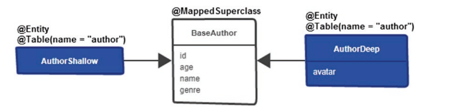

The class from the center of the above Figure is the base class (this is not an entity and doesn’t have a table in the database), BaseAuthor, and is annotated with @MappedSuperclass. This annotation marks a class whose mapping information is applied to the entities that inherit from it.

So, BaseAuthor should host the attributes that are loaded eagerly (id, age, name, and genre). Each subclass of BaseAuthor is an entity that inherits these attributes; therefore, loading a subclass will load these attributes as well:

```
@MappedSuperclass
public class BaseAuthor implements Serializable {
private static final long serialVersionUID = 1L;
@Id
private Long id;
private int age;
private String name;
private String genre;
// getters and setters omitted for brevity
}
```

The AuthorShallow is a subentity of BaseAuthor. This subentity inherits the attributes from the superclass. Therefore, all the attributes should be loaded eagerly. It’s important to explicitly map this subentity to the author table via the @Table annotation:

```
@Entity
@Table(name = "author")
public class AuthorShallow extends BaseAuthor {
}
```

The AuthorDeep is also a subentity of BaseAuthor. This subentity inherits the attributes from the superclass and defines the avatar as well. The avatar lands in the author table as well by explicitly mapping this subentity via @Table, as follows:

```
@Entity
@Table(name = "author")
public class AuthorDeep extends BaseAuthor {
@Lob
private byte[] avatar;
public byte[] getAvatar() {
return avatar;
}
public void setAvatar(byte[] avatar) {
this.avatar = avatar;
}
}
```

If subentities are not explicitly mapped to the same table via @Table, then the attributes will land in different tables. Moreover, the inherited attributes will be duplicated.

For example, without @Table(name = "author"), id, name, age, and genre will land in a table named author\_shallow and in a table named author\_deep. On the other hand, the avatar will land only in the author\_deep table. Obviously, this is not good.

At this point, AuthorShallow allows fetching the id, age, name, and genre eagerly, while the AuthorDeep allows fetching these four attributes plus the avatar. In conclusion, the avatar can be loaded on demand.

The next step is quite simple. Just provide the classical Spring repositories for these two subentities as follows:

```
@Repository
public interface AuthorShallowRepository
extends JpaRepositoryauthorshallow, {
}
@Repository
public interface AuthorDeepRepository
extends JpaRepositoryauthordeep, {
}
```

Calling findAll() from AuthorShallowRepository will trigger the following SQL (notice that the avatar is not loaded):

```
SELECT
authorshal0_.id AS id1_0_,
authorshal0_.age AS age2_0_,
authorshal0_.genre AS genre3_0_,
authorshal0_.name AS name4_0_
FROM author authorshal0_
```

Calling findAll() from AuthorDeepRepository will trigger the following SQL (notice that the avatar is loaded):

```
SELECT
authordeep0_.id AS id1_0_,
authordeep0_.age AS age2_0_,
authordeep0_.genre AS genre3_0_,
authordeep0_.name AS name4_0_,
authordeep0_.avatar AS avatar5_0_
FROM author authordeep0_
```

At this point, a conclusion starts to take shape. Hibernate supports attributes to be lazily loaded, but this requires Bytecode Enhancement and needs to deal with the Open Session in View and Jackson serialization issues. On the other hand, using subentities might be a better alternative, since it doesn’t require Bytecode Enhancement and doesn’t encounter these issues.

### How to Fetch DTO via Spring Projections

Fetching data from the database results in a copy of that data in memory (usually referred to as the result set or JDBC result set). This zone of memory that holds the fetched result set is known and referred to as the Persistence Context or the First Level Cache or simply the Cache. By default, Hibernate operates in readwrite mode. This means that the fetched result set is stored in the Persistence Context as Object[] (more precisely, as Hibernate-specific EntityEntry instances), and is known in Hibernate terminology as the hydrated state, and as entities built from this hydrated state.

The hydrated state serves the Dirty Checking mechanism (at flush time, Hibernate compares the entities against the hydrated state to discover the potential changes/modifications and triggers UPDATE statements on your behalf), the Versionless Optimistic Locking mechanism (for building the WHERE clause), and the Second Level Cache (the cached entries are built from the disassembled hydrated state, or more precisely, from Hibernate-specific CacheEntry instances built from the hydrated state that was first disassembled).

In other words, after the fetching operation, the fetched result set lives outside the database, in memory. The application accesses/manages this data via entities (so, via Java objects), and, to facilitate this context, Hibernate applies several specific techniques that transform the fetched raw data (JDBC result set) into the hydrated state (this process is known as hydration) and further into the manageable representation (entities).

This is a good reason for NOT fetching data as entities in read-write mode if there is no plan to modify them.

In such a scenario, the read-write data will consume memory and CPU resources for nothing. This adds serious performance penalties to the application. Alternatively, if you need read-only entities then switch to read-only mode (e.g., in Spring, use readOnly element, @Transactional(readOnly=true)). This will instruct Hibernate to discard the hydrated state from memory

Moreover, there will be no automatic flush time and no Dirty Checking. Only entities remain in the Persistence Context. As a consequence, this will save memory and CPU resources (e.g., CPU cycles).

Read-only entities still mean that you plan to modify them at some point in the near future as well (e.g., you don’t plan to modify them in the current Persistence Context, but they will be modified in the detached state and merged later in another Persistence Context).

This is a good reason for NOT fetching data as entities in read-only mode if you never plan to modify them.

However, as an exception here, you can consider read-only entities as an alternative to DTOs that mirror the entity (contains all columns).

As a rule of thumb, if all you need is read-only data that it will not be modified then use Data Transfer Object (DTO) to represent read-only data as Java objects.

Most of the time, DTOs contain only a subset of entity attributes and this way you avoid fetching more data (columns) than needed. Don’t forget that, besides skipping the unneeded columns, you should consider limiting the number of fetched rows via LIMIT or its counterparts.

For a variety of reasons, some voices will tell you to fetch entities only to use a converter/mapper to create DTOs. Before deciding, consider reading the Vlad Mihalcea’s tweet11 that also argues against this anti-pattern. Vlad says: “Don’t fetch entities, only to use a mapper to create DTOs. That’s very inefficient, yet I keep on seeing this anti-pattern being promoted.”

DTO and Spring projections have essentially the same purpose. Martin Folwer defines a DTO as “an object that carries data between processes in order to reduce the number of method calls”. At the implementation level, DTO and Spring projections are not the same.

DTO relies on classes with constructor and getters/setters, while Spring projections rely on interfaces and automatically generated proxies. However, Spring can rely on classes as well and the result is known as DTO projection.

Assume that we have the following Author entity. This entity maps an author profile:

```
@Entity
public class Author implements Serializable {
private static final long serialVersionUID = 1L;
@Id
@GeneratedValue(strategy = GenerationType.IDENTITY)
private Long id;
public interface AuthorRepository extends JpaRepositoryauthor,
{
@Transactional(readOnly = true)
Listauthornameage findFirst2ByGenre(String genre);
private int age;
private String name;
private String genre;
// getters and setters omitted for brevity
}
```

The goal is to fetch only the name and age of the two authors having the same genre. This time, the application relies on Spring projections.

A Spring projection may debut with a Java interface that contains getters only for the columns that should be fetched from the database (e.g., name and age).

This type of Spring projection is known as an interface-based closed projection (methods defined in this kind of projection exactly match the names of the entity properties):

```
public interface AuthorNameAge {
String getName();
int getAge();
}
```

Behind the scenes, Spring generates a proxy instance of the projection interface for each entity object. Further, the calls to the proxy are automatically forwarded to that object.

The projection interface can be declared as an inner interface of the repository interface as well. It can be declared static or non-static, as in the following example:

```
@Repository
public interface AuthorRepository extends JpaRepositoryauthor,
{
@Transactional(readOnly = true)
Listauthornameage findFirst2ByGenre(String genre);
private int age;
private String name;
private String genre;
// getters and setters omitted for brevity
}
public interface AuthorNameAge {
String getName();
int getAge();
}
}
```

The proper query for fetching only two authors in this projection is (take advantage of the Spring Data Query Builder mechanism or rely on JPQL or native SQL):

```
@Repository
@Transactional(readOnly = true)
public interface AuthorRepository extends JpaRepositoryauthor, {
Listauthornameage findFirst2ByGenre(String genre);
}
```

Notice that this query returns a List not a List. Calling this method for the given genre will trigger the following SQL:

```
SELECT
author0_.name AS col_0_0_,
author0_.age AS col_1_0_
FROM author author0_
WHERE author0_.genre=?
LIMIT ?
```

The fetched data can be manipulated via the projection getters, as in this simple example:

```
Listauthornameage authors = ...;
for (AuthorNameAge author : authors) {
```

Using projections is not limited to using the Query Builder mechanism built into the Spring Data repository infrastructure. Fetching projections via JPQL or native SQL queries is an option as well. For example, the previous query can be written via a native SQL query as follows:

@Query(value = "SELECT a.name, a.age FROM author a  WHERE a.genre=?1 LIMIT 2", nativeQuery=true)

When the names of the columns doesn’t correspond to the name of the entity’s attributes then simply rely on the SQL AS keyword to define the corresponding aliases. For example, if the name attribute is mapped to the author\_name column and the age attribute is mapped to the author\_age column then a native SQL query will be as follows:

```
@Query(value = "SELECT a.author\_name AS name, a.author\_age AS age  FROM author a WHERE a.genre=?1 LIMIT 2",  nativeQuery=true)
```

#### JPA Named (Native) Queries Can Be Combined with Spring Projections

Say you have a bunch of named queries in your project and you want to take advantage of Spring Projection. Here is a sample of accomplishing this task. First, you define two named queries and their native counterparts using the @NamedQuery and @NamedNativeQuery annotations. The first query, Author.fetchName, represents a scalar mapping to `List<String>`, while the second query, Author.fetchNameAndAge, represents a Spring projection mapping to `List<AuthorNameAge>`:

```
@NamedQuery(
name = "Author.fetchName",
query = "SELECT a.name FROM Author a"
)
@NamedQuery(
name = "Author.fetchNameAndAge",
query = "SELECT a.age AS age, a.name AS name FROM Author a"
)
@Entity
public class Author implements Serializable {
...
}
```

```
span
```

Or, you could define the same queries via a jpa-named-queries.properties file (this is the recommended way for taking advantage of dynamic sort (Sort) in named queries that are not native) and Sort in Pageable (in both, named queries and named native queries):

```
# Find the names of authors
Author.fetchName=SELECT a.name FROM Author a
```

```
# Find the names and ages of authors
Author.fetchNameAndAge=SELECT a.age AS age, a.name AS name FROM Author a
```

And their native counterparts:

```
# Find the names of authors
Author.fetchName=SELECT name FROM author
```

```
# Find the names and ages of authors
```

Or, you can define the same queries via the orm.xml file (notice that this approach has the same shortcomings as using @NamedQuery and @NamedNativeQuery):

```
<!-- Find the names of authors -->
<named-query name="Author.fetchName">
 <query>SELECT a.name FROM Author a</query>
</named-query>
```

```
<!-- Find the names and ages of authors -->
<named-query name="Author.fetchNameAndAge">
 <query>SELECT a.age AS age, a.name AS name FROM Author a</query>
</named-query>
```

And their native counterparts:

```
<!-- Find the names of authors -->
<named-native-query name="Author.fetchName">
 <query>SELECT name FROM author</query>
</named-native-query>
```

```
<!-- Find the names and ages of authors -->
<named-native-query name="Author.fetchNameAndAge">
 <query>SELECT age, name FROM author</query>
</named-native-query>
```

Independent of which approach you prefer, the AuthorRepository is the same:

```
@Repository
@Transactional(readOnly = true)
public interface AuthorRepository extends JpaRepository<Author, Long> {
// Scalar Mapping
List<String> fetchName();
// Spring projection
List<AuthorNameAge> fetchNameAndAge();
}
```

Or the native counterpart:

```
@Repository
@Transactional(readOnly = true)
public interface AuthorRepository extends JpaRepository<Author, Long> {
 // Scalar Mapping
 @Query(nativeQuery = true)
 List<String> fetchName();
 // Spring projection
 @Query(nativeQuery = true)
 List<AuthorNameAge> fetchNameAndAge();
}
```

That’s all! Spring Boot will automatically do the rest for you. Depending on how the
named (native) queries are provided, you can choose from the following applications:

1. How to use JPA named queries via @NamedQuery and Spring projection
2. How to use JPA named native queries via @NamedNativeQuery and Spring projection
3. How to use JPA named queries via a properties file and Spring projection
4. How to use JPA named native queries via a properties file and Spring projection
5. How to use JPA named queries via the orm.xml file and Spring projection
6. How to use JPA named native queries via the orm.xml file and Spring projection

#### Class-Based Projections
Besides interface-based projections, Spring supports class-based projections. This time,
instead of an interface, you write a class. For example, the AuthorNameAge interface
becomes the AuthorNameAge class from the following

```
public class AuthorNameAge {
 private String name;
 private int age;
 public AuthorNameAge(String name, int age) {
 this.name = name;
 this.age = age;
 }
 // getters, setters, equals() and hashCode() omitted for brevity
}
```
As you can see, the names of the constructor's arguments must match the entity properties.

Notice that interface-based projections can be nested, while class-based
projections cannot

#### How to Reuse a Spring Projection

This time, consider that we’ve enriched the Author entity to contain the following
attributes: id, name, genre, age, email, address, and rating. Or, generally speaking,
an entity with a large number of attributes. When an entity has a significant number of
attributes, we potentially need a bunch of read-only queries to fetch different subsets of
attributes. For example, a read-only query may need to fetch the age, name, genre, email,
and address, while another query may need to fetch the age name and genre, and yet
another query may need to fetch only the name and email.

To satisfy these three queries, we may define three interface-based Spring closed
projections. This is not quite practical. For example, later, we may need one more readonly query that fetches the name and address. Following this logic, we need to define
one more Spring projection as well. It will be more practical to define a single Spring
projection that works for all read-only queries executed against the authors.

To accomplish this task, we define a Spring projection that contains getters to satisfy
the heaviest query (in this case, the query that fetches the age, name, genre, email, and
address):

```
@JsonInclude(JsonInclude.Include.NON_DEFAULT)
public interface AuthorDto {
 public Integer getAge();
 public String getName();
 public String getGenre();
 public String getEmail();
 public String getAddress();
}
```

The projection was annotated with @JsonInclude(JsonInclude.Include.NON_
DEFAULT). This is needed to avoid serializing null values (values that haven’t been
fetched in the current query). This will instruct the Jackson serialization mechanism to
skip null values from the resulted JSON.
Now, we can rely on Spring Data Query Builder mechanism to generate the query for
fetching the age, name, genre, email, and address as follows:

List<AuthorDto> findBy();

Or, you can write a JPQL as follows:

```
@Query("SELECT a.age AS age, a.name AS name, a.genre AS genre, "
 + "a.email AS email, a.address AS address FROM Author a")
List<AuthorDto> fetchAll();
```
Calling fetchAll() and representing the result as JSON will produce the following:

```
[
 {
 "genre":"Anthology",
 "age":23,
 "email":"markj@gmail.com",
 "name":"Mark Janel",
 "address":"mark's address"
 },
 ...
]
```
Further, you can reuse the AuthorDto projection for a query that fetches only the age,
name, and genre:

```
@Query("SELECT a.age AS age, a.name AS name, a.genre AS genre FROM Author a")
List<AuthorDto> fetchAgeNameGenre();
```
Calling fetchAgeNameGenre() and representing the result as JSON will produce
something as follows:

```
 {
 "genre":"Anthology",
 "age":23,
 "name":"Mark Janel"
 },
 ...
]
```
Or, you can reuse the AuthorDto projection for a query that fetches only the name and email:

```
@Query("SELECT a.name AS name, a.email AS email FROM Author a")
List<AuthorDto> fetchNameEmail();
```
Calling fetchNameEmail() and representing the result as JSON will produce something
as follows:

```
[
 {
 "email":"markj@gmail.com",
 "name":"Mark Janel"
 },
 ...
]
```

#### How to Use Dynamic Spring Projections

Consider the Author entity from the previous section, which has the following attributes:
id, name, genre, age, email, address, and rating. Moreover, consider two Spring
projections for this entity, defined as follows:

```
public interface AuthorGenreDto {
 public String getGenre();
}
```

```
public interface AuthorNameEmailDto {
 public String getName();
 public String getEmail();
}
```
You can fetch the entity type, AuthorGenreDto type, and AuthorNameEmailDto type via
the same query-method by writing three queries, as shown here:

```
Author findByName(String name);
AuthorGenreDto findByName(String name);
AuthorNameEmailDto findByName(String name);
```

You essentially write the same query-method to return different types. This is somehow
cumbersome, and Spring tackles such cases via dynamic projections. You can apply
dynamic projections just by declaring a query-method with a Class parameter, as follows:

``<T> T findByName(String name, Class<T> type);``

Here are two more examples:

```
<T> List<T> findByGenre(String genre, Class<T> type);
@Query("SELECT a FROM Author a WHERE a.name=?1 AND a.age=?2")
<T> T findByNameAndAge(String name, int age, Class<T> type);
```
This time, depending on the type that you expect to be returned, you can call
findByName() as follows:

```
Author author = authorRepository.findByName(
 "Joana Nimar", Author.class);
AuthorGenreDto author = authorRepository.findByName(
 "Joana Nimar", AuthorGenreDto.class);
AuthorNameEmailDto author = authorRepository.findByName(
 "Joana Nimar", AuthorNameEmailDto.class);
```
### How to Add an Entity in a Spring Projection
Typically, a Spring projection (DTO) is used to fetch read-only data. But there might be
cases when the application needs to fetch an entity inside the Spring Projection. For
such cases, the steps that need to be followed are highlighted in this example.

#### Materialized Association
Consider the Author and Book entities involved in a bidirectional lazy @OneToMany association.
The Spring projection should map the Author entity and, from the Book entity, only
the title attribute. Based on the previous item, the Spring projection interface can be
written as follows:

```
public interface BookstoreDto {
 public Author getAuthor();
 public String getTitle();
}
```

Fetching data is accomplished in the following repository via JPQL (the fetched data
lands in a List<BookstoreDto>):

```
@Repository
@Transactional(readOnly = true)
public interface AuthorRepository extends JpaRepository<Author, Long> {
 @Query("SELECT a AS author, b.title AS title
 FROM Author a JOIN a.books b")
 List<BookstoreDto> fetchAll();
}
```
Calling this method will trigger the following SQL:

```
SELECT
 author0_.id AS col_0_0_,
 books1_.title AS col_1_0_,
 author0_.id AS id1_0_,
 author0_.age AS age2_0_,
 author0_.genre AS genre3_0_,
 author0_.name AS name4_0_
FROM author author0_
INNER JOIN book books1_
 ON author0_.id = books1_.author_id
```
The following service-method calls fetchAll() in a read-write transaction. Notice that
the fetched Author instances are managed by Hibernate and the potential changes will
be propagated to the database via the Dirty Checking mechanism (Hibernate will trigger
UPDATE statements on your behalf):

```
@Transactional
public List<BookstoreDto> fetchAuthors() {
 List<BookstoreDto> dto = authorRepository.fetchAll();
 // the fetched Author are managed by Hibernate
 // the following line of code will trigger an UPDATE
 dto.get(0).getAuthor().setGenre("Poetry");
 return dto;
}
```
Displaying the fetched data to the console is quite simple:

```
List<BookstoreDto> authors = ...;
authors.forEach(a -> System.out.println(a.getAuthor()
 + ", Title: " + a.getTitle()));
```

#### Not Materialized Association

This time, consider that there is no materialized association between the Author and
Book entities.

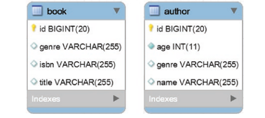

both entities share a genre attribute.
This attribute can be used to join Author with Book and fetch the data in the same Spring
projection, BookstoreDto. This time, the JPQL uses the genre attribute in order to join
these two tables as follows:

```
@Repository
@Transactional(readOnly = true)
public interface AuthorRepository extends JpaRepository<Author, Long> {
 @Query("SELECT a AS author, b.title AS title FROM Author a
 JOIN Book b ON a.genre=b.genre ORDER BY a.id")
 List<BookstoreDto> fetchAll();
}
```
Calling fetchAll() will trigger the following SQL:

```
SELECT
 author0_.id AS col_0_0_,
 book1_.title AS col_1_0_,
 author0_.id AS id1_0_,
 author0_.age AS age2_0_,
 author0_.genre AS genre3_0_,
 author0_.name AS name4_0_
FROM author author0_
INNER JOIN book book1_
 ON (author0_.genre = book1_.genre)
ORDER BY author0_.id
```

The following service-method calls fetchAll() in a read-write transaction. Notice that
the fetched Authors are managed and Hibernate will propagate to the database the
modifications of these Authors:

```
@Transactional
public List<BookstoreDto> fetchAuthors() {
 List<BookstoreDto> dto = authorRepository.fetchAll();
 // the fetched Author are managed by Hibernate
 // the following line of code will trigger an UPDATE
 dto.get(0).getAuthor().setAge(47);
 return dto;
}
```

Displaying the fetched data to the console is quite simple:

```
List<BookstoreDto> authors = ...;
authors.forEach(a -> System.out.println(a.getAuthor()
 + ", Title: " + a.getTitle()));
```

### How to Enrich Spring Projections with Virtual Properties That Are/Aren’t Part of Entities

Spring projections can be enriched with virtual properties that are or are not part of
the Domain Model. Commonly, when they are not part of the Domain Model, they are
computed at runtime via SpEL expressions.

An interface-based Spring projection that contains methods with unmatched names in
the Domain Model and with returns computed at runtime is referenced as an interfacebased open projection.

For example, the following Spring projection contains three virtual properties (years,
rank, and books):

```
public interface AuthorNameAge {
 String getName();
 @Value("#{target.age}")
 String years();
 @Value("#{ T(java.lang.Math).random() * 10000 }")
 int rank();
 @Value("5")
 String books();
}
```

In the Spring projection, AuthorNameAge relies on @Value and Spring SpEL to point to a
backing property from the Domain Model (in this case, the Domain Model property age
is exposed via the virtual property years). Moreover, use the @Value and Spring SpEL
to enrich the result with two virtual properties that don’t have a match in the Domain
Model (in this case, rank and books).

The Spring repository is pretty simple and it contains a query that fetches the author
name and age older than the given age:

```
@Repository
@Transactional(readOnly = true)
public interface AuthorRepository extends JpaRepository<Author, Long> {
 @Query("SELECT a.name AS name, a.age AS age
 FROM Author a WHERE a.age >= ?1")
 List<AuthorNameAge> fetchByAge(int age);
}
```

Calling fetchByAge() for the given age will trigger the following SQL:

```
SELECT
 author0_.name AS col_0_0_,
 author0_.age AS col_1_0_
FROM author author0_
WHERE author0_.age >= ?
```
Printing the fetched data uses years() for age, rank(), and books():

```
List<AuthorNameAge> authors = ...;
for (AuthorNameAge author : authors) {
 System.out.println("Author name: " + author.getName()
 + " | Age: " + author.years()
 + " | Rank: " + author.rank()
 + " | Books: " + author.books());
}
```

An output to the console is (author’s name and age have been fetched from the database):

Author name: Olivia Goy | Age: 43 | Rank: 3435 | Books: 5
Author name: Quartis Young | Age: 51 | Rank: 2371 | Books: 5
Author name: Katy Loin | Age: 56 | Rank: 2826 | Books: 5

### How to Efficiently Fetch Spring Projection Including *-to-One Associations

Assume that Author and Book are again involved in a bidirectional lazy @OneToMany
association. You want to fetch a read-only result set containing the title of each book
and the name and genre of the author. Such a read-only result set is the perfect candidate
for a DTO, and, being in Spring, the main way to fetch this DTO involves Spring
projections.

data snapshot
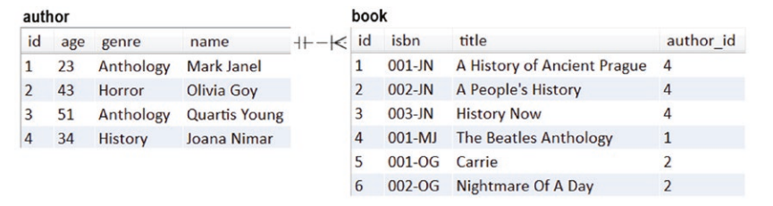

#### Using Nested Closed Projections

The book title is fetched from the book table, while the author name and genre are
fetched from the author table. This means that you can write an interface-based, nested
Spring closed projection, as follows:

```
public interface BookDto {
 public String getTitle();
 public AuthorDto getAuthor();
 interface AuthorDto {
 public String getName();
 public String getGenre();
 }
}
```
Now all you need is the proper query to populate this Spring projection. The quickest
approach relies on the Spring Data Query Builder mechanism, as follows:

```
@Repository
@Transactional(readOnly=true)
public interface BookRepository extends JpaRepository<Book, Long> {
 List<BookDto> findBy();
}
```

From an implementation point of view, this was really fast! But, is this approach
working? Let’s see the result set as a JSON representation

```
[
 {
 "title":"A History of Ancient Prague",
 "author":{
 "genre":"History",
 "name":"Joana Nimar"
 }
 },
 {
 "title":"A People's History",
 "author":{
 "genre":"History",
 "name":"Joana Nimar"
 }
 },
 ...
]
```

Yes, it’s working! But is it efficient? Without inspecting the triggered SQL and the
Persistence Context contents, you may think that this approach is great. But the
generated SELECT fetches more data than required

```
SELECT
 book0_.title AS col_0_0_,
 author1_.id AS col_1_0_,
 author1_.id AS id1_0_,
 author1_.age AS age2_0_,
 author1_.genre AS genre3_0_,
 author1_.name AS name4_0_
FROM book book0_
Chapter 3 Fetching
189
LEFT OUTER JOIN author author1_
 ON book0_.author_id = author1_.id
```

It is obvious that this query fetches all the attributes of the author (the more attributes
the entity has, the more unneeded data is fetched). Moreover, if you inspect the
Persistence Context contents, you’ll notice that it contains three entries in READ_ONLY
status and none of them has the hydrated state (the hydrated state was discarded since
this transaction was marked as readOnly):

Here are the Persistence Context contents:

Total number of managed entities: 3
Total number of collection entries: 3
EntityKey[com.bookstore.entity.Author#1]:
Author{id=1, name=Mark Janel, genre=Anthology, age=23}
EntityKey[com.bookstore.entity.Author#2]:
Author{id=2, name=Olivia Goy, genre=Horror, age=43}
EntityKey[com.bookstore.entity.Author#4]:
Author{id=4, name=Joana Nimar, genre=History, age=34}

The road of the result set from the database to the projection passes partially
through the Persistence Context. The authors are fetched as read-only entities
as well. Generally speaking, the amount of data may impact performance
(e.g., a relatively large number of unneeded fetched columns and/or a
relatively large number of fetched rows). But since we are in the read-only
mode, there is no hydrated state in the Persistence Context and no Dirty
Checking is executed for the authors. Nevertheless, the Garbage Collector
needs to collect these instances after the Persistence Context is closed.

Writing an explicit JPQL produces the same output as the query generated via the Query
Builder mechanism):

```
@Repository
@Transactional(readOnly=true)
public interface BookRepository extends JpaRepository<Book, Long> {
 @Query("SELECT b.title AS title, a AS author "
 + "FROM Book b LEFT JOIN b.author a")
 // or as a INNER JOIN
 // @Query("SELECT b.title AS title, b.author AS author FROM Book b")
 List<BookDto> findByViaQuery();
}
```
#### Using a Simple Closed Projection
Relying on nested Spring projection can lead to performance penalties. How about using
a simple Spring closed projection that fetches raw data as follows:

```
public interface SimpleBookDto {
 public String getTitle(); // of book
 public String getName(); // of author
 public String getGenre(); // of author
}
```

This time the Query Builder mechanism cannot help you. You can write a LEFT JOIN as
follows:

```
@Repository
@Transactional(readOnly=true)
public interface BookRepository extends JpaRepository<Book, Long> {
 @Query("SELECT b.title AS title, a.name AS name, a.genre AS genre "
 + "FROM Book b LEFT JOIN b.author a")
 List<SimpleBookDto> findByViaQuerySimpleDto();
}
```

This time, the JSON representation of the result set looks as follows:

```
[
 {
 "title":"A History of Ancient Prague",
 "genre":"History",
 "name":"Joana Nimar"
 },
Chapter 3 Fetching
191
 {
 "title":"A People's History",
 "genre":"History",
 "name":"Joana Nimar"
 },
 ...
]
```
The books and authors data is mixed. Depending on the case, this kind of output can be
accepted (as in this case) or not. But how efficient is it? Let’s look at the triggered SQL:

```
SELECT
 book0_.title AS col_0_0_,
 author1_.name AS col_1_0_,
 author1_.genre AS col_2_0_
FROM book book0_
LEFT OUTER JOIN author author1_
 ON book0_.author_id = author1_.id
```

The query looks exactly as expected. Notice that this query fetches only the requested
columns. Further, the Persistence Context is empty. Here is the Persistence Context
content:

Total number of managed entities: 0
Total number of collection entries: 0

From a performance perspective, this approach is better than relying on nested
Spring projections. The SQL fetches only the requested columns and the
Persistence Context is bypassed.

The drawback is in data representation (raw
data), which doesn’t maintain the tree structure of parent-child entities.

In some
cases, this is not an issue; in other cases, it is.

You have to process this data to be
shaped as needed (on the server-side or client-side). When no further processing
is needed, you can even drop the projection and return List<Object[]>:

```
@Query("SELECT b.title AS title, a.name AS name, a.genre AS genre "
 + "FROM Book b LEFT JOIN b.author a")
List<Object[]> findByViaQueryArrayOfObjects();
```

#### Using a Simple Open Projection

Relying on a simple Spring closed projection is okay as long as you don’t care to maintain
the data structure (tree structure of parent-child entities). If this is an issue, you can rely on
a simple Spring open projection

an open projection allows
you to define methods with unmatched names in the Domain Model and with returns that
are computed at runtime. Essentially, an open projection supports virtual properties.

```
public interface VirtualBookDto {
 public String getTitle(); // of book
 @Value("#{@authorMapper.buildAuthorDto(target.name, target.genre)}")
 AuthorClassDto getAuthor();
}
```
The highlighted SpEL expression refers to the bean AuthorMapper that invokes the
buildAuthorDto() method and forwards the projection name and genre as the method
parameters. So, at runtime, the name and genre of the author should be used to create an
instance of AuthorClassDto listed here:

```
public class AuthorClassDto {
 private String genre;
 private String name;
 // getters, setters, equals() and hashCode() omitted for brevity
}
```

The job is accomplished by a helper class named AuthorMapper, as shown here:

```
@Component
public class AuthorMapper {
 public AuthorClassDto buildAuthorDto(String genre, String name) {
 AuthorClassDto authorClassDto = new AuthorClassDto();
 authorClassDto.setName(name);
 authorClassDto.setGenre(genre);
 return authorClassDto;
 }
}
```
How efficient is this implementation? Is it worth the effort? The triggered SQL is
obtained from the following JPQL:

```
@Repository
@Transactional(readOnly=true)
public interface BookRepository extends JpaRepository<Book, Long> {
 @Query("SELECT b.title AS title, a.name AS name, a.genre AS genre "
 + "FROM Book b LEFT JOIN b.author a")
 List<VirtualBookDto> findByViaQueryVirtualDto();
}
```

The SQL looks exactly as expected:


```
SELECT
 book0_.title AS col_0_0_,
 author1_.name AS col_1_0_,
 author1_.genre AS col_2_0_
FROM book book0_
LEFT OUTER JOIN author author1_
 ON book0_.author_id = author1_.id
```
The Persistence Context was untouched, as shown.:
Total number of managed entities: 0
Total number of collection entries: 0
The JSON representation maintains the data structure:

```
 {
 "title":"A History of Ancient Prague",
 "author":{
 "genre":"Joana Nimar",
 "name":"History"
 }
 },
Chapter 3 Fetching
194
 {
 "title":"A People's History",
 "author":{
 "genre":"Joana Nimar",
 "name":"History"
 }
 },
 ...
]
```

Even if it requires a little more work than the preceding approaches,
relying on a simple Spring open projection maintains the data structure.

